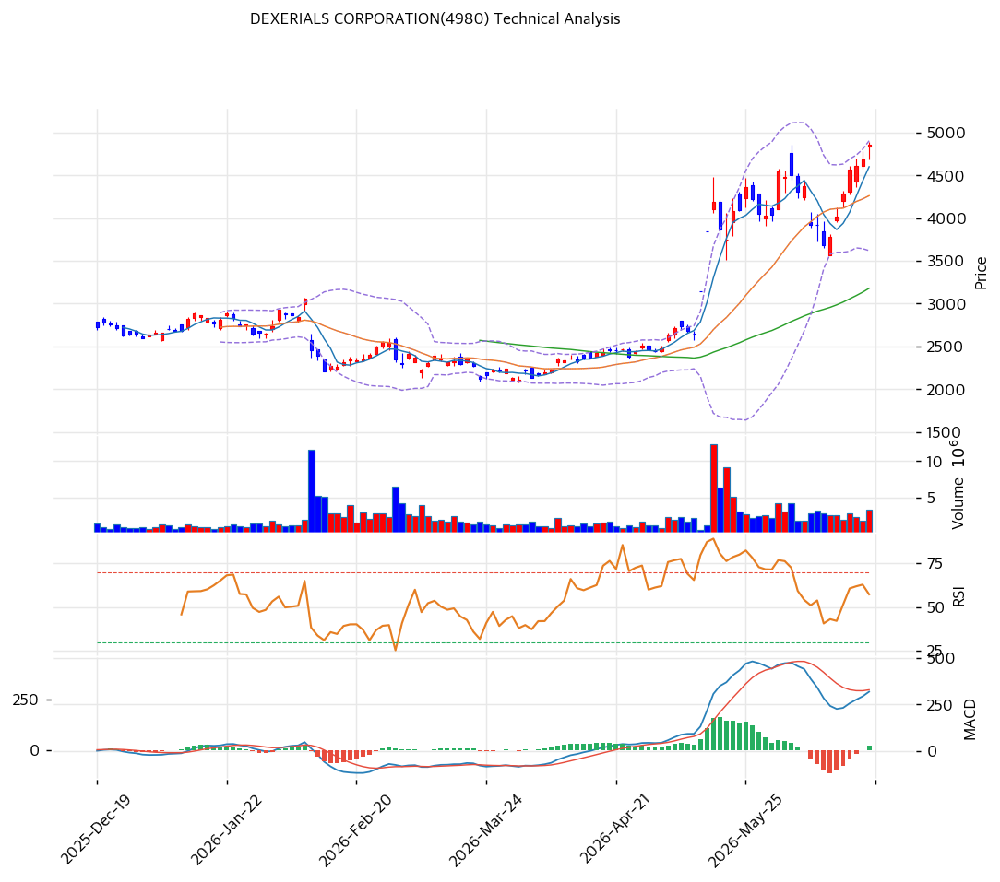

# 덱세리얼스(4980) 기술적 분석

2026-06-20 | T2 Technical Analysis

---

## 차트

---

## 1. 가격 현황

| 항목 | 값 |
|------|-----|
| 현재가 | ¥4,859 (+3.80%) |
| 52주 고가 | ¥4,894 |
| 52주 저가 | ¥1,903 |
| 52주 범위 위치 | 100% (신고가권) |
| 거래량비 | 1.26x |
| RSI | 69.8 (중립, 과매수 직전) |

> 52주 저점(¥1,903)에서 약 2.6배 급등, 신고가권(¥4,859). 모든 이평선 위 완전 정배열(MA200 대비 +80%). RSI 69.8 과매수 직전, 거래량 1.26x. Beta 0.72로 4종 중 가장 낮은 변동성(대형 우량주). 광전융합 테마로 강한 추세.

---

## 2. 차트 패턴 분석

### 2.1 구조·캔들

| 패턴 | 위치 | 신뢰도 | 해석 |
|------|------|--------|------|
| 강세 추세·신고가권 | ¥4,859 | 중상 | 포토닉스 테마 |
| MA200 +80% 이격 | 큰 폭 | 중 | 되돌림 압력 |
| 볼린저 상단 근접 | ¥4,904 | 중 | 단기 과열 |

- **장기 상승 추세·신고가권** (신뢰도: 중상): 2.6배 급등, 정배열. 추세 강건.
- **단기 과열** (신뢰도: 중): RSI 69.8·스토캐 88.1. 볼린저 상단 근접.

### 2.2 다이버전스

- **상승 모멘텀 지속·과열 경계** (신뢰도: 중): MACD 매수·스토캐 과매수(88.1). RSI 69.8 과매수 직전. 추세 강하나 단기 조정 여지.

---

## 3. 이동평균선 — 강한 정배열·장기 과열

| MA | 값 | 괴리율 | 위치 |
|----|-----|--------|------|
| MA5 | 4,600 | +5.6% | 위 |
| MA20 | 4,262 | +14.0% | 위 |
| MA60 | 3,180 | +52.8% | 위 |
| MA120 | 2,875 | +69.0% | 위 |
| MA200 | 2,698 | +80.1% | 위 |

**해석**: 완전 정배열. MA200 대비 +80%로 장기 과열이나 추세 강건. MA20(¥4,262)이 1차 지지, 단기 조정 시 MA20·MA60(¥3,180) 시험. MA60까지 갭이 큼(급등 구간).

---

## 4. 보조 지표

### RSI(14) — 69.8 (중립, 과매수 직전)
70 직전. 추가 상승 시 과매수.

### MACD(12,26,9)
매수 크로스, 상승 모멘텀 지속.

### 볼린저밴드(20,2σ)
| 상단 | 중단 | 하단 | 밴드폭 |
|---|---|---|---|
| 4,904 | 4,262 | 3,620 | 30.1% |

현재가 ¥4,859는 상단(4,904) 근접. 밴드폭 30.1%. 상단 돌파 시 추가 상승이나 과열.

### 스토캐스틱
| %K | 판단 |
|---|---|
| 88.1 | 과매수 |

과매수권. 단기 조정 경계.

---

## 5. 지지/저항

| 구분 | 가격 | 근거 |
|------|------|------|
| 저항 | 5,023 | 피봇 R2 |
| 저항 | 4,941 | 피봇 R1 |
| 저항 | 4,904 | 볼린저 상단 |
| 저항 | 4,894 | 52주 고가 |
| **현재가** | **4,859** | 신고가권 |
| 지지 | 4,730 | 피봇 S1 |
| 지지 | 4,601 | 피봇 S2·MA5 |
| 지지 | 4,262 | MA20·볼린저 중단 |
| 지지 | 3,620 | 볼린저 하단 |
| 지지 | 3,180 | MA60 |

---

## 6. 시그널 종합

| 지표 | 내용 | 시그널 |
|------|------|--------|
| 차트 패턴 | 강세 추세·신고가권 | 🟢 |
| 이동평균선 | 정배열·장기 과열 | 🟢 |
| RSI | 69.8 — 중립 | ⚪ |
| MACD | 매수 | 🟢 |
| 볼린저밴드 | 상단 근접 | 🔴 |
| 스토캐스틱 | 과매수 88.1 | ⚪ |
| 거래량 | 1.26x | ⚪ |

**종합 판단**: 🟢 매수 3개 / 🔴 매도 1개 / ⚪ 중립 3개 → **매수 우위 (강세 vs 단기 과열)**

2.6배 급등 후 신고가권에서 강한 정배열을 유지. MACD 매수로 모멘텀 살아 있으나 볼린저 상단·스토캐 과매수로 단기 과열. Beta 0.72로 4종 중 가장 안정적이나 MA200 +80% 이격은 부담. MA20(¥4,262) 지지가 단기 분수령, 이탈 시 MA60(¥3,180)까지 갭. 우량주이나 단기 추격보다 조정·분할.

---

## 7. 전략 제안

### 보유 중인 경우
- **홀드 (과열 관리)**
- 익절: ¥4,941(R1)·¥5,023(R2)·신고가 돌파 시 트레일링
- 손절: ¥4,262(MA20) 이탈
- 저변동(Beta 0.72)이나 급등 후 분할 익절

### 진입 대기인 경우
- **눌림목 분할 (추격 자제)**
- 1차: ¥4,262(MA20) 회귀 시
- 2차: ¥3,180\~3,620(MA60·볼린저 하단)
- 진입 조건: 우량주·포토닉스 옵션으로 중장기 매력. 단 리레이팅·과열로 단기 진입은 MA20 눌림 후. 포토닉스 실적 가시화 확인 권장.
