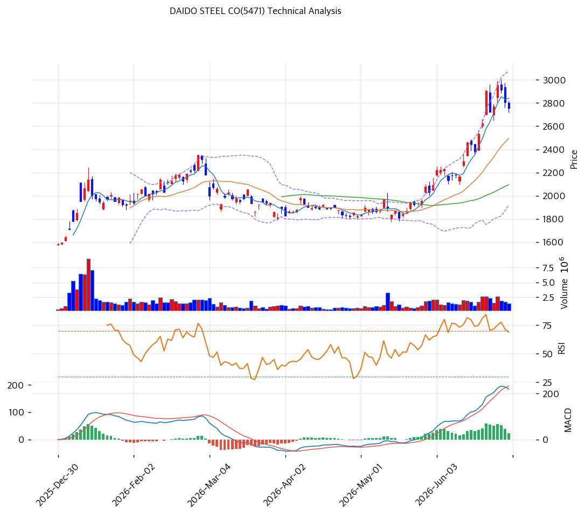

# 기술적분석

## 차트

## 가격 현황

| 항목         | 값                         |
| ---------- | ------------------------- |
| 현재가        | **¥2,757.5** (-1.8%)      |
| 52주 고/저    | ¥2,958 / ¥932             |
| 52주 위치     | 90.1%                     |
| RSI        | 63.9 (중립)                 |
| MACD       | 219.0/196.0/24.0 (매수)     |
| Stochastic | K=80.4 D=85.5 데드크로스 (과매수) |
| 볼린저        | 폭 46.4%, 중간 밴드 근처         |

## 이동평균선

| MA    | 가격(¥) |   갭(%) | 위치     |
| ----- | ----: | -----: | ------ |
| MA5   | 2,841 |  -2.9% | 현재가 하회 |
| MA20  | 2,495 | +10.5% | 현재가 상회 |
| MA60  | 2,094 | +31.7% | 현재가 상회 |
| MA120 | 2,042 | +35.0% | 현재가 상회 |
| MA200 | 1,789 | +54.2% | 현재가 상회 |

→ 정배열(MA5>MA20>MA60>MA120>MA200) 유지. 다만 현재가가 5일선(¥2,841)을 하회하며 단기 조정 진행 중 — 52주 90.1% 구간 과열 이후 눌림목 성격.

## 시그널 종합

| 구분     |    카운트 |
| ------ | -----: |
| 매수     |      1 |
| 매도     |      1 |
| 중립     |      4 |
| **결론** | **중립** |

이동평균선(정배열, MA20 +10.5%)만 매수 신호, 스토캐스틱(데드크로스, K=80.4 과매수)만 매도 신호. RSI·MACD·볼린저·거래량(0.81배, 약함)은 모두 중립으로 방향성 부재.

## 지지·저항

| 구분      |        가격(¥) | 근거                                        |
| ------- | -----------: | ----------------------------------------- |
| 강 저항    |        2,958 | 52주 고가                                    |
| 저항      |        2,814 | 피봇 R1 / PRZ(중, R1·MA5·R2 중첩 2,814\~2,870) |
| **현재가** | **¥2,757.5** | 피봇 포인트(2,766) 부근                          |
| 지지      |        2,709 | 피봇 S1                                     |
| 강 지지    |        2,495 | MA20 / 피보나치 0.236 되돌림(PRZ 약 2,495\~2,514) |

## 전략

| 시나리오     | 액션                          |
| -------- | --------------------------- |
| 보유자      | 홀드 (TP ¥3,017 / SL ¥2,661)  |
| 신규 진입 1차 | ¥2,709 (피봇 S1 지지)           |
| 신규 진입 2차 | ¥2,495 (MA20·피보나치 0.236 지지) |
| 매도 트리거   | 종가 기준 ¥2,661(피봇 S2) 이탈 시 손절 |

## 핵심 판단

MA5\~MA200 정배열이 유지되며 중기 상승추세는 살아있으나, 52주 고점 대비 90.1% 구간에서 스토캐스틱 데드크로스(과매수)와 거래량 감소(0.81배)가 겹치며 단기 숨고르기 국면. RSI(63.9)·MACD(매수, 히스토그램 정체)는 방향성 확대 신호 없이 중립권에 머물러 있어 즉각적인 재상승 모멘텀은 부족. 엔화 약세 기조가 이어지면 특수강 수출 마진 개선 기대감이 재료가 될 수 있으나, 기술적으로는 ¥2,709\~2,495 지지 구간에서 저가 매수 대응이 유리하며 ¥2,814\~2,870 저항 돌파 전까지는 박스권 등락 가능성이 높다.
