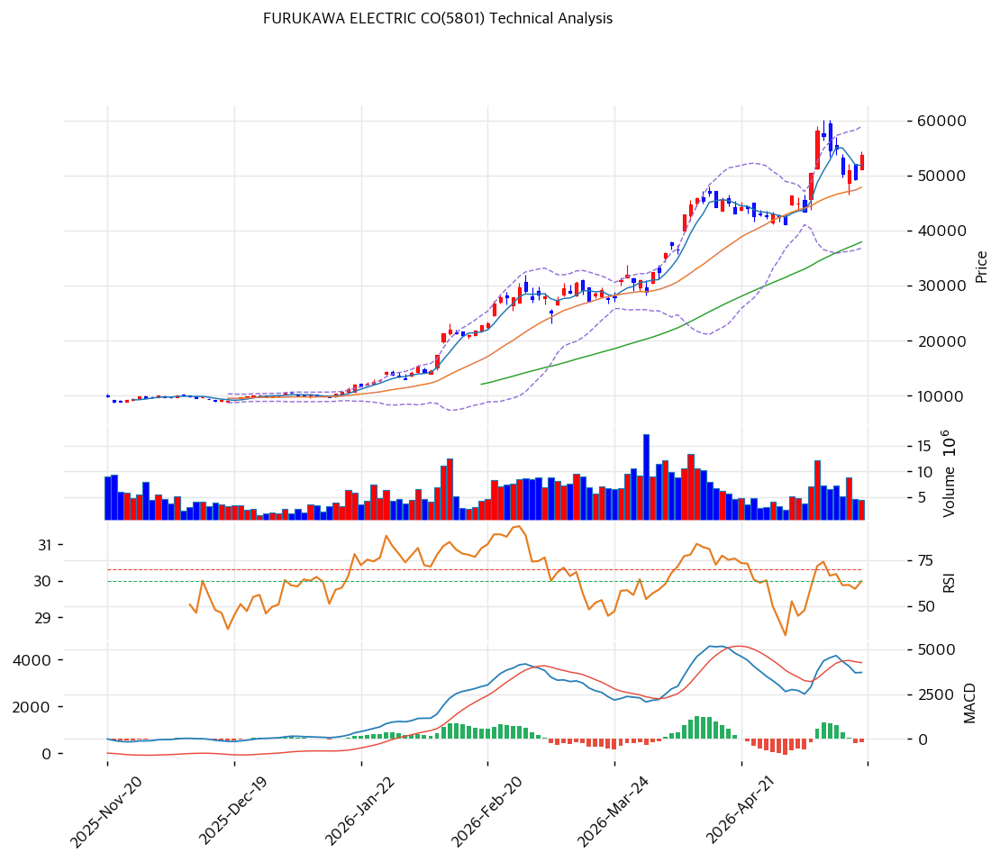

# 기술적분석

***

## 캔들스틱 차트

***

## 추세 판단

| 이동평균  |  값 (¥) |    괴리율 |  위치 |
| ----- | -----: | -----: | :-: |
| MA5   | 51,776 |  +3.6% |  위  |
| MA20  | 47,830 | +12.2% |  위  |
| MA60  | 37,913 | +41.5% |  위  |
| MA120 |      — |      — |  위  |
| MA200 |      — |      — |  위  |

* **정배열 여부**: ✅ 정배열
* **추세 요약**: 52주 저가 ¥6,375 → 현재 ¥53,650(+741%) 초강세. MA20 대비 +12.2%, MA60 대비 +41.5%로 중단기 과열 구간. 정배열 유지이나 고점(¥60,150) 대비 -10.8% 조정 중.

***

## 모멘텀 지표

| 지표      | 값     |   신호  |
| ------- | ----- | :---: |
| RSI(14) | 61.8  |  중립 ⚪ |
| MACD    | 매도    | 매도 🔴 |
| 스토캐스틱   | 골든크로스 |   🟢  |

**모멘텀 해석**: RSI 61.8 중립이나 MA60 괴리 +41.5%로 중기 과열. 스토캐스틱 골든크로스 단기 반등 시그널. MACD 데드크로스로 모멘텀 둔화.

***

## 매매 신호 종합

**종합 판정**: 매수 1 / 매도 1 / 중립 4 → **중립**

***

## 매매 전략

### 보유자 전략

* 52주 고점: ¥60,150 — 돌파 시 신고가 영역
* 손절: MA20(¥47,830) 이탈 시

### 관망자 전략

* MA60(¥37,913) 대비 +41.5% 괴리 → 현재 진입은 리스크 높음
* 1차 관찰: ¥45,000\~48,000 (MA20 부근 조정 시)
* 2차 관찰: ¥38,000 (MA60 테스트)

**전략 요약**: 52주 +741% 급등으로 정배열 유지이나 중기 과열. 신규 진입보다 조정 대기가 유리. MA20(¥47,830) 지지 확인이 단기 방향성 핵심.
