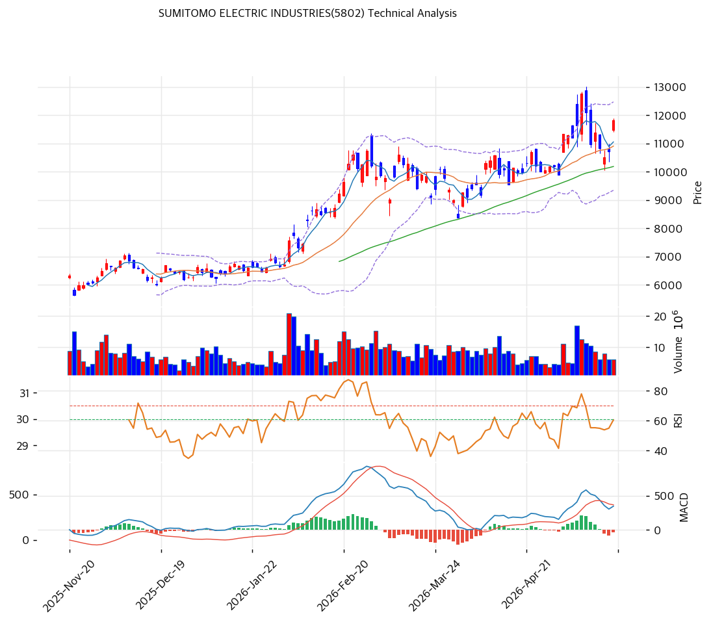

# 기술적분석

***

## 캔들스틱 차트

***

## 추세 판단

| 이동평균  |  값 (¥) |    괴리율 |  위치 |
| ----- | -----: | -----: | :-: |
| MA5   | 11,059 |  +6.9% |  위  |
| MA20  | 10,911 |  +8.3% |  위  |
| MA60  | 10,189 | +16.0% |  위  |
| MA120 |  8,509 | +38.9% |  위  |
| MA200 |  6,869 | +72.1% |  위  |

* **정배열 여부**: ✅ 정배열. MA5 > MA20 > MA60 > MA120 > MA200
* **추세 요약**: 2025.11\~2026.5 강한 상승 추세. 52주 저가 ¥2,784 → 현재 ¥11,820(+325%). 단기 MA20 대비 +8.3% 괴리로 과열 구간은 아님.

***

## 모멘텀 지표

| 지표         | 값                       |    신호    |
| ---------- | ----------------------- | :------: |
| RSI(14)    | 58.4                    |   중립 ⚪   |
| MACD       | 348/Signal 385/Hist -37 |   매도 🔴  |
| MACD 히스토그램 | 수축                      |  매도세 약화  |
| 스토캐스틱      | K=35.9, D=31.3          | 골든크로스 🟢 |
| 거래량 비율     | 0.81                    |   평균 이하  |

**모멘텀 해석**: MACD 데드크로스 유지이나 히스토그램 수축 중(매도세 약화). 스토캐스틱 골든크로스 발생으로 단기 반등 시그널. RSI 58.4 중립, 과열/과매도 어디에도 해당 않음.

***

## 변동성·밴드

| 볼린저 밴드    |  값 (¥) |
| --------- | -----: |
| 상단        | 12,475 |
| 중간 (MA20) | 10,911 |
| 하단        |  9,347 |
| 밴드폭       |  28.7% |

**밴드 해석**: 현재가 ¥11,820은 중간선\~상단 사이. 밴드폭 28.7%는 적정 수준. 상단(¥12,475) 근접 시 단기 과열 주의.

***

## 매매 신호 종합

| 지표    |   판정  | 비고              |
| ----- | :---: | --------------- |
| 이동평균선 | 🟢 매수 | 정배열             |
| RSI   |  ⚪ 중립 | 58.4, 중립        |
| MACD  | 🔴 매도 | 데드크로스, 히스토그램 수축 |
| 볼린저   |  ⚪ 중립 | 중간\~상단          |
| 스토캐스틱 |  ⚪ 중립 | 골든크로스, 중립구간     |
| 거래량   |  ⚪ 중립 | 0.81배, 평균 이하    |

**종합 판정**: 매수 1 / 매도 1 / 중립 4 → **중립**

***

## 지지·저항 & 피보나치

### 피봇 포인트

| 레벨    | 가격 (¥) |
| ----- | -----: |
| R2    | 12,193 |
| R1    | 12,007 |
| Pivot | 11,703 |
| S1    | 11,517 |
| S2    | 11,213 |

### 피보나치 되돌림 (Swing High ¥13,030 → Swing Low ¥2,504)

| 레벨    | 가격 (¥) | 현재가 대비 |
| ----- | -----: | -----: |
| 0.382 |  9,009 | -23.8% |
| 0.5   |  7,767 | -34.3% |
| 0.618 |  6,525 | -44.8% |

> 현재가 ¥11,820은 피보나치 0.236(¥10,018) 위에 위치. 강한 상승 모멘텀 반영.

***

## 매매 전략

### 보유자 전략

| 항목     | 가격 (¥) | 비고        |
| ------ | -----: | --------- |
| 1차 저항  | 12,007 | 피봇 R1     |
| 2차 저항  | 12,475 | 볼린저 상단    |
| 52주 고점 | 13,030 | 최종 저항     |
| 손절     | 10,900 | MA20 이탈 시 |

### 관망자 전략

| 항목    |         가격 (¥) | 비고            |
| ----- | -------------: | ------------- |
| 1차 진입 | 10,900\~11,000 | MA20 부근 지지 확인 |
| 2차 진입 |         10,200 | MA60 지지 테스트   |
| 손절    |          9,300 | 볼린저 하단 이탈 시   |

**전략 요약**: 정배열 상승 추세 유지 중이나 MACD 데드크로스로 단기 모멘텀 둔화. MA20(¥10,911) 지지 여부가 추세 지속의 핵심. 신규 진입은 MA20 부근 조정 시 유리.
