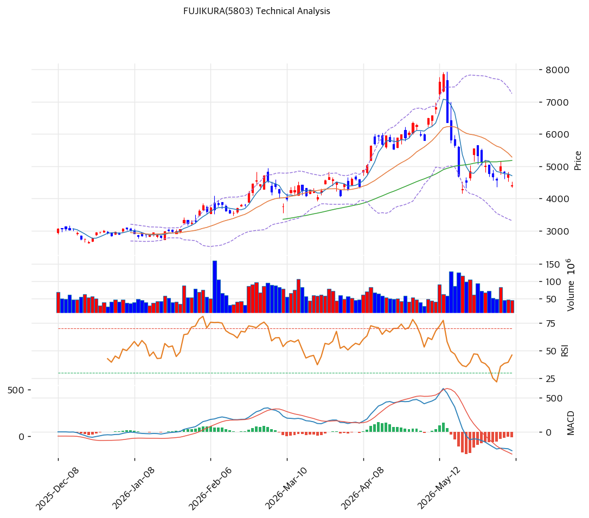

# FUJIKURA(5803) 기술적 분석 보고서

---

## 캔들스틱 차트

---

## 추세 판단

| 이동평균 | 값 (¥) | 괴리율 | 위치 |
|---------|-------:|------:|:----:|
| MA5 | 4,706 | -6.5% | 아래 |
| MA20 | 5,283 | -16.7% | 아래 |
| MA60 | 5,176 | -15.0% | 아래 |
| MA120 | 4,265 | +3.2% | 위 |
| MA200 | 3,597 | +22.4% | 위 |

- **정배열 여부**: 비정배열. 단기·중기선(MA5/20/60) 모두 현재가 위에 위치한 하락 배열. 장기선(MA120/200)만 아래 지지
- **추세 요약**: 2025.11\~2026.4월 급등(¥1,100→¥7,855) 후 -44% 급조정 진행 중. 직전(2주 전 ¥4,850) 대비 추가 -9% 하락하며 **MA120(¥4,265)을 지지선으로 테스트**. 중기 하락 추세 지속, 당일 -7.29% 급락

---

## 모멘텀 지표

| 지표 | 값 | 신호 |
|------|-----|:----:|
| RSI(14) | 40.0 | 중립 ⚪ |
| MACD | -276 / Signal -194 / Hist -82 | 매도 🔴 |
| MACD 히스토그램 | 확장 중 | 매도세 강화 |
| 스토캐스틱 | K=30.5, D=30.4 | 골든크로스·중립 ⚪ |
| 거래량 비율 | 0.58 | 평균 대비 -42% 위축 |

**모멘텀 해석**: MACD 매도 신호 유지 + 히스토그램이 다시 **확장(매도세 강화)** — 2주 전 수축 국면에서 재차 악화. RSI 40.0 중립이나 하단으로 이동. 스토캐스틱은 과매도 탈출(K=30.5) 후 골든크로스이나 강도 약함. 거래량 0.58x로 위축 — 투매가 아닌 매수세 실종형 하락. 단기 반등 동력 미약.

---

## 변동성·밴드

| 볼린저 밴드 | 값 (¥) |
|------------|-------:|
| 상단 | 7,254 |
| 중간 (MA20) | 5,283 |
| 하단 | 3,312 |
| 밴드폭 | 74.6% |

**밴드 해석**: 밴드폭 74.6%로 극도로 확장 — 고점 급등→급락 구간의 초고변동성 반영. 현재가 ¥4,401은 중간선(¥5,283)과 하단(¥3,312) 사이 중간 구간. 하단 ¥3,312까지 추가 하방 여지가 열려 있어, 밴드 수축 전까지 변동성 위험 상존.

---

## 매매 신호 종합

| 지표 | 판정 | 비고 |
|------|:----:|------|
| 이동평균선 | 🔴 매도 | 비정배열, MA5/20/60 아래 |
| RSI | ⚪ 중립 | 40.0, 하단 이동 |
| MACD | 🔴 매도 | 데드크로스 + 히스토그램 확장 |
| 볼린저 | ⚪ 중립 | 중간 구간, 하단 여지 |
| 스토캐스틱 | ⚪ 중립 | 골든크로스나 강도 약함 |
| 거래량 | ⚪ 중립 | 0.58배 위축 |

**종합 판정**: 매수 0 / 매도 1 / 중립 5 → **매도우위(중립)**

---

## 지지·저항 & 피보나치

### 피봇 포인트

| 레벨 | 가격 (¥) |
|------|-------:|
| R2 | 4,609 |
| R1 | 4,505 |
| Pivot | 4,421 |
| S1 | 4,317 |
| S2 | 4,233 |

### 피보나치 되돌림 (Swing High ¥7,855 → Swing Low ¥4,295, 하락 추세)

| 레벨 | 가격 (¥) | 현재가 대비 |
|------|-------:|----------:|
| 0.236 | 5,135 | +16.7% |
| 0.382 | 5,655 | +28.5% |
| **0.5** | **6,075** | **+38.0%** |
| 0.618 | 6,495 | +47.6% |

> 직전 고점(¥7,855)에서 저점(¥4,295)까지의 하락 스윙 기준. 현재가 ¥4,401은 스윙 저점(¥4,295) 바로 위 — 저점 지지 테스트 국면. 되돌림 0.236(¥5,135)이 1차 반등 저항.

### PRZ (잠재 반전 구간)

| 방향 | 가격대 (¥) | 신뢰도 | 근거 |
|:----:|----------:|:----:|------|
| 지지 | 4,233\~4,376 | 강 | 피봇 S2 + MA120 + 피봇 S1 + 추세선 지지 |
| 저항 | 5,135\~5,176 | 약 | 피보나치 0.236 + MA60 |

---

## 매매 전략

### 보유자 전략

| 항목 | 가격 (¥) | 비고 |
|------|-------:|------|
| 1차 저항 | 5,135\~5,176 | 피보나치 0.236 + MA60, 단기 반등 목표 |
| 2차 저항 | 5,283 | MA20(BB 중간) |
| 손절 | 4,233 | PRZ 강지지(S2+MA120) 이탈 시 중기 추세 훼손 |

### 관망자 전략

| 항목 | 가격 (¥) | 비고 |
|------|-------:|------|
| 1차 진입 | 4,233\~4,376 | PRZ 강지지(S2+MA120+추세선) 분할 |
| 2차 진입 | 3,800 내외 | MA120 이탈 시 BB 하단(¥3,312) 방향 추가 분할 |
| 손절 | 3,300 | BB 하단·피보 확장 이탈 시 |

**전략 요약**: 급등(+600%대) 후 -44% 조정으로 MA120(¥4,265) 강지지대를 테스트 중. 당일 -7.29% 급락 + MACD 매도세 재확장 + 거래량 위축으로 **단기 반등 동력 미약**. 스윙 저점(¥4,295)·MA120 지지 유지 여부가 핵심 분기점이며, 이탈 시 BB 하단(¥3,312)까지 하방 여지. 추격 매수보다 PRZ 강지지(¥4,233\~4,376) 분할 + 거래량 회복·MA60(¥5,176) 회복 확인 후 접근이 안전.
