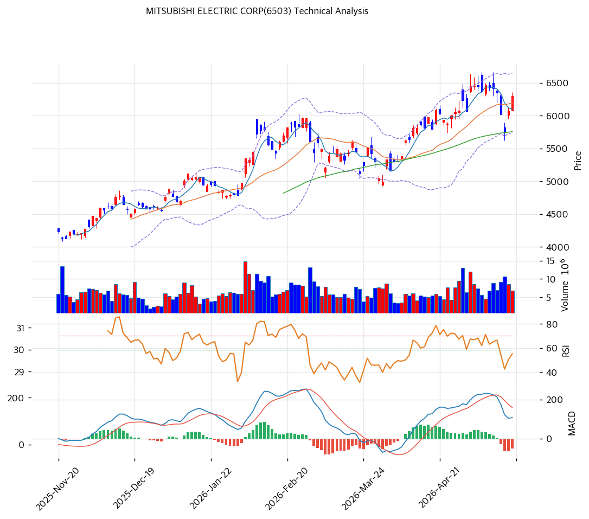

# 기술적분석

***

## 캔들스틱 차트

***

## 추세 판단

| 이동평균  | 값 (¥) |    괴리율 |  위치 |
| ----- | ----: | -----: | :-: |
| MA5   | 6,097 |  +3.3% |  위  |
| MA20  | 6,190 |  +1.8% |  위  |
| MA60  | 5,759 |  +9.4% |  위  |
| MA120 | 5,289 | +19.1% |  위  |
| MA200 | 4,685 | +34.5% |  위  |

* **정배열 여부**: 비정배열. MA5 < MA20이나 전체적으로 상승 배열. 단기 조정 후 반등 시도 중
* **추세 요약**: 중장기 상승 추세 유지. 52주 저가 ¥2,844 대비 +121% 상승. 52주 고점 ¥6,667에 근접.

***

## 모멘텀 지표

| 지표      | 값                       |    신호    |
| ------- | ----------------------- | :------: |
| RSI(14) | 56.1                    |   중립 ⚪   |
| MACD    | 108/Signal 158/Hist -51 |   매도 🔴  |
| 스토캐스틱   | K=39.8, D=33.4          | 골든크로스 🟢 |
| 거래량 비율  | —                       |     —    |

**모멘텀 해석**: MACD 데드크로스 유지이나 스토캐스틱 골든크로스 발생. RSI 56.1 중립. 단기 조정 후 반등 가능성 시사.

***

## 변동성·밴드

| 볼린저 밴드    | 값 (¥) |
| --------- | ----: |
| 상단        | 6,644 |
| 중간 (MA20) | 6,190 |
| 하단        | 5,737 |
| 밴드폭       | 14.7% |

**밴드 해석**: 밴드폭 14.7%로 적정 수준. 현재가 ¥6,301은 중간\~상단 사이. 52주 고점(¥6,667)과 볼린저 상단(¥6,644) 수렴 구간이 핵심 저항대.

***

## 매매 신호 종합

| 지표    |   판정  | 비고          |
| ----- | :---: | ----------- |
| 이동평균선 |  ⚪ 중립 | 전체 위이나 비정배열 |
| RSI   |  ⚪ 중립 | 56.1        |
| MACD  | 🔴 매도 | 데드크로스       |
| 볼린저   |  ⚪ 중립 | 중간\~상단      |
| 스토캐스틱 |  ⚪ 중립 | 골든크로스, 중립구간 |
| 거래량   |  ⚪ 중립 | —           |

**종합 판정**: 매수 0 / 매도 1 / 중립 5 → **매도우위**

***

## 지지·저항 & 피봇

| 레벨     | 가격 (¥) |
| ------ | -----: |
| 52주 고점 |  6,667 |
| R2     |  6,526 |
| R1     |  6,413 |
| Pivot  |  6,247 |
| S1     |  6,134 |
| S2     |  5,968 |
| MA60   |  5,759 |

***

## 매매 전략

### 보유자 전략

* 1차 저항: ¥6,413(R1) → 52주 고점 ¥6,667 돌파 시도
* 손절: ¥5,950(S2 하방) 이탈 시

### 관망자 전략

* 1차 진입: ¥5,750\~5,960 (MA60+S2 지지 확인)
* 손절: ¥5,500 이탈 시

**전략 요약**: 52주 고점(¥6,667) 근접으로 돌파 vs 저항의 분기점. MACD 매도 신호로 단기 모멘텀 약화. 신규 진입보다 52주 고점 돌파 확인 후 추격 또는 MA60(¥5,759) 조정 시 진입이 유리.
