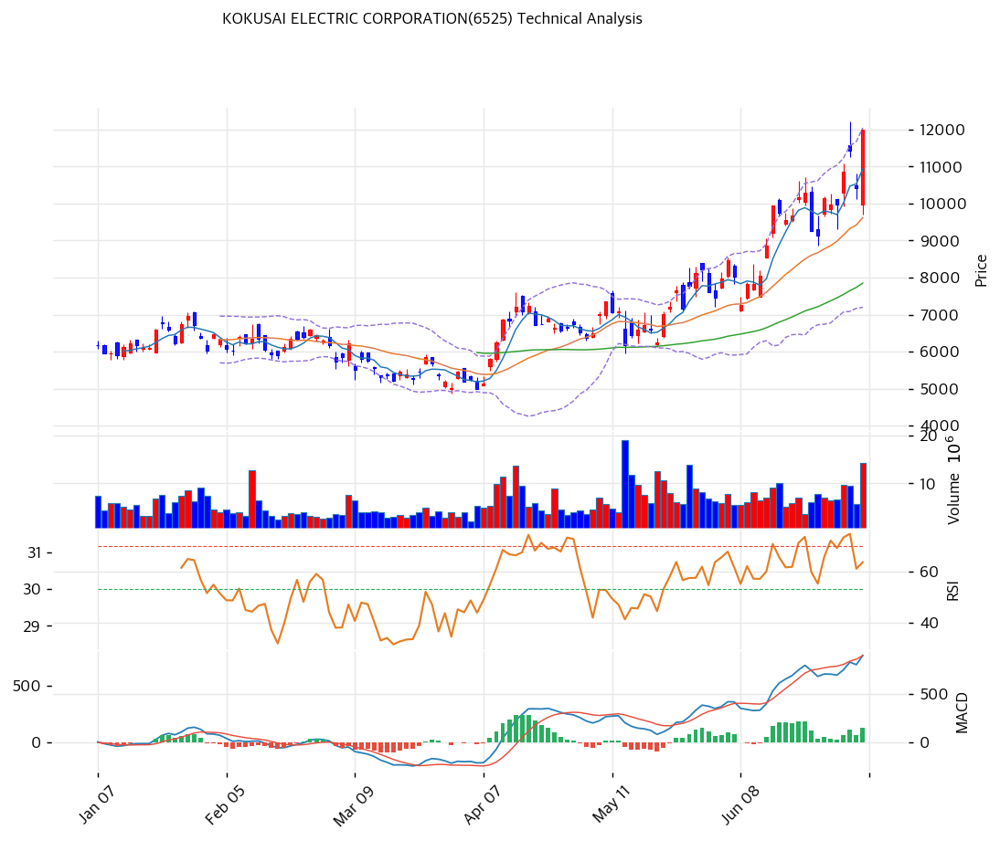

# 코쿠사이 일렉트릭(6525) 기술적 분석

## 차트

> 차트 직독 — 1\~2월 ¥6,000\~7,500 박스권 등락 후 3월 초 ¥5,800선까지 조정(RSI 30%대 근접, 볼린저 하단 부근) → 4월 초 골든크로스 동반 급반등 개시, MA5·MA20·MA60이 순차적으로 우상향 전환 → 5월 ¥7,000\~8,000 단기 눌림목 후 6월 들어 거래량 동반 대추세 가속 → 최근 봉에서 거래량비 2.05배와 함께 ¥12,000 52주 신고가 갱신. 볼린저 상단(¥12,049) 밀착 상태에서 MACD 히스토그램은 계속 확대 중이나, 스토캐스틱은 데드크로스로 단기 숨고르기 가능성을 시사.

## 가격 현황

| 항목 | 값 |
|---|---|
| 현재가 | **¥12,000** (+15.05%) |
| 52주 고/저 | ¥12,000 / ¥2,619 (1년 +358%) |
| 52주 위치 | **100%** (52주 신고가) |
| RSI | **67.9** ⚪ 중립 (과매수 70 직전) |
| MACD | 896 / 764 / +132 (매수, 히스토그램 확대) |
| Stochastic | K=72.8 D=76.2 데드크로스 (중립 영역) |
| 볼린저 | 폭 50.4%, 상단 밀착 |

## 이동평균선

| MA | 가격(¥) | 갭(%) | 위치 |
|---|--:|--:|---|
| MA5 | 10,936 | +9.7 | 상회 |
| MA20 | 9,622 | +24.7 | 상회 |
| MA60 | 7,852 | +52.8 | 상회 |
| MA120 | 6,913 | +73.6 | 상회 |
| MA200 | 5,982 | +100.6 | 상회 |

→ **완전 정배열**(MA5>MA20>MA60>MA120>MA200). MA20 괴리 +24.7%는 과열 경고 임계치(+20%)를 이미 넘었고, MA200 괴리 +100.6%는 52주 저점 대비 폭발적 리레이팅이 이평선 전 구간에 누적됐음을 보여준다. 단기 조정 시 1차 회귀 목표는 MA5(¥10,936) → MA20(¥9,622).

## 시그널 종합

| 구분 | 카운트 |
|---|--:|
| 매수 | 3 (MACD 매수·히스토그램 확대, 이동평균 정배열, 거래량 2.05배 동반) |
| 매도 | 1 (MA20 괴리 +24.7% 과열) |
| 중립 | 3 (RSI 67.9, 볼린저 상단 밀착, 스토캐스틱 데드크로스) |
| **결론** | **🟢 매수우위** (단, 과열 경계 병존) |

## 지지·저항

| 구분 | 가격(¥) | 근거 |
|---|--:|---|
| 강 저항 | 14,840 | 피보나치 1.272 확장 (상단 목표) |
| 저항 | 13,529 | 피봇 R2 |
| 저항 | 12,765 | 피봇 R1 |
| **현재가** | **¥12,000** | 52주 신고가, 볼린저 상단(¥12,049) 근접 |
| 지지 | 10,471 | 피봇 S1 |
| 지지 | 9,947 | 피보나치 0.236 되돌림 |
| 강 지지 | 9,622 | MA20 (정배열 핵심 지지) |
| 지지 | 8,941 | 피봇 S2 |
| 강 지지 | 8,540 | 피보나치 0.382 되돌림 |
| 추가 지지 | 7,852 | MA60 (본격 조정 시) |

## 전략

| 시나리오 | 액션 |
|---|---|
| 보유자 | 홀드 (TP ¥12,240 / SL ¥8,941) — MA20 괴리 과열권 진입, 부분 익절 검토 가능 |
| 신규 진입 1차 | ¥10,471 (피봇 S1, 단기 눌림목) |
| 신규 진입 2차 | ¥9,622 (MA20 회귀, 정배열 핵심 지지) |
| 매도 트리거 | 종가 기준 ¥8,941(피봇 S2) 이탈 — 스토캐스틱 데드크로스 확정 + 거래량 급증 동반 시 |

## 핵심 판단

2026년 4월 이후 52주 저점(¥2,619) 대비 약 4.6배 폭등해 52주 신고가(¥12,000)에 안착한 국면으로, MA5~MA200 전 구간 완전 정배열과 거래량 2.05배 동반은 이번 랠리가 얇은 거래량의 투기적 급등이 아니라 수급이 실린 추세임을 뒷받침한다. 다만 MA20 괴리 +24.7%(과열 경고 임계 +20% 상회)·MA200 괴리 +100.6%·스토캐스틱 데드크로스가 겹치며 단기 되돌림 압력이 누적 중이고, RSI 67.9는 아직 과매수(70) 진입 전이라 상승 여력이 완전히 소진되진 않았지만 속도 조절 구간에 들어설 공산이 크다. Beta 2.197의 초고변동 종목 특성상 반도체 capex 사이클·엔화 흐름 뉴스에 주가가 과민 반응할 수 있어, 보유자는 정배열의 핵심 지지선인 MA20(¥9,622) 이탈을 추세 훼손 신호로 삼아 대응해야 한다.
