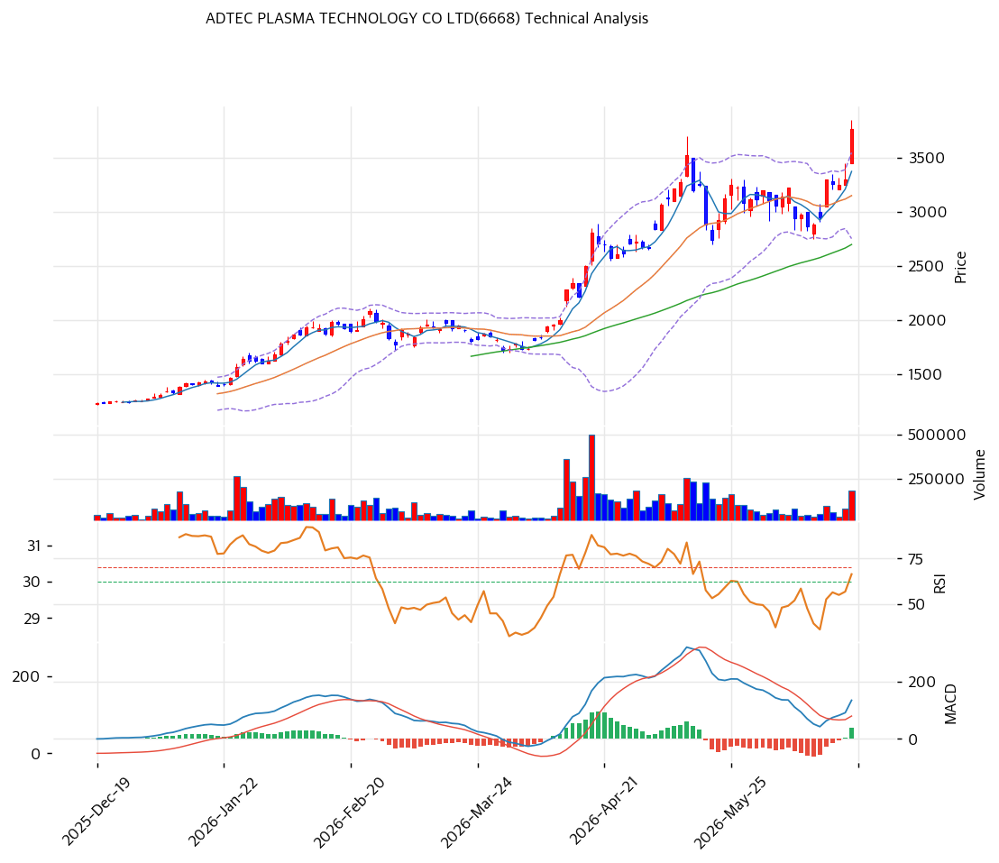

# 아드텍플라즈마테크놀로지(6668) 기술적 분석

2026-06-20 | T2 Technical Analysis

---

## 차트

---

## 1. 가격 현황

| 항목 | 값 |
|------|-----|
| 현재가 | ¥3,765 (+14.09%) |
| 52주 고가 | ¥3,850 |
| 52주 저가 | ¥1,159 |
| 52주 범위 위치 | \~98% (신고가권) |
| 거래량비 | 2.55x (급증) |
| Beta | 1.999 (초고변동) |

> 저점(¥1,159)에서 3.2배 급등, 당일 +14%로 52주 신고가(¥3,765) 경신. 모든 이평선 위 완전 정배열(MA200 대비 **+106%**)로 **극단적 과열**. RSI 70.3·스토캐 84 과매수, 거래량 2.55x. AI 반도체 capex 테마로 소형주 모멘텀 폭발.

---

## 2. 차트 패턴 분석

### 2.1 캔들스틱·구조

| 패턴 | 위치 | 신뢰도 | 해석 |
|------|------|--------|------|
| 포물선 급등·신고가 | ¥3,765 | 중상 | 모멘텀 폭발 |
| 거래량 급증 | 2.55x | 중 | 매물·과열 교차 |
| MA200 +106% 이격 | 극단 | 중상 | 되돌림 압력 |

- **포물선형 급등(parabolic)** (신뢰도: 중상): 저점 3.2배·당일 +14%. 신고가라 위쪽 매물 저항 부재이나 극단 과열.
- **장기 정배열·단기 과열** (신뢰도: 중): 모든 이평선 위, MA200 +106%. 급락 시 낙폭 클 수 있음.

### 2.2 다이버전스

- **과열 정점 경계** (신뢰도: 중): RSI 70.3·스토캐 K=84.4(데드크로스). MACD 매수(확산)이나 스토캐 과매수 데드크로스로 단기 조정 신호 혼재.

---

## 3. 이동평균선 — 극단 정(+)이격

| MA | 값 | 괴리율 | 위치 |
|----|-----|--------|------|
| MA5 | 3,373 | +11.6% | 위 |
| MA20 | 3,150 | +19.5% | 위 |
| MA60 | 2,698 | +39.6% | 위 |
| MA120 | 2,181 | +72.6% | 위 |
| MA200 | 1,829 | +105.8% | 위 |

**해석**: 완전 정배열(aligned True). MA200 대비 +106%로 **극단적 장기 과열**. 통계적으로 강한 되돌림(MA20 ¥3,150·MA60 ¥2,698) 압력. 추세는 강하나 이격 축소 불가피.

---

## 4. 보조 지표

### RSI(14) — 70.3 (과매수 🔴)
70 초과 과매수권. 포물선 급등 정점.

### MACD(12,26,9)
| MACD | Signal | Hist | 크로스 |
|---|---|---|---|
| 134 | 97 | +37 | 매수(확산) |

상승 모멘텀 강하나 급등 막바지 신호일 수 있음.

### 볼린저밴드(20,2σ)
| 상단 | 중단 | 하단 | 밴드폭 |
|---|---|---|---|
| 3,547 | 3,150 | 2,752 | 25.2% |

현재가 ¥3,765는 상단(3,547) 돌파. 과열 신호, 복귀 시 중단(3,150) 되돌림.

### 스토캐스틱
| %K | %D | 크로스 | 판단 |
|---|---|---|---|
| 84.4 | 85.0 | 데드크로스 | 과매수 |

과매수권 데드크로스 → 단기 조정 경계.

---

## 5. 지지/저항

| 구분 | 가격 | 근거 |
|------|------|------|
| 저항 | 5,517 | 피보 1.618 확장 |
| 저항 | 4,881 | 피보 1.382 확장 |
| 저항 | 4,584 | 피보 1.272 확장 |
| 저항 | 4,088 | 피봇 R2 |
| 저항 | 3,927 | 피봇 R1 |
| 저항 | 3,850 | 52주 고가 |
| **현재가** | **3,765** | 신고가 |
| 지지 | 3,547 | 볼린저 상단 |
| 지지 | 3,527 | 피봇 S1·PRZ |
| 지지 | 3,288 | 피봇 S2 |
| 지지 | 3,213 | 피보 0.236 |
| 지지 | 3,150 | MA20·볼린저 중단 |
| 지지 | 2,698 | MA60 |

---

## 6. 시그널 종합

| 지표 | 내용 | 시그널 |
|------|------|--------|
| 차트 패턴 | 포물선 급등·신고가 | 🟢 |
| 이동평균선 | 극단 정배열(과열) | 🔴 |
| RSI | 70.3 — 과매수 | 🔴 |
| MACD | 매수(확산) | 🟢 |
| 볼린저밴드 | 상단 돌파 | 🔴 |
| 스토캐스틱 | 과매수 데드크로스 | 🔴 |
| 거래량 | 2.55x 급증 | ⚪ |

**종합 판단**: 🟢 매수 2개 / 🔴 매도 4개(과열) / ⚪ 중립 1개 → **과열 경계 (모멘텀 vs 극단 과열)**

당일 +14%·52주 신고가의 강한 모멘텀이나, MA200 +106%·RSI 70·스토캐 과매수 데드크로스·볼린저 상단 돌파로 **과열이 극단**이다. ⚠️ **추격 매수 위험**. 소형주·Beta 2.0이라 급락 시 낙폭이 크다. 보유자는 분할 익절, 신규는 이격 축소(MA20 ¥3,150) 후 접근.

---

## 7. 전략 제안

### 보유 중인 경우
- **분할 익절 (과열 관리)**
- 익절: ¥3,927(R1)·¥4,088(R2)·피보 확장(¥4,584) 분할
- 손절: ¥3,288(S2) 이탈 / MA20(¥3,150) 이탈
- 초고변동(Beta 2.0), 트레일링 스톱

### 진입 대기인 경우
- **관망 (추격 금지)**
- 1차: ¥3,150(MA20) 회귀 시 소량
- 2차: ¥2,698(MA60)
- 진입 조건: 포물선 정점·과매수. 이격 축소·실적 가시화 확인 후. 컨센 EPS 하향 유의.
