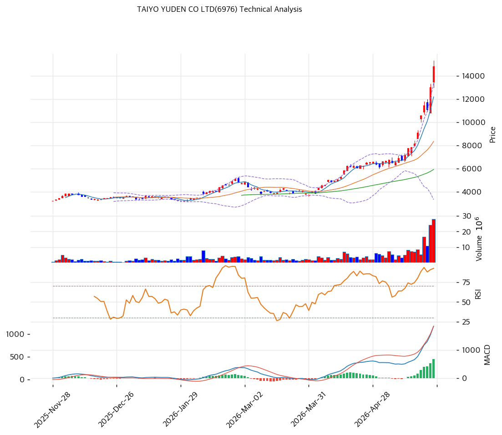

# 다이요유전(6976) 기술적 분석 보고서

---

## 가격 위치

현재가 **¥14,815** — 52주 고가 ¥17,075 근접, 저가 ¥2,257 (주식분할 반영 수정주가) 대비 **1년 극단 급등**. AI 서버 MLCC 수요 + 다운사이클 회복 기대로 일본 전자부품주 중 최강 모멘텀. **RSI 91.6 극단 과매수** — 단기 과열 명확.

## 이동평균선 / 모멘텀

장기 우상향 정배열 추정 (1년 급등). 모든 이동평균선 위에서 거래되며 단기 이격도 매우 큼. AI MLCC 테마 + 업사이클 기대가 추세를 견인했으나, 이격도 극단으로 단기 조정 임박 신호.

**RSI 91.6 (극단 과매수 🔴)** — 90 초과는 역사적 극단 수준. 단기 급등 후 되돌림 가능성 높음. Beta 1.438로 시장 대비 변동성 큼. AI 테마 모멘텀이 강하나 기술적으로 과열 정점.

## 종합 / 전략

종합 시그널 **중립** (추세 강세 vs 극단 과매수 상충).

- 저항: **¥17,075 (52주 고가)** / 심리적 ¥15,000\~16,000
- 지지: ¥13,000\~13,500 (단기) / ¥11,000\~12,000 (중기 이평) / ¥9,000\~10,000 (깊은 조정)

전략: **HOLD / 추격 매수 강력 비추** — RSI 91.6 극단 과매수. 1년 급등 후 단기 -20\~30% 조정 위험 높음. **¥12,000\~13,000 단기 조정 + ¥10,000\~11,000 깊은 조정 시 분할 매수** 권고. AI MLCC 업사이클 + FY2026 실적 회복이 중장기 추세 동력이나, 현 시점 신규 진입은 조정 대기 필수. 변동성(Beta 1.44) 주의.
