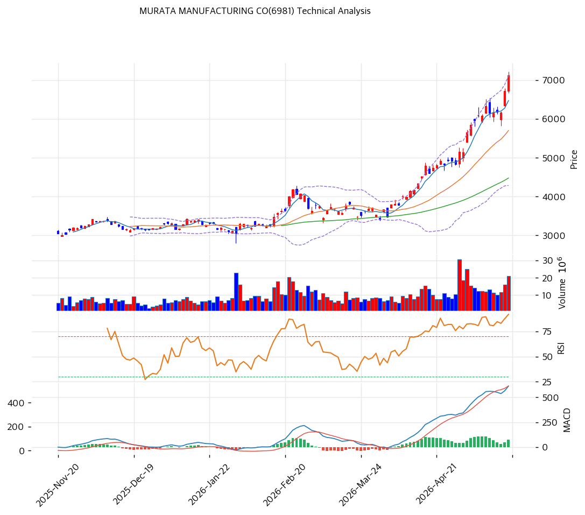

# 기술적분석

## 차트

> 차트 직독 — 2025.11\~2026.01 ¥3,000\~3,300 박스권 → 2026.2 SAW 굿윌 ¥438억 손상 공시 직후 갭다운, ¥3,500선에서 지지 형성 → 2026.3 중순부터 V자 반등 진입 → 2026.4\~5 단기 +58% 폭주(¥4,500→¥7,130). 최근 봉에서 윗꼬리·장대음봉 혼재, 볼린저 상단(¥7,116) 강한 이탈 직후 단기 -11% 되돌림 발생. MACD 히스토그램은 아직 우상향이나 RSI 85.8·MA200 +111% 극단 발산은 평균회귀 압력 누적을 시사.

## 가격 현황

| 항목         | 값                              |
| ---------- | ------------------------------ |
| 현재가        | **¥7,130** (+5.99%)            |
| 52주 고/저    | ¥8,147 / ¥2,018 (1년 +254%)     |
| 52주 위치     | **100%** (52주 고가권 밀착)          |
| RSI        | **85.8 🔴 과매수** (극단 구간)        |
| MACD       | 614 / 539 / +75 (매수, 히스토그램 확대) |
| Stochastic | K=90.7 D=85.2 골든크로스 (과매수 영역)   |
| 볼린저        | 폭 49.7%, **상단(¥7,116) 이탈**     |

## 이동평균선

| MA    | 가격(¥) |       갭(%) | 위치 |
| ----- | ----: | ---------: | -- |
| MA5   | 6,474 |      +10.1 | 상회 |
| MA20  | 5,700 |      +25.1 | 상회 |
| MA60  | 4,476 |      +59.3 | 상회 |
| MA120 | 3,862 |      +84.6 | 상회 |
| MA200 | 3,379 | **+111.0** | 상회 |

→ **완전 정배열** + 가속 발산. MA20 갭 +25%·MA200 갭 +111%는 1년 +254% 폭주의 누적치이며 통계적 평균회귀 압력이 극단 영역. 통상 MA20 +15% 초과 시 단기 조정 임박 시그널 작동. 1차 회귀 목표 MA5(¥6,474) → 2차 MA20(¥5,700).

## 시그널 종합

| 구분     |                                   카운트 |
| ------ | ------------------------------------: |
| 매수     |                   2 (MACD, MA 정배열 추세) |
| 매도     | 3 (RSI 85.8, Stoch 90.7, MA20 갭 +25%) |
| 중립     |               2 (BB 상단 이탈, 거래량 1.57x) |
| **결론** |            **🔴 매도우위 — 단기 정점, 조정 임박** |

## 지지·저항

| 구분      |      가격(¥) | 근거                    |
| ------- | ---------: | --------------------- |
| 강 저항    |      8,657 | 피보나치 1.272 확장 (목표 상단) |
| 저항      |      8,147 | 52주 고가                |
| 저항      |      7,351 | 피봇 R1 (단기 1차 저항)      |
| **현재가** | **¥7,130** | 52주 신고가권, BB 상단       |
| 지지      |      6,784 | 피봇 S1 (1차 단기 지지)      |
| 지지      |      6,456 | PRZ 약 (피봇 S2 + MA5)   |
| 지지      |      5,985 | 피보나치 0.236 되돌림        |
| 강 지지    |      5,700 | MA20·볼린저 중심선 (핵심 지지)  |
| 강 지지    |      5,216 | 피보나치 0.382 되돌림        |
| 추가 강 지지 |      4,596 | 피보나치 0.5 되돌림, MA60 인근 |

## 전략

| 시나리오     | 액션                                                                             |
| -------- | ------------------------------------------------------------------------------ |
| 보유자      | **비중축소 30\~50%** (TP ¥7,273 / SL ¥6,438) — RSI 85.8 + SAW 굿윌 손상(¥438억) 갭다운 리스크 |
| 신규 진입 1차 | ¥6,456\~6,784 (PRZ + 피봇 S1, 단기 풀백 -5% 구간)                                      |
| 신규 진입 2차 | ¥5,700 (MA20 회귀, 본격 조정 시 핵심 지지 -20%)                                           |
| 매도 트리거   | 종가 기준 ¥6,438 이탈 (피봇 S2) — MACD 데드크로스·거래량 동반 시 즉시 손절                            |

## 핵심 판단

MA200 +111% / RSI 85.8 / 스토캐스틱 90.7 / BB 상단 이탈 — 4중 과열 시그널 누적. 1년 +254% 폭주는 단원주(100주) 매물 출회 임박 + 2026.2 SAW 굿윌 ¥438억 손상으로 영업이익 -50% YoY 충격 미반영 상태에서의 모멘텀 추격일 개연성이 높다. MACD 양수권 유지가 추세 자체는 살아있음을 시사하나 **신고가 추격 매수는 금물**. 엔화 약세·BoJ 정상화 지연 매크로는 수출 우호이나 가격 선반영. 보유자는 ¥7,000\~7,300 부분 익절, 신규는 MA20(¥5,700) 또는 피보나치 0.382(¥5,216) 회귀 시 분할 진입이 리스크-리워드 우월.
