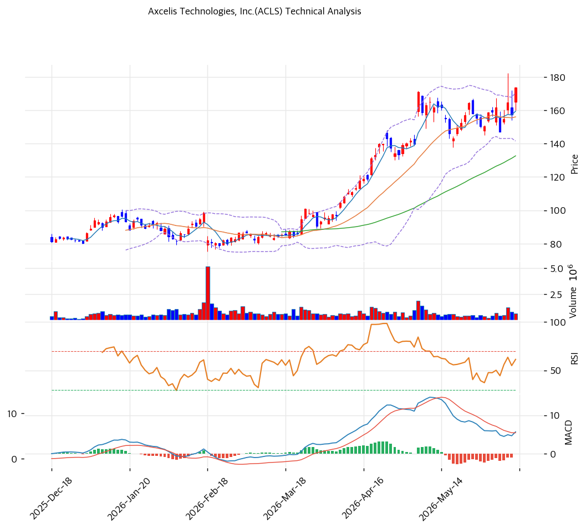

# 기술적분석

## 차트

## 가격 현황

| 항목         | 값                     |
| ---------- | --------------------- |
| 현재가        | **$173.57** (+10.25%) |
| 52주 고/저    | $182.19 / $64.26      |
| 52주 위치     | 100.0%                |
| RSI        | 62.3 (중립)             |
| MACD       | 매도                    |
| Stochastic | 골든크로스 (중립)            |
| 볼린저        | 상단 근접                 |

## 이동평균선

| MA    | 가격($) |  갭(%) | 위치 |
| ----- | ----: | ----: | -- |
| MA5   |   159 |  +8.8 | 위  |
| MA20  |   156 | +11.2 | 위  |
| MA60  |   133 | +30.8 | 위  |
| MA120 |   110 | +58.0 | 위  |
| MA200 |   100 | +73.5 | 위  |

→ **완전 정배열** 강세. MA200 대비 +73.5% 큰 괴리로 강한 상승 추세이나 단기 과열. 당일 +10.25% 급등으로 52주 신고가권. MACD는 매도 신호로 단기 모멘텀 혼조.

## 시그널 종합

| 구분     |                            카운트 |
| ------ | -----------------------------: |
| 매수     |                              1 |
| 매도     |                              1 |
| 중립     |                              4 |
| **결론** | **중립 (강세 추세 + 단기 과열·MACD 혼조)** |

## 지지·저항

| 구분      |       가격($) | 근거         |
| ------- | ----------: | ---------- |
| 강 저항    |         182 | 52주 고가     |
| 저항      |         178 | 피봇 R1      |
| **현재가** | **$173.57** | 신고가권       |
| 지지      |         164 | 피봇 S1      |
| 강 지지    |    155\~156 | MA20·피봇 S2 |

## 전략

| 시나리오     | 액션                        |
| -------- | ------------------------- |
| 보유자      | 분할 익절 (TP $182 / SL $155) |
| 신규 진입 1차 | $164 (피봇 S1)              |
| 신규 진입 2차 | $156 (MA20 눌림)            |
| 매도 트리거   | $155 종가 이탈 (MA20·추세 훼손)   |

## 핵심 판단

ACLS는 $64 → $173.6로 1년 2.7배 급등한 강한 상승 추세주로, 당일 +10.25% 급등으로 52주 신고가권에 진입했다. 완전 정배열로 추세가 강하나, MA200 대비 +73.5% 과열·MACD 매도 신호의 혼조로 종합은 중립이다. AI/메모리 이온주입 회복이 추세를 받치나, FY26Q1 OPM 4% 급락·SiC 둔화가 펀더멘털 역풍이며 애널 목표가($102)를 70% 초과한 상태다. 추격은 위험하며 $156\~164(MA20·피봇 S1) 눌림목 분할이 정석이다. 흑자·순현금 우량 재무가 하방을 지지하나, 마진 정상화 확인 전 변동성에 유의해야 한다.
