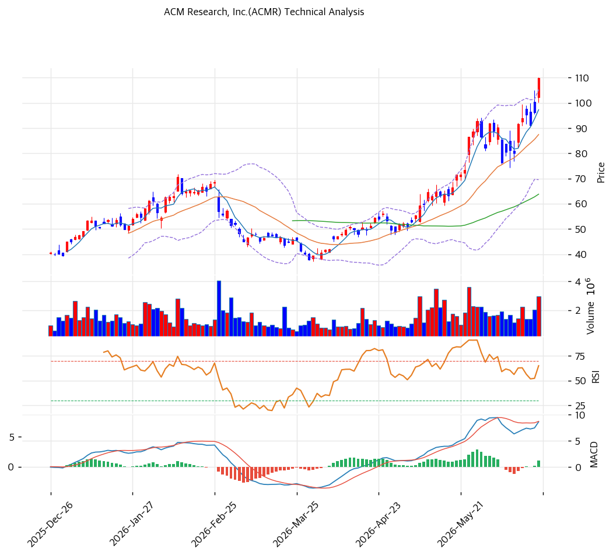

# 기술적분석

2026-06-19 | T2 Technical Analysis

***

## 차트

***

## 1. 가격 현황

| 항목        | 값            |
| --------- | ------------ |
| 현재가       | $109.87      |
| 52주 고가    | $110.18      |
| 52주 저가    | $23.03       |
| 52주 범위 위치 | 99% (사실상 고가) |
| 거래량비      | 1.65x (증가)   |
| Beta      | 1.98 (고변동)   |

> 저점($23.03)에서 약 5배 급등해 52주 고가($110.18) 직전(99%)에서 신고가를 도전. 중국 반도체 국산화·실적 재가속이 견인. 모든 이평선 위 강한 정배열, MA200 대비 +122%로 장기 과열. RSI 72.2 과매수권. 거래량 1.65x 증가로 상승 모멘텀 동반.

***

## 2. 차트 패턴 분석

### 2.1 캔들스틱 패턴

| 패턴         | 위치                   | 신뢰도 | 해석     |
| ---------- | -------------------- | --- | ------ |
| 52주 신고가 도전 | $109.87 ≈ 고가 $110.18 | 중상  | 돌파 시도  |
| 강세 지속      | MACD 매수·골든크로스        | 중   | 상승 모멘텀 |
| RSI 과매수    | 72.2                 | 중   | 단기 과열  |

※ 주요 캔들 패턴: 망치형, 역망치형, 장악형, 도지, 샛별/석별, 적삼병/흑삼병, 하라미, 유성형, 교수형 등

### 2.2 가격 구조 패턴

* **강한 상승 추세 + 신고가 돌파 시도** (신뢰도: 중상) $23→$110 대상승 후 52주 고가 직전. 정배열·MACD 매수 전환으로 추세 강건. 돌파 시 피보 확장($114·$127) 목표.
* **단기 과열 부담** (신뢰도: 중) RSI 72.2·스토캐 78.8 과매수권, 밴드폭 40.9% 고변동. 돌파 실패 시 MA20($87)·MA60($64)으로 되돌림 갭 큼.

※ 주요 구조 패턴: 이중천정/바닥, 삼각수렴, 쐐기형, 깃발형, 페넌트, 컵앤핸들, 박스권 등

### 2.3 다이버전스

* **상승 모멘텀 지속·과매수 경계** (신뢰도: 중) MACD 매수 전환(확산)·스토캐 골든크로스로 상승 모멘텀. 단 RSI 72.2 과매수로 단기 조정 시 되돌림 가능.

※ RSI·MACD 기반 | 상승 다이버전스 = 가격↓ 지표↑, 하락 다이버전스 = 가격↑ 지표↓

### 2.4 패턴 종합 판단

저점 대비 5배 급등 후 52주 고가($110.18) 직전(99%)에서 신고가를 도전하는 강세 국면. MACD 매수 전환(확산)·스토캐 골든크로스로 상승 모멘텀이 살아 있으나, RSI 72.2·스토캐 78.8 과매수권·MA200 대비 +122% 극도 과열이 부담이다. **신고가($110.18) 돌파·안착 시 피보 확장($114·$127)**, 실패 시 MA20($87)→MA60($64)까지 되돌림 갭이 크다. 밴드폭 40.9% 고변동·중국 센티먼트 의존으로 추격보다 분할·돌파 확인이 유효.

***

## 3. 이동평균선 — 강한 정배열·과열

| MA    | 값   | 현재가 괴리율 | 위치 |
| ----- | --- | ------- | -- |
| MA5   | $97 | +12.9%  | 위  |
| MA20  | $87 | +25.7%  | 위  |
| MA60  | $64 | +72.2%  | 위  |
| MA120 | $59 | +87.8%  | 위  |
| MA200 | $50 | +121.9% | 위  |

**해석**: 모든 이평선 위 완전 정배열(aligned True). MA20 대비 +25.7%, MA200 대비 +122%로 **극도의 과열**. 강세 추세는 명확하나 단기 조정 시 낙폭이 클 수 있다. MA20($87)이 1차 지지선, 이탈 시 MA60($64)까지 큰 공백.

***

## 4. 보조 지표

### RSI(14) — 72.2 (과매수 🔴)

70 상회 과매수권. 강한 상승이나 단기 조정·횡보 가능성.

### MACD(12,26,9)

| 항목        | 값         |
| --------- | --------- |
| MACD      | \~9.0     |
| Signal    | \~8.0     |
| Histogram | \~+1.0    |
| 크로스 상태    | 매수 전환(확산) |

**해석**: MACD가 Signal 상향 돌파(매수 전환), 히스토그램 양(+) 확대 → 상승 모멘텀 강화. 추세 지지 신호.

### 볼린저밴드(20, 2σ)

| 항목        | 값           |
| --------- | ----------- |
| 상단        | $105        |
| 중단 (MA20) | $87         |
| 하단        | $70         |
| 밴드 폭      | 40.9% (고변동) |
| 현재 위치     | 상단 돌파       |

**해석**: 현재가 $109.87은 상단($105) 돌파. 밴드폭 40.9% 매우 큼(고변동). 상단 돌파 후 안착 시 추가 상승이나 과열, 중단($87) 이탈 시 하단($70) 시험.

### 스토캐스틱(14, 3, 3)

| 항목      | 값      |
| ------- | ------ |
| Slow %K | 78.8   |
| Slow %D | 76.0   |
| 크로스 상태  | 골든크로스  |
| 판단      | 과매수 근접 |

**해석**: K=78.8 과매수(80) 근접, 골든크로스로 상승 모멘텀. 80 상회 시 과매수 진입·조정 경계.

***

## 5. 지지/저항 — 추세선 · 피보나치 · PRZ 통합

### 5.1 종합 지지/저항 테이블

| 구분      | 가격          | 근거                      |
| ------- | ----------- | ----------------------- |
| 저항      | $127        | 피보 1.618 확장             |
| 저항      | $114        | 피보 1.382 확장·피봇R1·PRZ(약) |
| 저항      | $113        | 피봇 R1                   |
| 저항      | $110.18     | 52주 고가                  |
| **현재가** | **$109.87** | 신고가 도전                  |
| 지지      | $108        | 피보 1.272 확장             |
| 지지      | $105        | 볼린저 상단                  |
| 지지      | $103        | 피봇 S1                   |
| 지지      | $97         | 피봇 S2·MA5·PRZ(중)        |
| 지지      | $87         | MA20·볼린저 중단             |
| 지지      | $80         | 피보 0.236                |
| 지지      | $72         | 피보 0.382                |
| 지지      | $70         | 볼린저 하단                  |
| 지지      | $64         | MA60                    |

***

## 6. 시그널 종합

| 지표    | 내용               | 시그널 |
| ----- | ---------------- | --- |
| 차트 패턴 | 정배열·신고가 도전       | 🟢  |
| 이동평균선 | 완전 정배열(과열)       | 🟢  |
| RSI   | 72.2 — 과매수       | 🔴  |
| MACD  | 매수 전환(확산)        | 🟢  |
| 볼린저밴드 | 상단 돌파, 밴드폭 40.9% | 🔴  |
| 스토캐스틱 | 골든크로스, K=78.8    | ⚪   |
| 거래량   | 1.65x 증가         | ⚪   |

**종합 판단**: 🟢 매수 2개 / 🔴 매도 2개 / ⚪ 중립 3개 → **중립 (강세 vs 과열 상충)**

저점 대비 5배 급등 후 52주 고가 직전에서 신고가 도전. MACD 매수 전환·정배열의 강세 vs RSI 72.2·볼린저 상단 돌파의 과열이 팽팽히 상충. **신고가($110.18) 돌파·안착이 단기 분수령**이며, 돌파 시 피보 확장($114·$127), 실패 시 MA20($87)→MA60($64)까지 갭이 크다. 밴드폭 40.9% 고변동·중국 센티먼트 의존이라 추격보다 **돌파 확인 후 추격 or 눌림목 분할**이 유효.

***

## 7. 전략 제안

### 보유 중인 경우

* **홀드 (신고가 트레일링)**
* 익절 라인: $114(피보 1.382)·$127(피보 1.618)·신고가 돌파 시 트레일링
* 손절 라인: $97 (피봇 S2·PRZ 이탈)
* 리스크/리워드: 과매수·고변동(Beta 1.98), 분할 익절·트레일링 스톱

### 진입 대기인 경우

* **돌파 확인 후 추격 or 눌림목 분할**
* 1차 진입가: $97\~103 (피봇 S1/S2·MA5)
* 2차 진입가: $87 (MA20·볼린저 중단)
* 진입 조건: 5배 급등·과매수·고밸류 감안, $110.18 돌파 안착 확인 후 추격 또는 MA20 눌림 분할. MA20 이탈 시 MA60($64)대까지 관망. 중국 규제·실적 가이드 확인 권장.
