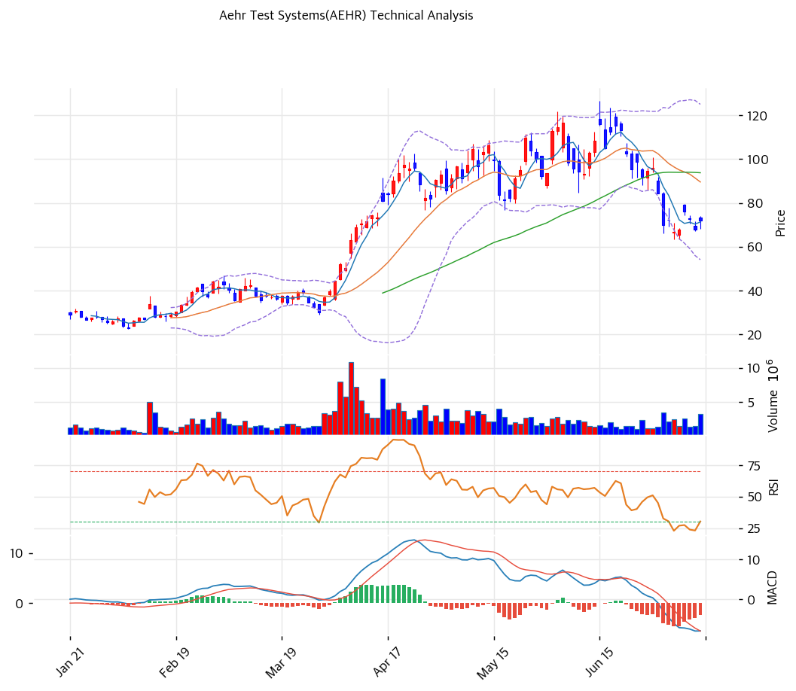

# Aehr Test Systems(AEHR) 기술적 분석

## 차트

## 가격 현황

| 항목 | 값 |
|---|---|
| 현재가 | **$72.01** (+5.87% — FY26 Q4 실적 발표 반응) |
| 52주 고/저 | $116.58 / $14.78 |
| 52주 위치 | 56.2% |
| RSI | 40.4 (중립 — 침체권 반등 초입) |
| MACD | -8.0 / -6.0 / -2.0 매도 구간 (히스토그램 축소) |
| Stochastic | K=16.5 D=16.3 골든크로스 (과매도) |
| 볼린저 | 폭 79.1%, 중간 (하단 $54 반등 후 복귀 중) |

## 이동평균선

| MA | 가격($) | 갭(%) | 위치 |
|---|--:|--:|---|
| MA5 | 71.0 | +0.9 | 위 |
| MA20 | 90.0 | -19.6 | 아래 |
| MA60 | 94.0 | -23.2 | 아래 |
| MA120 | 66.0 | +8.6 | 위 |
| MA200 | 50.0 | +44.9 | 위 |

→ **비정배열** — 3월 말\~6월의 수직 랠리($35→$116) 후 7월 급락($66)으로 단기(MA20·60) 아래, 장기(MA120·200) 위에 끼인 형태. 중기 조정 국면이지만 장기 상승 구조($50 MA200 우상향)는 훼손되지 않았다. 어제 실적 갭업으로 MA5 회복 — 다음 관문은 MA20($90).

## 시그널 종합

| 구분 | 카운트 |
|---|--:|
| 매수 | 1 |
| 매도 | 1 |
| 중립 | 4 |
| **결론** | **중립 (급락 후 실적발 반등 시도)** |

## 지지·저항

| 구분 | 가격($) | 근거 |
|---|--:|---|
| 강 저항 | 116.58 | 52주 고가 |
| 저항 | 89\~90 | PRZ(약) — 피보나치 0.786 + MA20 |
| 저항 | 75.0 | 피봇 R1 |
| **현재가** | **$72.01** | — |
| 지지 | 69.0 | 피봇 S1 |
| 강 지지 | 66.0 | PRZ(약) — 피봇 S2 + MA120 (7월 저점권) |

## 전략

| 시나리오 | 액션 |
|---|---|
| 보유자 | 홀드 (TP $89\~90 1차 / SL $64 — MA120·7월 저점 이탈) |
| 신규 진입 1차 | $66\~69 (MA120+피봇 S 지지 확인 — 실적 갭 되돌림 시) |
| 신규 진입 2차 | $54\~57 (볼린저 하단 — 급락 재개 시 낙폭과대 구간) |
| 매도 트리거 | $64 종가 이탈 (조정 연장 → $50 MA200까지 열림) / $90 돌파 실패 반복 시 반등분 축소 |

## 핵심 판단

1년간 $14.8 → $116.6 → $66 → $72로 움직인 Beta 3.2의 초고변동성 종목이다. 7월 급락으로 4\~6월 랠리의 과열(볼린저 폭 79%)을 해소한 자리에서, FY26 Q4 실적·수주 서프라이즈(+5.87%, 거래량 1.91x)가 반등의 트리거로 들어왔다. 기술적으로는 $66(MA120+피봇 S2) 지지 위에서 $90(MA20+피보나치 0.786) 회복 여부가 1차 시험대 — 돌파 시 $95\~108의 피보나치 저항대, 실패 시 $54\~66 박스 재확인이다. 공매도 14%의 얇은 스몰캡 특성상 가이던스 뉴스플로우에 따라 갭 변동이 반복될 것 — 기술적 레벨보다 실적 이벤트가 우선하는 구간임을 감안해야 한다.
