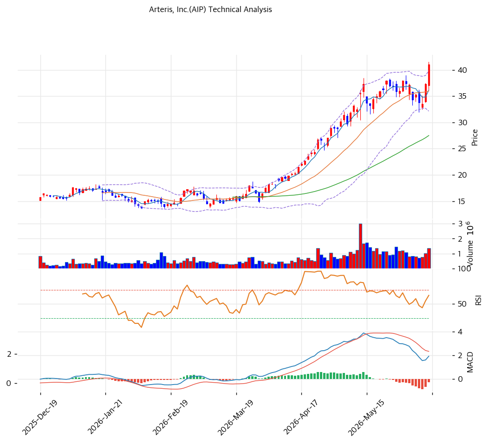

# 기술적분석

2026-06-15 | T2 Technical Analysis

***

## 차트

***

## 1. 가격 현황

| 항목        | 값               |
| --------- | --------------- |
| 현재가       | $41.0           |
| 52주 고가    | $41.56          |
| 52주 저가    | $8.01           |
| 52주 범위 위치 | \~100% (신고가 근접) |
| 거래량       | 20일 평균 대비 1.2x  |

> 52주 저점($8.01) 대비 약 5배 폭등한 신고가 근접. 완전 정배열·강세 추세이나 MA200 대비 +126%의 극단적 장기 과열이 공존한다.

***

## 2. 차트 패턴 분석

### 2.1 캔들스틱 패턴

| 패턴             | 위치       | 신뢰도 | 해석             |
| -------------- | -------- | --- | -------------- |
| 52주 신고가 근접     | 당일 ($41) | 강   | 매수 — 신고가 돌파 시도 |
| 완전 정배열         | 최근       | 강   | 매수 — 모든 MA 위   |
| MA200 +126% 괴리 | —        | 중   | 단기 과열 경계       |

※ 주요 캔들 패턴: 망치형, 역망치형, 장악형, 도지, 샛별/석별, 적삼병/흑삼병, 하라미, 유성형, 교수형 등

### 2.2 가격 구조 패턴

* **신고가 돌파 시도 ($41 ≈ 52주 고가 $41.56)** (신뢰도: 강) 실적·선행지표(ACV·RPO) 가속 모멘텀으로 신고가 부근. 피보나치 1.272 확장($51)이 다음 상단 목표.
* **장기 상승 추세 과열** (신뢰도: 강) MA200($18) 대비 +126%의 극단적 괴리로 1년 5배 강세. 추세 강하나 평균회귀 압력 큼.

※ 주요 구조 패턴: 이중천정/바닥, 헤드앤숄더, 삼각수렴, 쐐기형, 깃발형, 페넌트, 컵앤핸들, 박스권 등

### 2.3 다이버전스

* **뚜렷한 다이버전스 없음 — 추세 추종** (신뢰도: 중) 가격 신고가와 RSI 68.1 상승 동행. MACD는 0선 위 고원에서 히스토그램 소폭 둔화(매도 전환 근접)로 단기 모멘텀 정체 신호.

※ RSI·MACD 기반 | 상승 다이버전스 = 가격↓ 지표↑, 하락 다이버전스 = 가격↑ 지표↓

### 2.4 패턴 종합 판단

52주 신고가에 근접한 **강한 상승 추세** 국면이다. 완전 정배열·RSI 68의 강세이나 MA200 +126%·MACD 히스토그램 둔화의 단기 과열·정체가 공존한다. 실적·선행지표가 펀더멘털을 받치나 주가가 애널 목표가($35\~40)를 상회해 추격 손익비가 불리하다. 눌림목(MA20 $36·피보 0.236 $34) 확인이 안전하다.

***

## 3. 이동평균선 — 완전 정배열 (강세)

| MA    | 값   | 현재가 괴리율 | 위치 |
| ----- | --- | ------- | -- |
| MA5   | $36 | +13.4%  | 위  |
| MA20  | $36 | +13.9%  | 위  |
| MA60  | $28 | +49.1%  | 위  |
| MA120 | $22 | +89.5%  | 위  |
| MA200 | $18 | +126.3% | 위  |

**해석**: 현재가 > 모든 MA의 완전 정배열 강세. 단기선(MA5·20 $36)과 +14% 괴리로 단기 과열. MA200($18) 대비 +126%의 극단적 괴리는 1년 폭등의 결과로 평균회귀 압력이 크다. 조정 시 MA20($36)·MA60($28)이 지지대.

***

## 4. 보조 지표

### RSI(14) — 68.1 (중립, 과매수 근접)

신고가 동반 상승으로 과매수(70) 직전. 강한 모멘텀이나 단기 과열 신호.

### MACD(12,26,9)

| 항목        | 값                   |
| --------- | ------------------- |
| MACD      | \~2.0               |
| Signal    | \~2.0               |
| Histogram | \~0                 |
| 크로스 상태    | 매도 전환 근접 (히스토그램 둔화) |

**해석**: MACD가 고원에서 Signal과 수렴, 히스토그램이 0 부근으로 둔화 — 상승 모멘텀 정체·단기 매도 전환 가능성. 0선 위 강세는 유지.

### 볼린저밴드(20, 2σ)

| 항목        | 값        |
| --------- | -------- |
| 상단        | $40      |
| 중단 (MA20) | $36      |
| 하단        | $32      |
| 밴드 폭      | 21.4%    |
| 현재 위치     | 상단 근접/돌파 |

**해석**: 현재가 $41이 밴드 상단($40) 상회 — 강한 상승 압력이나 단기 과열. 밴드 폭 21%로 변동성 보통. 되돌림 시 중단(MA20 $36) 여지.

### 스토캐스틱(14, 3, 3)

| 항목      | 값      |
| ------- | ------ |
| Slow %K | 64.3   |
| Slow %D | 46.0   |
| 크로스 상태  | 골든크로스  |
| 판단      | 중립(상승) |

***

## 5. 지지/저항 — 추세선 · 피보나치 · PRZ 통합

### 5.1 피보나치 되돌림/확장

| 구분                 | 비율    | 가격  | 현재가 대비 |
| ------------------ | ----- | --- | ------ |
| 확장                 | 1.272 | $51 | +24.4% |
| **현재가/Swing High** | —     | $41 | —      |
| 되돌림                | 0.236 | $34 | -17.1% |
| 되돌림                | 0.382 | $29 | -29.3% |
| 되돌림                | 0.5   | $25 | -39.0% |
| 되돌림                | 0.618 | $21 | -48.8% |
| 되돌림                | 0.786 | $15 | -63.4% |

※ 피보나치 기준: 장기 상승 추세. 신고가로 확장 구간($51=1.272) 진입

### 5.2 종합 지지/저항 테이블

| 구분      | 가격      | 근거             |
| ------- | ------- | -------------- |
| 저항      | $51     | 피보나치 1.272 확장  |
| 저항      | $43     | 피봇 R1          |
| **현재가** | **$41** | 신고가·볼린저 상단     |
| 지지      | $38     | 피봇 S1          |
| 지지      | $36     | MA20·MA5 (PRZ) |
| 지지      | $34     | 피보 0.236·피봇 S2 |
| 지지      | $28     | MA60           |

***

## 6. 시그널 종합

| 지표    | 내용                 | 시그널 |
| ----- | ------------------ | --- |
| 차트 패턴 | 신고가 근접, 단기 과열      | 🟢  |
| 이동평균선 | 완전 정배열, MA20 +14%  | 🟢  |
| RSI   | 68.1 — 과매수 근접      | ⚪   |
| MACD  | 히스토그램 둔화(매도 전환 근접) | ⚪   |
| 볼린저밴드 | 상단 돌파              | ⚪   |
| 스토캐스틱 | 골든크로스, K=64.3      | ⚪   |
| 거래량   | 1.2x — 보통          | ⚪   |

**종합 판단**: 🟢 매수 1개 / 🔴 매도 1개 / ⚪ 중립 4개 (요약 시그널 buy1/sell1/neutral4) → **중립\~매수우위 (강추세 + 단기 과열)**

52주 신고가에 근접한 강세 추세이나 MA200 +126%·MACD 둔화의 단기 과열·정체가 공존한다. 실적·선행지표가 펀더멘털을 받치지만 주가가 애널 목표가를 상회해 추격 손익비가 불리하다. 추격보다 눌림목(MA20 $36·피보 0.236 $34) 대응이 정석.

***

## 7. 전략 제안

### 보유 중인 경우

* **홀드 (분할 익절 병행)**
* 익절 라인: $43(피봇 R1) 1차 / $51(피보 1.272) 2차
* 손절 라인: $34 (MA20·피보 0.236 이탈)
* 리스크/리워드: 신고가·목표가 상회로 신규 손익비 불리

### 진입 대기인 경우

* **추격 자제, 눌림목 대기**
* 1차 진입가: $36 (MA20·MA5)
* 2차 진입가: $34 (피보 0.236·피봇 S2)
* 진입 조건: 신고가·고밸류 추격은 위험. 조정 시 MA20($36)·피보 0.236($34) 지지 확인 후 분할. ACV·RPO 선행지표 가속과 분기 실적이 펀더멘털 하방 지지.
