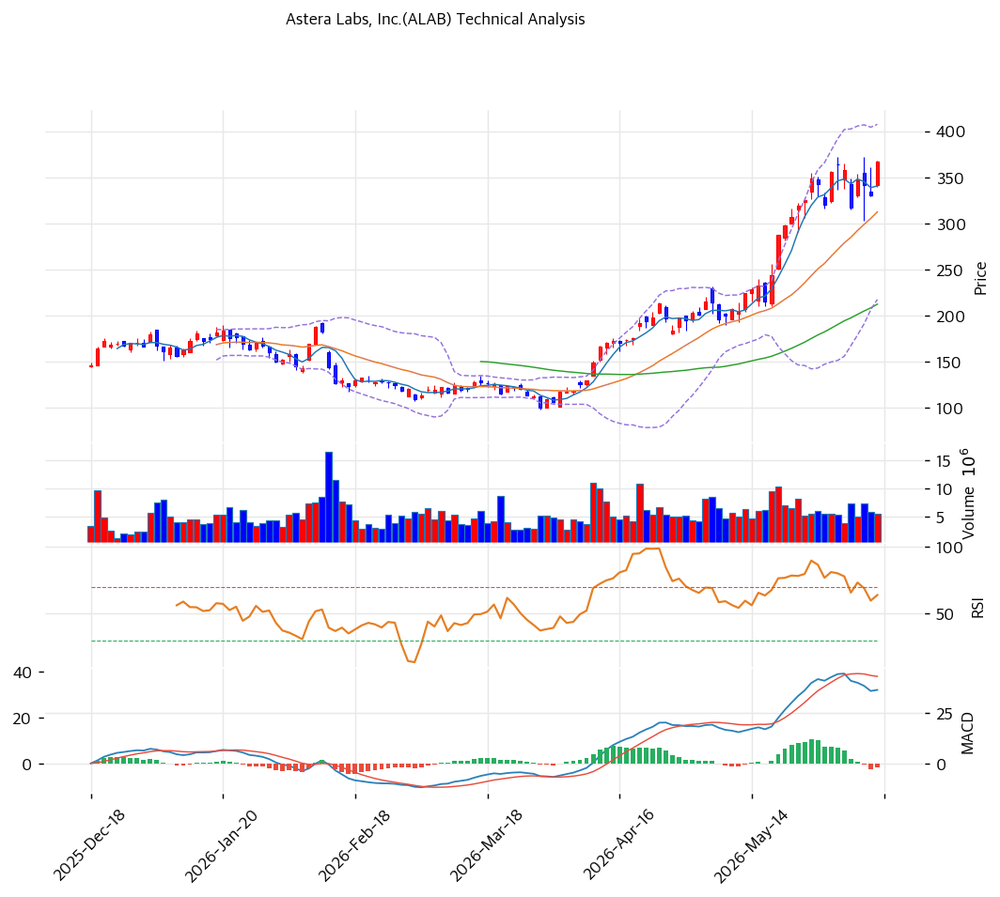

# Astera Labs(ALAB) 기술적 분석

## 차트

## 가격 현황

| 항목 | 값 |
|---|---|
| 현재가 | **$367.47** (+11.07%) |
| 52주 고/저 | $372.37 / $84.78 |
| 52주 위치 | 100.0% |
| RSI | 66.7 (중립, 과매수 근접) |
| MACD | 매도 |
| Stochastic | 골든크로스 (중립) |
| 볼린저 | 상단 근접 |

## 이동평균선

| MA | 가격($) | 갭(%) | 위치 |
|---|--:|--:|---|
| MA5 | 341 | +7.9 | 위 |
| MA20 | 313 | +17.6 | 위 |
| MA60 | 212 | +73.0 | 위 |
| MA120 | 181 | +102.6 | 위 |
| MA200 | 181 | +102.8 | 위 |

→ **완전 정배열** 강세. MA200 대비 +102.8%의 극단 괴리로 매우 강한 상승 추세이나 단기 과열 극심. 당일 +11.07% 급등으로 52주 신고가 경신(단, 거래량 0.87x 미동반). beta 3.96의 초고변동성.

## 시그널 종합

| 구분 | 카운트 |
|---|--:|
| 매수 | 1 |
| 매도 | 1 |
| 중립 | 4 |
| **결론** | **중립 (강세 추세 + 극단 과열·MACD 혼조)** |

## 지지·저항

| 구분 | 가격($) | 근거 |
|---|--:|---|
| 강 저항 | 377 | 피봇 R1 |
| 저항 | 372 | 52주 고가 |
| **현재가** | **$367.47** | 신고가권 |
| 지지 | 349 | 피봇 S1 |
| 강 지지 | 313\~330 | MA20·피봇 S2 |

## 전략

| 시나리오 | 액션 |
|---|---|
| 보유자 | 분할 익절 (TP $377 / SL $313) |
| 신규 진입 1차 | $330 (피봇 S2) |
| 신규 진입 2차 | $313 (MA20 눌림) |
| 매도 트리거 | $313 종가 이탈 (MA20·추세 훼손) |

## 핵심 판단

ALAB은 $85 → $367로 1년 4.3배 급등한 초강세 하이퍼그로스주로, 당일 +11.07% 급등으로 52주 신고가를 경신했다. 완전 정배열로 추세가 매우 강하나, MA200 대비 +102.8% 극단 과열·MACD 매도·거래량 0.87배 미동반의 혼조로 종합은 중립이다. AI 인프라 폭발 성장(2026Q1 +93%)이 추세를 받치지만, **beta 3.96의 초고변동성**으로 AI 테마 조정 시 급락 위험이 크다. 애널 목표가($250)를 47% 초과한 상태로 추격은 매우 위험하며, $313\~330(MA20·피봇 S2) 눌림목 분할이 정석이다. 변동성 관리가 무엇보다 중요한 종목이다.
