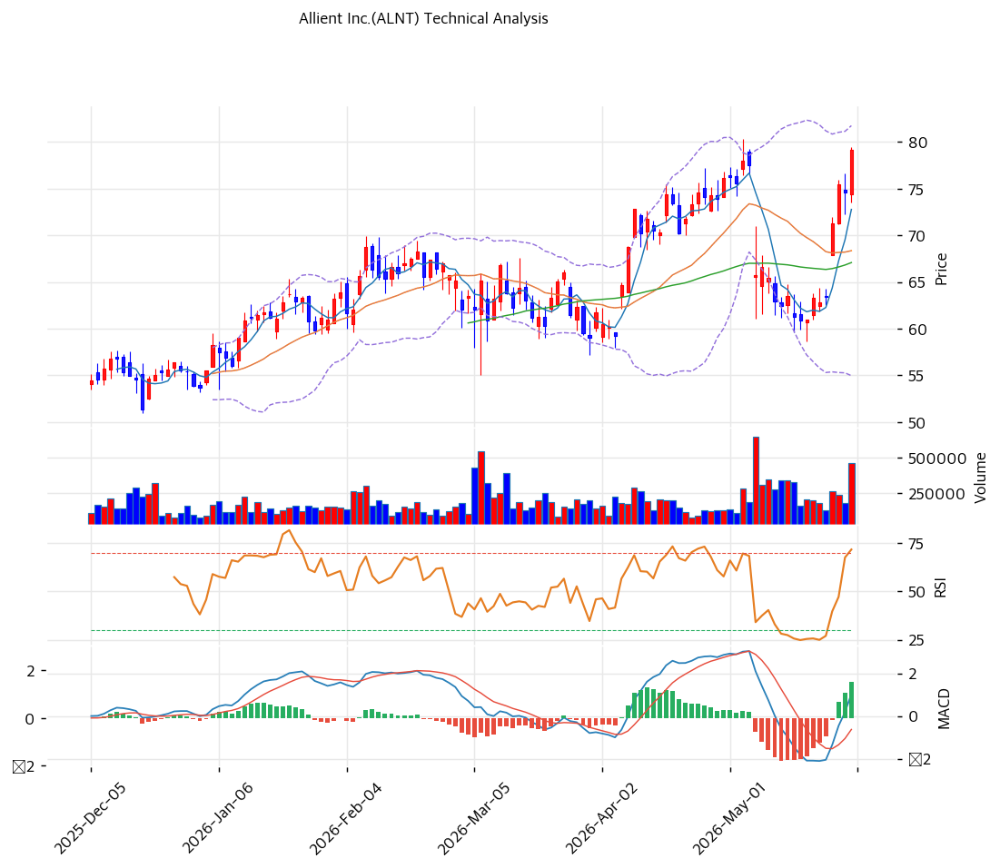

# 얼라이언트(ALNT) 기술적 분석 보고서

---

## 가격 위치

현재가 **$79.16** (+6.13%) — **52주 신고가** 갱신, 52주 위치 **100%** (고가 $79.16 / 저가 $30.27). 1년 **+162%** ($30.27→$79.16). 정밀 모션 컨트롤·로봇·방산 + 마진 개선 + 당일 +6.13% 급등. 거래량 1.87배 증가. RSI 67.6 중립(과매수 직전).

## 이동평균선

| 이평선 | 값 | 이격도 | 위치 |
|------|---:|----:|:---:|
| MA5 | $73 | +8.8% | 위 |
| MA20 | $68 | +15.8% | 위 |
| MA60 | $67 | +18.0% | 위 |
| MA120 | $64 | +24.0% | 위 |
| MA200 | $58 | +37.0% | 위 |

**완전 정배열 True**. MA200 대비 +37.0%, MA20 대비 +15.8% 이격. 1년 +162% 급등이나 MA60·MA120 간격이 좁아(67·64) 중기 추세 견고 + 당일 급등으로 단기 이격.

## 모멘텀 지표

- **RSI 67.6 (중립)** — 70 직전, 과매수 근접이나 여유. 추가 모멘텀 가능
- **MACD 1.0 / 시그널 -0.0 / 히스토 2.0** — 매수 시그널 + **확장 진행**(hist 증가). 모멘텀 강화
- **스토캐스틱 K=94.8 / D=79.1** — 골든크로스 **과매수**(94 극단)
- **볼린저밴드** — 상단 $82 / 중심 $68 / 하단 $55, 폭 39.2%, **중간**. 변동성 확대 여지
- **거래량비 1.87x** — 평균 대비 급증, 매수세 강함

## 피보나치 되돌림 (스윙 $79 / $30)

| 레벨 | 가격 | 성격 |
|------|---:|------|
| 0.236 | $73 | 1차 지지 (MA5 동조) |
| 0.382 | $71 | 2차 지지 |
| 0.5 | $69 | 중기 지지 |
| 0.618 | $66 | 깊은 조정 지지 (MA60 근접) |
| 1.272 확장 | $83 | 상승 시 목표 |
| 1.618 확장 | $90 | 추가 목표 |

## 지지/저항 (S&R)

- **저항**: $79.16(52주 고가) / **$81(PRZ 약: 추세선·피봇 R1)** / **$83(PRZ 약: 피보 1.272·피봇 R2)** / $90(피보 1.618)
- **지지**: $75(피봇 S1) / **$73(PRZ 약: 피보 0.236·MA5)** / **$71(PRZ 약: 피보 0.382·피봇 S2)** / **$68(PRZ 강: 피보 0.618·MA60·MA20)** / **$63(PRZ 중: 추세선·MA120)**

## 종합 시그널 & 전략

**시그널: 매수 2 / 매도 1 / 중립 3 → 매수우위** (마진 개선 + 거래량 급증, 4종목 중 가장 양호)

- **전략**: HOLD(홀드) — **TP $81 / SL $71**. WAIT(관망) e1=$75 / e2=$68
- **눌림목 매수**: RSI 67.6(여유) + 마진 개선으로 추세 양호하나 당일 +6.13% 급등. **MA20·MA60 $68(PRZ 강) ~ $63 눌림목 분할 매수** 권고
- **상방**: 52주 고가 $79 돌파 + 마진 개선·EPS 성장 가시화 시 피보 1.272 $83 → 1.618 $90 도전
- **하방**: $68(PRZ 강: MA20·MA60·피보 0.618) 이탈 시 $63 조정. 중기 추세선 $63 견고
- **변곡점**: 마진 개선 지속(OPM 9%+) + EPS $3.10 성장이 추세 분기점. 4종목 중 펀더멘털 가장 견고
