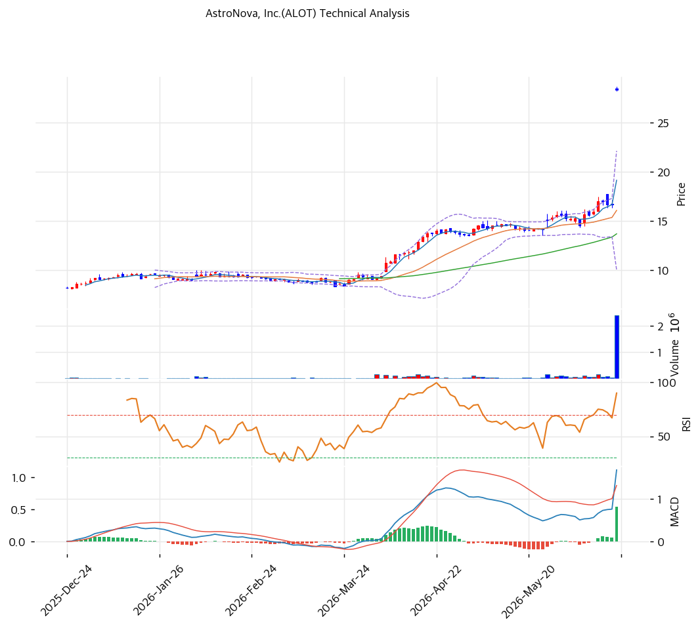

# 기술적분석

2026-06-18 | T2 Technical Analysis

***

## 차트

***

> 🔴 **합병 차익거래 종목 — 기술적 분석은 무의미(Deal-Pinned)**: 2026-06-17 Arcline의 **$29.00 전액현금 인수 합의**로 주가가 하루 +70% 점프해 딜가($29) 바로 아래($28.35)에 \*\*고정(pinned)\*\*됐다. 이제 가격은 수급·추세·이평선이 아니라 **딜 종결 확률**이 결정한다. RSI·MACD 등 모든 지표는 인수 발표 당일의 일회성 갭상승 아티팩트이며 추세 시그널로 해석하면 안 된다. 아래 분석은 형식상 기재이되, **딜핀 상태에서 실효성이 없음**을 전제로 본다.

***

## 1. 가격 현황

| 항목      | 값                           |
| ------- | --------------------------- |
| 현재가     | $28.35 (딜가 $29.00 대비 -2.2%) |
| 52주 고가  | $28.68 (인수 발표 갭상승)          |
| 52주 저가  | $6.96                       |
| 발표 전 종가 | \~$17 (참고)                  |
| 거래량     | 발표일 급증(차익거래 유입)             |

> 인수 발표(2026-06-17) 직후 \~$17 → $28대로 **+70% 갭상승**. 현재가 $28.35는 딜가 $29.00에 근접 고정. 차트의 "52주 신고가"는 추세가 아니라 **딜 프리미엄 일시 반영**이다.

***

## 2. 차트 패턴 분석

### 2.1 캔들스틱 패턴

| 패턴                    | 위치           | 신뢰도 | 해석            |
| --------------------- | ------------ | --- | ------------- |
| 인수 갭상승(Breakaway Gap) | \~$17→$28    | —   | 이벤트 갭, 추세성 아님 |
| 딜가 부근 횡보              | $28.35 ≈ $29 | —   | 종결 대기 박스      |

※ 인수 합의 갭은 일반 캔들 패턴 분석 대상이 아니다. 갭은 종결 시 메워지지 않고 딜가에서 상폐로 소멸한다.

### 2.2 가격 구조 패턴

* **딜핀 박스(Deal-Pinned Range)** — 딜가 $29 직하($28.0\~$28.7)에서 좁은 박스. 종결 확률·잔여기간이 스프레드 폭을 결정. 추세 돌파 개념이 적용되지 않음.
* **무산 시 갭다운 리스크** — 딜 무산 시 발표 전 \~$17로 갭다운(-40%). 차트상 지지선이 무의미한 이벤트 드리븐 하락.

### 2.3 다이버전스

* 딜핀 상태에서 모멘텀 다이버전스는 의미 없음. RSI 급등은 갭상승 1회 아티팩트.

### 2.4 패턴 종합 판단

가격은 **딜가 $29에 고정**돼 추세·패턴 분석이 실효성을 잃었다. 박스 상단은 딜가($29), 하단은 종결 불확실성에 따른 스프레드. 진짜 변수는 차트가 아니라 **규제·종결 일정**이다.

***

## 3. 이동평균선 — 딜 갭으로 왜곡(해석 보류)

| MA                 | 의미                                  |
| ------------------ | ----------------------------------- |
| 단기선(MA5/20)        | 갭상승으로 급격히 상향 중, 추세 신뢰도 없음           |
| 중장기선(MA60/120/200) | 발표 전 \~$10\~17대, 현재가와 큰 괴리 — 갭 아티팩트 |

**해석**: 인수 갭으로 현재가가 모든 MA를 큰 폭 상회하나 이는 **이벤트 갭**일 뿐 정배열·추세가 아니다. 딜핀 종목의 MA 이격은 무의미.

***

## 4. 보조 지표 (딜핀으로 실효성 없음)

### RSI(14)

발표 당일 급등으로 과매수권 진입했으나, 이는 **+70% 갭상승 1회 효과**다. 추세 과열 시그널로 해석 불가.

### MACD / 볼린저 / 스토캐스틱

모두 갭상승으로 급격히 상향됐으나 딜핀 박스에서 방향성 신호로서 가치 없음. 종결 시 상폐, 무산 시 갭다운으로 지표 무관하게 가격 결정.

***

## 5. 지지/저항 — 딜 레벨이 유일한 기준

| 구분      | 가격         | 근거                |
| ------- | ---------- | ----------------- |
| 상단(캡)   | $29.00     | 딜가(전액현금) — 사실상 천장 |
| **현재가** | **$28.35** | 차익 스프레드 -2.2%     |
| 무산 시 하방 | \~$17      | 인수 발표 전 종가(-40%)  |

※ 일반적 추세선·피보·PRZ는 딜핀 상태에서 무의미. 유일한 의미 있는 레벨은 **딜가 $29(상단 캡)** 와 **발표 전 \~$17(무산 하방)**.

***

## 6. 시그널 종합

| 지표          | 내용           | 시그널 |
| ----------- | ------------ | --- |
| 차트 패턴       | 딜핀 박스, 추세 무관 | ⚪   |
| 이동평균선       | 갭 아티팩트(왜곡)   | ⚪   |
| RSI         | 갭상승 1회 효과    | ⚪   |
| MACD/BB/스토캐 | 딜핀으로 무의미     | ⚪   |
| 거래량         | 차익거래 유입 급증   | ⚪   |

**종합 판단**: ⚪ 중립(기술적 분석 비적용) — 가격은 **딜 종결 확률**이 결정한다.

기술적 분석은 딜핀 종목에서 실효성이 없다. 상단은 딜가 $29로 캡, 하방은 무산 시 \~$17. 매매 판단은 차트가 아니라 **종결 확률 vs 무산 리스크 + 스프레드(2.3%) ÷ 잔여기간**으로 한다.

***

## 7. 전략 제안

### 보유 중인 경우

* **종결 대기(차익거래 보유)** — 딜가 $29까지 +2.3% 잔여. 무산 리스크(-40%) 감내 가능 시 보유
* 청산 라인: 딜가 $29 근접 시 차익 실현(잔여 스프레드 미미 시 자금 회전)
* 손절 개념: 차트 손절이 아니라 **딜 무산 시그널**(규제 반대·MAC)이 청산 트리거

### 진입 대기인 경우

* **추격 매수 비권장** — 상방 +2.3% 캡 vs 하방 -40%의 비대칭. 일반 투자자에게 실익 낮음
* 차익거래 전문가만: 종결 확률 높고 잔여기간 짧으면 연환산 수익률 계산 후 진입
* 진입 조건: 차트가 아니라 **규제·주주 승인 진행·종결 일정**으로 판단
