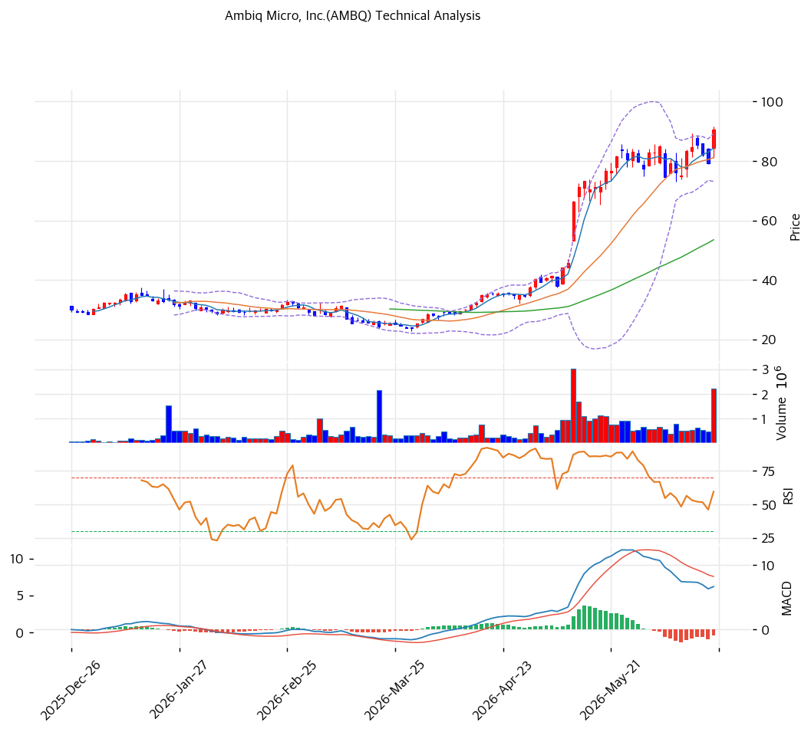

# Ambiq Micro(AMBQ) 기술적 분석

2026-06-19 | T2 Technical Analysis

---

## 차트

---

## 1. 가격 현황

| 항목 | 값 |
|------|-----|
| 현재가 | $90.48 |
| 52주 고가 | $91.61 |
| 52주 저가 | $22.12 |
| 52주 범위 위치 | 99% (사실상 고가) |
| 거래량비 | 3.40x (급증) |
| 비고 | 2025 신규 IPO, Beta 미산출 |

> IPO 저점($22.12)에서 약 4배 급등해 52주 고가($91.61) 직전(99%)에서 거래. 엣지 AI 하이퍼그로스 내러티브가 주가를 견인. 모든 이평선 위(강한 정배열), MA200 대비 +144%로 장기 과열. 거래량 3.40x 급증으로 고점권 변동성 확대. 신규 상장이라 Beta·장기 차트 데이터는 제한적.

---

## 2. 차트 패턴 분석

### 2.1 캔들스틱 패턴

| 패턴 | 위치 | 신뢰도 | 해석 |
|------|------|--------|------|
| 52주 고가 도전 | $90.48 ≈ 고가 $91.61 | 중 | 신고가 돌파 시도 |
| 거래량 급증 | 3.40x | 중 | 고점권 매물·모멘텀 교차 |
| 볼린저 상단 근접 | $89 부근 | 중 | 단기 과열 |

※ 주요 캔들 패턴: 망치형, 역망치형, 장악형, 도지, 샛별/석별, 적삼병/흑삼병, 하라미, 유성형, 교수형 등

### 2.2 가격 구조 패턴

- **IPO 후 강한 상승 추세 + 신고가 도전** (신뢰도: 중상)
  $22→$90 대상승 후 52주 고가 직전. 정배열(aligned True) 강건하나 단기 과열·고변동.

- **고점권 변동성 확대** (신뢰도: 중)
  거래량 3.40x·볼린저 상단 근접. 신고가 돌파 시 추가 상승, 실패 시 MA20($81)·MA60($54)으로 되돌림 갭 큼.

※ 주요 구조 패턴: 이중천정/바닥, 삼각수렴, 쐐기형, 깃발형, 페넌트, 컵앤핸들, 박스권 등

### 2.3 다이버전스

- **단기 모멘텀 혼조** (신뢰도: 중)
  RSI 66.3(중립 상단)·스토캐 골든크로스(상승) vs MACD 매도 전환(약화). 고점권 모멘텀 둔화 조짐과 반등 신호 혼재.

※ RSI·MACD 기반 | 상승 다이버전스 = 가격↓ 지표↑, 하락 다이버전스 = 가격↑ 지표↓

### 2.4 패턴 종합 판단

IPO 저점 대비 4배 급등 후 52주 고가($91.61) 직전(99%)에서 신고가를 도전하는 국면. 모든 이평선 위 강한 정배열이나 MA200 대비 +144%로 극도의 장기 과열이다. 거래량 3.40x 급증·볼린저 상단 근접은 고점권 매물 교차·단기 과열을 시사. **신고가($91.61) 돌파·안착 여부**가 단기 방향이며, 실패 시 MA20($81)→MA60($54)까지 되돌림 갭이 매우 크다. 신규 상장·소형주 특성상 변동성이 극심해 추격보다 분할·관망이 유효.

---

## 3. 이동평균선 — 강한 정배열·극도 과열

| MA | 값 | 현재가 괴리율 | 위치 |
|----|-----|--------------|------|
| MA5 | $84 | +7.2% | 위 |
| MA20 | $81 | +11.5% | 위 |
| MA60 | $54 | +69.1% | 위 |
| MA120 | $42 | +116.1% | 위 |
| MA200 | $37 | +144.1% | 위 |

**해석**: 모든 이평선 위로 완전 정배열(aligned True). MA60 대비 +69%, MA200 대비 +144%로 **극도의 과열**. 강세 추세는 명확하나 단기 조정 시 낙폭이 클 수 있다. MA20($81)이 단기 지지선, 이탈 시 MA60($54)까지 큰 공백.

---

## 4. 보조 지표

### RSI(14) — 66.3 (중립 상단)

과매수(70) 직전. 강세이나 추가 상승 시 과매수 진입.

### MACD(12,26,9)

| 항목 | 값 |
|------|-----|
| MACD | \~7.0 |
| Signal | \~8.0 |
| Histogram | ~-1.0 |
| 크로스 상태 | 매도 전환(미확산) |

**해석**: MACD가 Signal 하향 돌파(매도 전환)했으나 히스토그램 음(-) 폭 작음(미확산) → 고점권 모멘텀 둔화 초기. 추세 훼손은 아님.

### 볼린저밴드(20, 2σ)

| 항목 | 값 |
|------|-----|
| 상단 | $89 |
| 중단 (MA20) | $81 |
| 하단 | $73 |
| 밴드 폭 | 19.8% (변동) |
| 현재 위치 | 상단 근접 |

**해석**: 현재가 $90.48은 상단($89) 부근·돌파. 상단 안착 시 추가 상승이나 과열 신호. 중단($81) 이탈 시 하단($73) 시험.

### 스토캐스틱(14, 3, 3)

| 항목 | 값 |
|------|-----|
| Slow %K | 62.3 |
| Slow %D | 62.3 |
| 크로스 상태 | 골든크로스 |
| 판단 | 중립(상승) |

**해석**: K=62.3 중립권 상향, 골든크로스로 단기 상승 모멘텀. 과매수(80) 아래라 여력 존재.

---

## 5. 지지/저항 — 추세선 · 피보나치 · PRZ 통합

### 5.1 종합 지지/저항 테이블

| 구분 | 가격 | 근거 |
|------|------|------|
| 저항 | $94 | 피봇 R1 |
| 저항 | $91.61 | 52주 고가 |
| 저항 | $89 | 볼린저 상단 |
| **현재가** | **$90.48** | 신고가 도전 |
| 지지 | $84 | 피봇 S1·MA5·PRZ(약) |
| 지지 | $81 | MA20·볼린저 중단 |
| 지지 | $77 | 피봇 S2·전략 SL |
| 지지 | $73 | 볼린저 하단 |
| 지지 | $55 | 추세선 지지 |
| 지지 | $54 | MA60 |
| 지지 | $42 | MA120 |

---

## 6. 시그널 종합

| 지표 | 내용 | 시그널 |
|------|------|--------|
| 차트 패턴 | 정배열·신고가 도전 | 🟢 |
| 이동평균선 | 완전 정배열(과열) | 🟢 |
| RSI | 66.3 — 중립 상단 | ⚪ |
| MACD | 매도 전환(미확산) | 🔴 |
| 볼린저밴드 | 상단 근접, 밴드폭 19.8% | ⚪ |
| 스토캐스틱 | 골든크로스, K=62.3 | ⚪ |
| 거래량 | 3.40x 급증 | ⚪ |

**종합 판단**: 🟢 매수 2개 / 🔴 매도 1개 / ⚪ 중립 3개 → **매수 우위 (극도 과열 경계)**

IPO 저점 대비 4배 급등 후 52주 고가 직전에서 신고가 도전. 완전 정배열·스토캐 골든크로스의 강세 vs MACD 매도 전환·MA200 대비 +144% 극도 과열이 상충. 거래량 3.40x 급증으로 고점권 매물 교차. **신고가($91.61) 돌파 여부가 단기 분수령**이며, 실패 시 MA20($81)→MA60($54)까지 갭이 크다. 신규·소형·고변동 특성상 추격보다 **분할·실적 확인 후 접근**이 유효.

---

## 7. 전략 제안

### 보유 중인 경우
- **홀드 (신고가 트레일링)**
- 익절 라인: $91.61(52주 고가)·$94(피봇 R1)·신고가 돌파 시 트레일링
- 손절 라인: $77 (피봇 S2 이탈)
- 리스크/리워드: 극도 과열·고변동, 분할 익절·타이트 트레일링 스톱

### 진입 대기인 경우
- **눌림목 분할 (추격 자제)**
- 1차 진입가: $81\~84 (MA20·피봇 S1)
- 2차 진입가: $73\~77 (볼린저 하단·피봇 S2)
- 진입 조건: 4배 급등·EV/Sales 19x·소형 고변동 감안, MA20 지지 확인 후 소량 분할. MA20 이탈 시 MA60($54)대까지 관망. 락업 해제 일정·실적 가이드 확인 권장.
