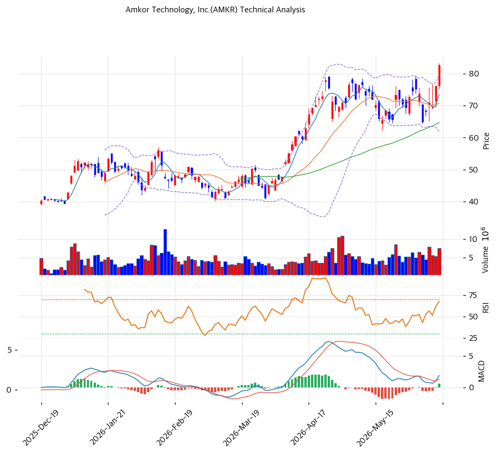

# 기술적분석

2026-06-15 | T2 Technical Analysis

***

## 차트

***

## 1. 가격 현황

| 항목        | 값                    |
| --------- | -------------------- |
| 현재가       | $82.78               |
| 52주 고가    | $83.30               |
| 52주 저가    | $19.79               |
| 52주 범위 위치 | \~99% (신고가 근접)       |
| 거래량       | 20일 평균 대비 1.43x (동반) |

> 52주 저점($19.79) 대비 약 4.2배 폭등, 신고가 근접. 완전 정배열·MACD 매수 확대·거래량 동반(1.43x)으로 추세 강하나 MA200 대비 +78%의 장기 과열이 공존한다.

***

## 2. 차트 패턴 분석

### 2.1 캔들스틱 패턴

| 패턴               | 위치              | 신뢰도 | 해석             |
| ---------------- | --------------- | --- | -------------- |
| 52주 신고가 근접 + 거래량 | 당일 ($83, 1.43x) | 강   | 매수 — 신고가 돌파 시도 |
| 완전 정배열           | 최근              | 강   | 매수 — 모든 MA 위   |
| MA200 +78% 괴리    | —               | 중   | 단기 과열 경계       |

※ 주요 캔들 패턴: 망치형, 역망치형, 장악형, 도지, 샛별/석별, 적삼병/흑삼병, 하라미, 유성형, 교수형 등

### 2.2 가격 구조 패턴

* **52주 신고가 돌파 시도** (신뢰도: 강) AI 첨단패키징·애리조나·실적 모멘텀으로 거래량 동반 신고가 부근. 피보 1.272 확장($101)이 다음 상단 목표.
* **장기 상승 추세** (신뢰도: 강) MA200($46) 대비 +78%의 큰 괴리로 1년 4.2배 강세. 추세 견조하나 단기 과열.

※ 주요 구조 패턴: 이중천정/바닥, 헤드앤숄더, 삼각수렴, 쐐기형, 깃발형, 페넌트, 컵앤핸들, 박스권 등

### 2.3 다이버전스

* **뚜렷한 다이버전스 없음 — 추세 추종** (신뢰도: 중) 가격 신고가·RSI 64.4·MACD 매수 확대 동행. 과매수(70) 미도달로 추가 상승 여지. 매도 다이버전스 없음.

※ RSI·MACD 기반 | 상승 다이버전스 = 가격↓ 지표↑, 하락 다이버전스 = 가격↑ 지표↓

### 2.4 패턴 종합 판단

52주 신고가에 거래량을 동반한 **강한 상승 추세** 국면이다. 완전 정배열·MACD 매수 확대·RSI 64로 5종목 중 기술적으로 가장 건강한 편이나, MA200 +78%·4.2배 폭등의 과열은 동반된다. AI 첨단패키징·애리조나가 펀더멘털을 받친다. 신고가 근접이나 RSI 여유가 있어, 추격보다 눌림목(MA20 $71·피보 0.236 $68) 분할이 안전하다.

***

## 3. 이동평균선 — 완전 정배열 (강세)

| MA    | 값   | 현재가 괴리율 | 위치 |
| ----- | --- | ------- | -- |
| MA5   | $74 | +12.6%  | 위  |
| MA20  | $71 | +16.9%  | 위  |
| MA60  | $65 | +27.8%  | 위  |
| MA120 | $56 | +48.1%  | 위  |
| MA200 | $46 | +78.3%  | 위  |

**해석**: 현재가 > 모든 MA의 완전 정배열 강세. 단기선(MA20 $71)과 +17% 괴리로 단기 과열이나 다른 4종목(+89\~135%) 대비 MA200 괴리(+78%)는 상대적으로 덜 극단적. 조정 시 MA20($71)·MA60($65)이 지지대.

***

## 4. 보조 지표

### RSI(14) — 64.4 (중립)

신고가 동반 상승이나 과매수(70) 미도달 — 추가 상승 여지. 5종목 중 가장 여유 있는 RSI.

### MACD(12,26,9)

| 항목        | 값                |
| --------- | ---------------- |
| MACD      | \~2.0            |
| Signal    | \~1.0            |
| Histogram | +1.0 (확대)        |
| 크로스 상태    | 매수 구간 (히스토그램 확대) |

**해석**: MACD가 Signal 위에서 히스토그램 확대하는 강한 상승 모멘텀. 0선 위 강세.

### 볼린저밴드(20, 2σ)

| 항목        | 값     |
| --------- | ----- |
| 상단        | $80   |
| 중단 (MA20) | $71   |
| 하단        | $62   |
| 밴드 폭      | 25.3% |
| 현재 위치     | 상단 돌파 |

**해석**: 현재가 $83이 밴드 상단($80)을 상회 — 강한 상승 압력. 밴드 폭 25%로 변동성 보통. 되돌림 시 중단(MA20 $71) 여지.

### 스토캐스틱(14, 3, 3)

| 항목      | 값      |
| ------- | ------ |
| Slow %K | 70.0   |
| Slow %D | 53.2   |
| 크로스 상태  | 골든크로스  |
| 판단      | 중립(상승) |

***

## 5. 지지/저항 — 추세선 · 피보나치 · PRZ 통합

### 5.1 피보나치 되돌림/확장

| 구분                 | 비율    | 가격   | 현재가 대비 |
| ------------------ | ----- | ---- | ------ |
| 확장                 | 1.272 | $101 | +22.0% |
| **현재가/Swing High** | —     | $83  | —      |
| 되돌림                | 0.236 | $68  | -17.9% |
| 되돌림                | 0.382 | $59  | -28.7% |
| 되돌림                | 0.5   | $51  | -38.4% |
| 되돌림                | 0.618 | $44  | -46.9% |
| 되돌림                | 0.786 | $33  | -60.1% |

### 5.2 종합 지지/저항 테이블

| 구분      | 가격      | 근거                 |
| ------- | ------- | ------------------ |
| 저항      | $101    | 피보나치 1.272 확장      |
| 저항      | $88     | 추세선 저항·피봇 R2 (PRZ) |
| 저항      | $86     | 피봇 R1              |
| **현재가** | **$83** | 신고가·볼린저 상단         |
| 지지      | $78     | 피봇 S1              |
| 지지      | $72     | MA20·피봇 S2 (PRZ)   |
| 지지      | $71     | MA20               |
| 지지      | $68     | 피보 0.236           |
| 지지      | $65     | MA60               |

***

## 6. 시그널 종합

| 지표    | 내용                | 시그널 |
| ----- | ----------------- | --- |
| 차트 패턴 | 신고가 + 거래량 동반      | 🟢  |
| 이동평균선 | 완전 정배열, MA20 +17% | 🟢  |
| RSI   | 64.4 — 중립(여유)     | ⚪   |
| MACD  | 매수구간, 히스토그램 확대    | 🟢  |
| 볼린저밴드 | 상단 돌파             | ⚪   |
| 스토캐스틱 | 골든크로스, K=70.0     | ⚪   |
| 거래량   | 1.43x — 동반        | ⚪   |

**종합 판단**: 🟢 매수 2개 / 🔴 매도 0개 / ⚪ 중립 4개 → **매수우위 (건강한 상승 추세)**

52주 신고가에 거래량을 동반한 강세 추세로, 매도 신호가 없고 RSI에 여유가 있어 5종목 중 기술적으로 가장 건강하다. 다만 4.2배 폭등·MA200 +78%의 과열은 동반된다. AI 첨단패키징·애리조나가 펀더멘털을 받친다. 신고가 추격보다 눌림목(MA20 $71·피보 0.236 $68) 대응이 정석.

***

## 7. 전략 제안

### 보유 중인 경우

* **홀드 (분할 익절 병행)**
* 익절 라인: $86\~88(피봇 R1·추세선) 1차 / $101(피보 1.272) 2차
* 손절 라인: $71 (MA20 이탈)
* 리스크/리워드: 4.2배 폭등·신고가로 신규 손익비 다소 불리

### 진입 대기인 경우

* **추격 자제, 눌림목 대기**
* 1차 진입가: $71\~72 (MA20·PRZ)
* 2차 진입가: $65\~68 (MA60·피보 0.236)
* 진입 조건: 신고가 추격은 위험. 조정 시 MA20·피보 0.236($68\~72 PRZ) 지지 확인 후 분할. AI 첨단패키징 매출·애리조나 진척이 펀더멘털 하방 지지. (5종목 중 기술적 건강도 가장 양호)
