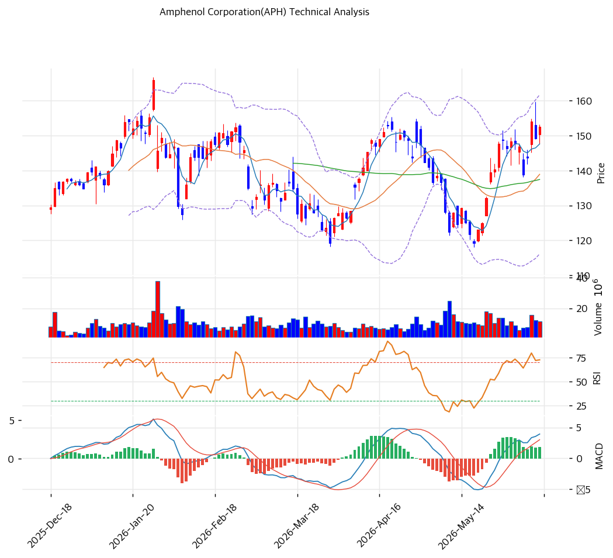

# Amphenol(APH) 기술적 분석

## 차트

## 가격 현황

| 항목 | 값 |
|---|---|
| 현재가 | **$152.46** (+2.17%) |
| 52주 고/저 | $167.04 / $92.08 |
| 52주 위치 | 81.8% |
| RSI | 60.3 (중립) |
| MACD | 매수 |
| Stochastic | 골든크로스 (중립) |
| 볼린저 | 중상단 |

## 이동평균선

| MA | 가격($) | 갭(%) | 위치 |
|---|--:|--:|---|
| MA5 | 148 | +3.3 | 위 |
| MA20 | 139 | +9.7 | 위 |
| MA60 | 137 | +10.9 | 위 |
| MA120 | 140 | +9.1 | 위 |
| MA200 | 135 | +12.9 | 위 |

→ 모든 MA 위 강세이나 단기 혼조(비정배열). MA200 대비 +12.9%로 다른 비교 종목 대비 **과열이 완만**(건전한 추세). 52주 고가($167) 대비 -8.7%로 신고가 직전.

## 시그널 종합

| 구분 | 카운트 |
|---|--:|
| 매수 | 1 |
| 매도 | 1 |
| 중립 | 4 |
| **결론** | **중립 (건전한 상승 추세)** |

## 지지·저항

| 구분 | 가격($) | 근거 |
|---|--:|---|
| 강 저항 | 165.9 | 52주 고가 |
| 저항 | 155 | 피봇 R1 |
| **현재가** | **$152.46** | 고가 직전 |
| 지지 | 149 | 피봇 S1 |
| 강 지지 | 139\~146 | MA20·피봇 S2 |

## 전략

| 시나리오 | 액션 |
|---|---|
| 보유자 | 홀드 (TP $166 / SL $139) |
| 신규 진입 1차 | $149 (피봇 S1) |
| 신규 진입 2차 | $139 (MA20 눌림) |
| 매도 트리거 | $139 종가 이탈 (MA20·추세 훼손) |

## 핵심 판단

APH는 $92 → $152로 1년 상승했으나, 4개 비교 종목 중 **유일하게 52주 신고가가 아니며(81.8%) MA200 대비 +12.9%로 과열이 완만**한 건전한 상승 추세주다. 당일 +2.17%로 안정적이며, MACD 매수·모든 MA 위의 강세 배열을 유지한다. AI 데이터센터 인터커넥트 폭발 성장(2026Q1 +58%)·book-to-bill 1.24가 추세를 견인하고, 애널 목표가($169\~200)를 하회해 상승 여력이 있다. beta 1.28의 상대적 안정성으로 다른 고변동 종목 대비 리스크가 낮다. $139\~149 눌림목이 매수 기회이며, 52주 고가($167) 돌파 시 추세 연장이 유력하다.
