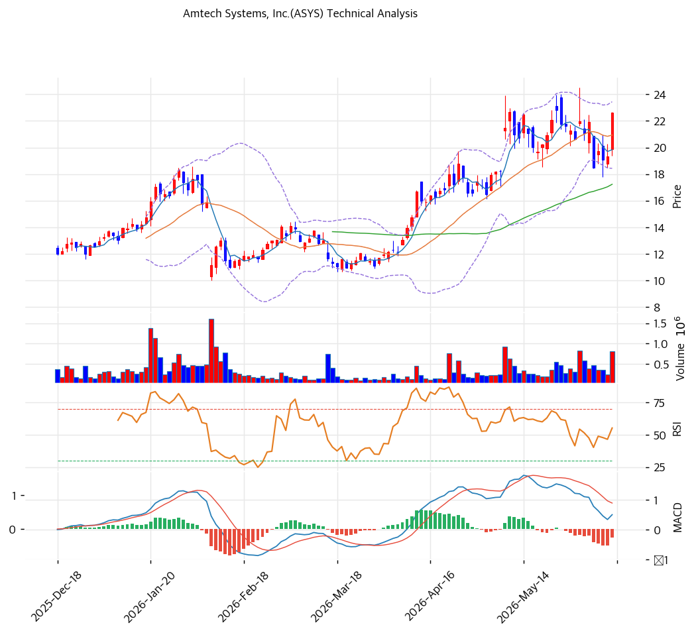

# Amtech Systems(ASYS) 기술적 분석

## 차트

## 가격 현황

| 항목 | 값 |
|---|---|
| 현재가 | **$22.60** (+17.04%) |
| 52주 고/저 | $22.82 / $4.05 |
| 52주 위치 | 98.8% |
| RSI | 58.8 (중립) |
| MACD | 1.0/1.0/-0.0 (매도) |
| Stochastic | K=38.0 D=24.2 골든크로스 (중립) |
| 볼린저 | 폭 24.0%, 중간 |

## 이동평균선

| MA | 가격($) | 갭(%) | 위치 |
|---|--:|--:|---|
| MA5 | 20 | +13.9 | 위 |
| MA20 | 21 | +7.9 | 위 |
| MA60 | 17 | +31.2 | 위 |
| MA120 | 15 | +46.3 | 위 |
| MA200 | 13 | +79.4 | 위 |

→ 모든 MA 위 강세 배열(단기 일부 혼조). MA200 대비 +79%의 극단 괴리로 강한 상승 추세이나 단기 과열. 당일 +17% 급등으로 52주 신고가권 진입.

## 시그널 종합

| 구분 | 카운트 |
|---|--:|
| 매수 | 1 |
| 매도 | 1 |
| 중립 | 4 |
| **결론** | **중립 (강세 추세 + 단기 과열)** |

## 지지·저항

| 구분 | 가격($) | 근거 |
|---|--:|---|
| 강 저항 | 25 | 피보 1.272\~1.382 확장·피봇 R2 |
| 저항 | 24 | 추세선 저항·피봇 R1·52주 고가 |
| **현재가** | **$22.60** | 볼린저 중상단 |
| 지지 | 20 | PRZ(강) — 피보 0.382/0.5·피봇 S1·MA5 |
| 강 지지 | 18 | 피보 0.786·피봇 S2 |

## 전략

| 시나리오 | 액션 |
|---|---|
| 보유자 | 분할 익절 (TP $24\~25 / SL $18) |
| 신규 진입 1차 | $20 (PRZ 강 지지·MA5) |
| 신규 진입 2차 | $18 (피봇 S2·강 지지) |
| 매도 트리거 | $18 종가 이탈 (상승 추세 훼손) |

## 핵심 판단

ASYS는 $4 → $22.6로 1년 +430% 급등한 강력한 상승 추세주로, 당일 +17% 급등(거래량 2.23배)으로 52주 신고가권에 진입했다. 모든 이동평균선 위 강세 배열이나 MA200 대비 +79%의 극단 괴리·RSI 58·MACD 약세 등 단기 과열·혼조 신호가 공존한다. Russell 지수 편입(6/29)·AI 패키징 모멘텀이 추세를 받치나, 1년 5배 급등 후 변동성이 매우 큰 구간이다. 추격보다 $20(PRZ 강 지지) 눌림목 대응이 정석이며, 펀더멘털(FY26Q2 흑전·GM 47%)이 하방을 지지한다.
