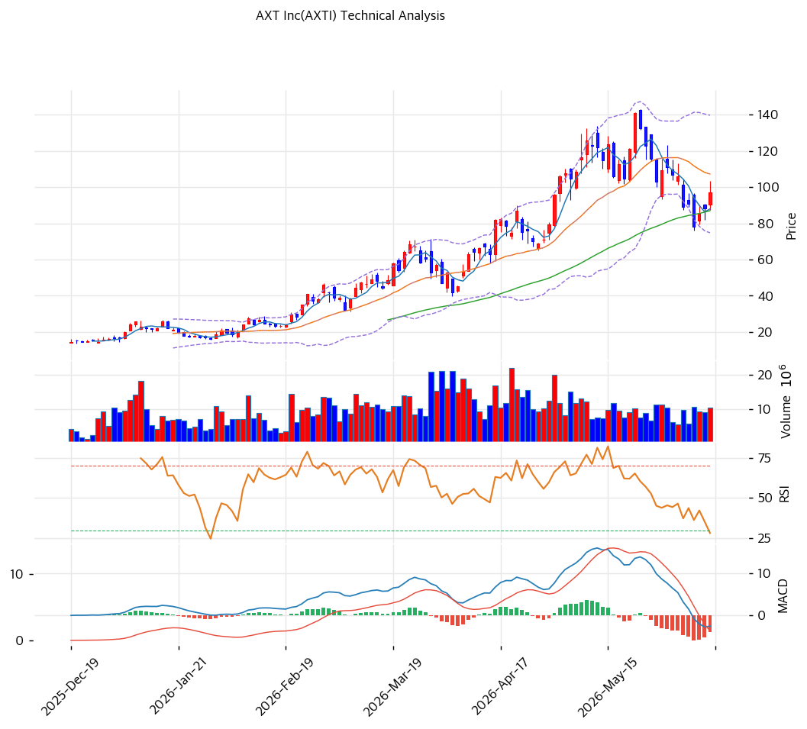

# 기술적분석

2026-06-13 | T2 Technical Analysis

***

## 차트

***

## 1. 가격 현황

| 항목        | 값                 |
| --------- | ----------------- |
| 현재가       | $97.18            |
| 52주 고가    | $140.83           |
| 52주 저가    | $1.81 ※데이터 이상치 가능 |
| 52주 범위 위치 | 68.6%             |
| 거래량       | 20일 평균 대비 1.17x   |

> ⚠️ 지난 1년 저가 마이크로캡에서 $140대까지 폭등 후 $97대로 -31% 되돌림. MA200($37) 대비 +162%로 장기 과열, 단기는 고점 대비 조정 국면.

***

## 2. 차트 패턴 분석

### 2.1 캔들스틱 패턴

| 패턴         | 위치                      | 신뢰도 | 해석                |
| ---------- | ----------------------- | --- | ----------------- |
| 고점 대비 되돌림  | $140.83 → $97.18 (-31%) | 중   | 매도 — 급등 후 차익실현 조정 |
| MA20 하회    | 현재 $97 < MA20 $107      | 중   | 단기 약세 — 단기선 이탈    |
| MA60 지지 시도 | $97 > MA60 $87          | 중   | 중기 지지선 부근         |

※ 주요 캔들 패턴: 망치형, 역망치형, 장악형, 도지, 샛별/석별, 적삼병/흑삼병, 하라미, 유성형, 교수형 등

### 2.2 가격 구조 패턴

* **급등 후 되돌림 (고점 $140.83 → $97)** (신뢰도: 중) AI 모멘텀으로 $140대까지 폭등한 뒤 -31% 조정. MA20($107)을 하회해 단기 모멘텀 둔화. 피보나치 0.5 되돌림($91)·0.618($80)이 주요 지지 후보.
* **장기 상승 추세 과열** (신뢰도: 강) MA200($37) 대비 +162%의 극단적 괴리. 1년 폭등으로 추세는 강하나 평균회귀 압력이 매우 크다. MA120($57) 대비도 +71%.

※ 주요 구조 패턴: 이중천정/바닥, 헤드앤숄더, 삼각수렴, 쐐기형, 깃발형, 페넌트, 컵앤핸들, 박스권 등

### 2.3 다이버전스

* **약한 하락 모멘텀 — 가격 조정 동반** (신뢰도: 중) 가격이 고점 대비 하락하며 MACD 매도 전환(-3.0 < Signal). RSI 48.7로 중립. 스토캐스틱은 저점에서 골든크로스(K=21.2)로 단기 반등 시그널 혼재.

※ RSI·MACD 기반 | 상승 다이버전스 = 가격↓ 지표↑, 하락 다이버전스 = 가격↑ 지표↓

### 2.4 패턴 종합 판단

AI 모멘텀 폭등 후 **-31% 되돌림 조정** 국면이다. MA20($107) 하회·MACD 매도 전환으로 단기 모멘텀이 꺾였으나, MA60($87)·피보 0.5($91) 부근에서 지지 시도 중이다. MA200 대비 +162%의 장기 과열이 부담이며, 펀더멘털(적자·흑자전환 기대)이 변동성을 키운다. 추격보다 지지선($88\~$91) 확인 후 대응이 안전하다.

***

## 3. 이동평균선 — 혼조 (단기 약세)

| MA    | 값    | 현재가 괴리율 | 위치     |
| ----- | ---- | ------- | ------ |
| MA5   | $88  | +10.4%  | 위      |
| MA20  | $107 | -9.4%   | **아래** |
| MA60  | $87  | +11.7%  | 위      |
| MA120 | $57  | +70.9%  | 위      |
| MA200 | $37  | +162.2% | 위      |

**해석**: 현재가가 MA20($107)을 하회해 단기 조정 신호. 다만 MA5($88)·MA60($87) 위에 있어 중기 지지는 유효. MA20이 MA60 위에 있는 구조에서 가격이 그 사이로 눌린 형태로, **정배열 아님(aligned=False)**. MA200 대비 +162%의 극단적 괴리가 장기 과열을 시사. MA60($87)·MA5($88)이 1차 지지대, MA20($107) 회복이 단기 반등 분기점.

***

## 4. 보조 지표

### RSI(14) — 48.7 (중립)

고점 대비 조정으로 과매수 해소. 중립권에서 방향성 모색. 과매도(30)는 아니어서 추가 하락 여지도 열려 있음.

### MACD(12,26,9)

| 항목        | 값          |
| --------- | ---------- |
| MACD      | -3.0       |
| Signal    | 1.0        |
| Histogram | -4.0       |
| 크로스 상태    | 매도 (데드크로스) |

**해석**: MACD가 Signal을 하회한 매도 구간. 히스토그램 음(-4.0)으로 하락 모멘텀 우위. 단기 약세 신호.

### 볼린저밴드(20, 2σ)

| 항목        | 값         |
| --------- | --------- |
| 상단        | $140      |
| 중단 (MA20) | $107      |
| 하단        | $75       |
| 밴드 폭      | 60.5%     |
| 현재 위치     | 중간(중단 하회) |

**해석**: 현재가 $97은 중단($107) 아래·하단($75) 위의 중간 영역. 밴드 폭 60.5%로 변동성 극심. 추가 조정 시 하단($75) 부근까지 여지, 반등 시 중단($107) 회복이 관건.

### 스토캐스틱(14, 3, 3)

| 항목      | 값         |
| ------- | --------- |
| Slow %K | 21.2      |
| Slow %D | 13.7      |
| 크로스 상태  | 골든크로스     |
| 판단      | 저점권 반등 시도 |

***

## 5. 지지/저항 — 추세선 · 피보나치 · PRZ 통합

### 5.1 피보나치 되돌림

| 구분         | 비율    | 가격      | 현재가 대비 |
| ---------- | ----- | ------- | ------ |
| Swing High | —     | $140.83 | +44.9% |
| 되돌림        | 0.236 | $118    | +21.4% |
| 되돌림        | 0.382 | $103    | +6.0%  |
| 되돌림        | 0.5   | $91     | -6.4%  |
| 되돌림        | 0.618 | $80     | -17.7% |
| 되돌림        | 0.786 | $63     | -35.2% |

※ 피보나치 기준: 급등 후 되돌림 국면. 현재가 $97은 0.382($103)와 0.5($91) 사이.

### 5.2 종합 지지/저항 테이블

| 구분      | 가격         | 근거                      |
| ------- | ---------- | ----------------------- |
| 저항      | $140.83    | 52주 고가                  |
| 저항      | $131       | 추세선 저항                  |
| 저항      | $118       | 피보 0.236                |
| 저항      | $107       | MA20·피봇 R1 부근           |
| 저항      | $103       | 피보 0.382                |
| **현재가** | **$97.18** | —                       |
| 지지      | $91        | 피보 0.5                  |
| 지지      | $88        | PRZ(중) — MA5·MA60·피봇 S1 |
| 지지      | $80        | 피보 0.618·피봇 S2          |
| 지지      | $63        | 피보 0.786                |

***

## 6. 시그널 종합

| 지표    | 내용                        | 시그널 |
| ----- | ------------------------- | --- |
| 차트 패턴 | 고점 -31% 되돌림, MA20 하회      | 🔴  |
| 이동평균선 | 비정배열, MA20 하회·MA200 +162% | ⚪   |
| RSI   | 48.7 — 중립                 | ⚪   |
| MACD  | 매도(데드크로스), 히스토그램 음        | ⚪   |
| 볼린저밴드 | 중단 하회, 밴드폭 60.5%          | ⚪   |
| 스토캐스틱 | 골든크로스, K=21.2 (저점 반등)     | ⚪   |
| 거래량   | 1.17x — 보통                | ⚪   |

**종합 판단**: 🟢 매수 0개 / 🔴 매도 1개 / ⚪ 중립 5개 → **매도우위 (급등 후 조정)**

AI 모멘텀 폭등 후 -31% 되돌림 조정 국면. MA20 하회·MACD 매도로 단기 모멘텀이 꺾였으나, MA60($87)·피보 0.5($91)·PRZ($88) 부근에서 지지 시도 중이다. 스토캐스틱 골든크로스로 단기 반등 가능성도 혼재. MA200 +162%의 극단적 장기 과열과 적자·흑자전환 불확실성이 변동성을 키운다. 추격 자제, 지지선 확인 후 분할 대응이 정석.

***

## 7. 전략 제안

### 보유 중인 경우

* **비중축소 / 분할 대응**
* 익절 라인: $140(전고·볼린저 상단) / 추세 회복 시 분할 익절
* 손절 라인: $80 (피보 0.618·피봇 S2 이탈 시)
* 리스크/리워드: MA20 하회·MACD 매도로 단기 불리, 변동성 극심

### 진입 대기인 경우

* **추격 자제, 지지선 대기**
* 1차 진입가: $88 (PRZ — MA5·MA60·피봇 S1)
* 2차 진입가: $80 (피보 0.618·피봇 S2)
* 진입 조건: MA200 +162% 장기 과열·적자 기업 특성상 변동성 매우 큼. 지지선($88\~$91)에서 스토캐스틱 반등·MA20($107) 회복 확인 후 소액 분할. 흑자전환·중국 수출허가 진전이 펀더멘털 트리거.
