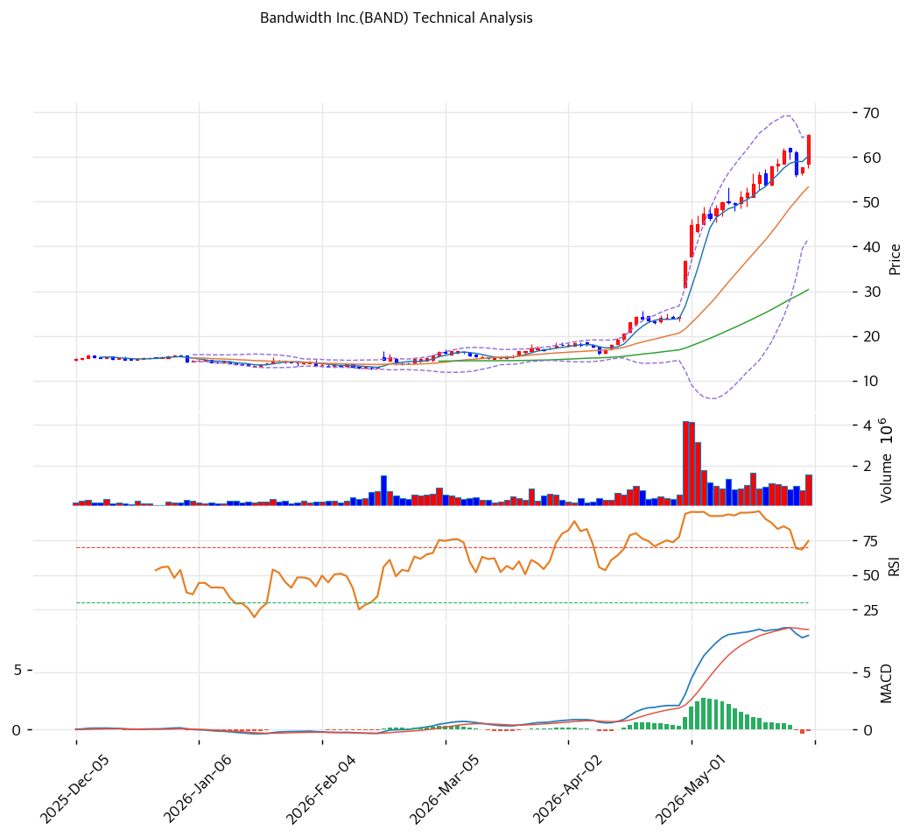

# 밴드위스(BAND) 기술적 분석 보고서

---

## 가격 위치

현재가 **$64.97** (+12.68%) — **52주 신고가** 갱신, 52주 위치 **100%** (고가 $64.97 / 저가 $12.82). 1년 **+407%** ($12.82→$64.97). CPaaS·AI 음성 인프라 + 흑전 전환 기대 + 당일 +12.68% 급등. 거래량 1.05배. RSI 79.0 과매수.

## 이동평균선

| 이평선 | 값 | 이격도 | 위치 |
|------|---:|----:|:---:|
| MA5 | $60 | +7.8% | 위 |
| MA20 | $53 | +21.9% | 위 |
| MA60 | $30 | +114.0% | 위 |
| MA120 | $22 | +190.8% | 위 |
| MA200 | $20 | +231.6% | 위 |

**완전 정배열 True**. MA200 대비 +231.6%, MA60 대비 +114.0% 극단 이격. 1년 +407% 급등으로 단기 이격 사상 최대 — 추세 강세이나 극단 과열.

## 모멘텀 지표

- **RSI 79.0 (과매수 🔴)** — 80 근접 과매수. 단기 조정 압력
- **MACD 8.0 / 시그널 8.0 / 히스토 -0.0** — **매도 시그널** (데드크로스 직전, 히스토 축소). 모멘텀 정점 통과
- **스토캐스틱 K=77.7 / D=79.4** — 데드크로스, 중립~과매수
- **볼린저밴드** — 상단 $65 / 중심 $53 / 하단 $42, 폭 43.4%, **상단 근접**. 변동성 확대 + 과열
- **거래량비 1.05x** — 평균 수준

## 피보나치 되돌림 (스윙 $65 / $13)

| 레벨 | 가격 | 성격 |
|------|---:|------|
| 0.236 | $53 | 1차 지지 (MA20 동조) |
| 0.382 | $45 | 2차 지지 |
| 0.5 | $39 | 중기 지지 |
| 0.618 | $33 | 깊은 조정 지지 |
| 1.272 확장 | $79 | 상승 시 목표 |
| 1.618 확장 | $98 | 추가 목표 |

## 지지/저항 (S&R)

- **저항**: $64.97(52주 고가) / $68(피봇 R1) / $70(피봇 R2) / $79(피보 1.272)
- **지지**: $60(PRZ 약: 피봇 S1·MA5) / $55(피봇 S2) / **$53(PRZ 약: MA20·피보 0.236)** / $45(피보 0.382) / $39(피보 0.5) / $30(MA60)

## 종합 시그널 & 전략

**시그널: 매수 1 / 매도 3 / 중립 3 → 매도우위** (MACD 데드크로스 + 과매수)

- **전략**: HOLD(비중축소) — **TP $66 / SL $55**. WAIT(관망) e1=$60 / e2=$53
- **눌림목 매수**: RSI 79 + MACD 데드크로스 + 1년 +407%로 추격 강력 비추. **MA20 $53 ~ 피보 0.382 $45 분할 매수** 권고. 깊은 조정 시 $39 추가
- **상방**: 52주 고가 $64.97 안착 + 흑전·AI 음성 가시화 시 피보 1.272 $79 도전
- **하방**: MA20 $53 이탈 시 $45\~39 조정. 단기 -25\~40% 조정 위험(MACD 데드크로스 + 극단 이격)
- **변곡점**: 흑전 실현(forward EPS +$2.24) + AI 음성 매출 가속이 추세 분기점
