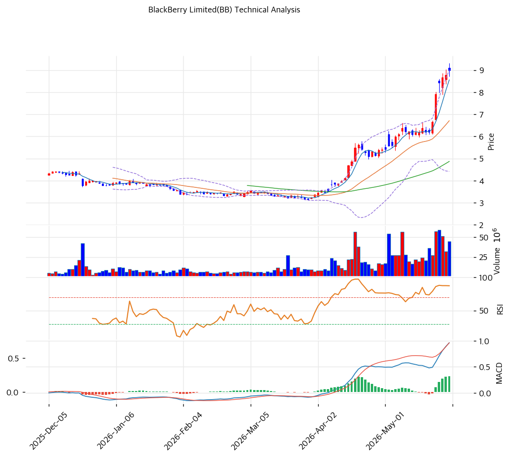

# 블랙베리(BB) 기술적 분석 보고서

---

## 가격 위치

현재가 **$9.0** — **52주 신고가** 갱신, 52주 위치 **100%**. 1년 **+186%** ($3.15→$9.0). QNX 자동차 OS + 흑전 턴어라운드 기대 + SW·AI 테마. **RSI 89.3 극단 과매수** + 거래량 1.4배. 턴어라운드 + QNX 기대 급등.

## 이동평균선 / 모멘텀

MA5 $9 / MA20 $7 / MA60 $5 / MA120 $4 / MA200 $4 — **완전 정배열 True**. MA200 대비 **+108.9%**, MA20 대비 +34.1% 극단 이격. 1년 +186% 급등으로 이격 큼. 단기 급등 정점.

**RSI 89.3 (극단 과매수 🔴)** — 90 근접 역사적 극단. MACD 매수 + 확장. 스토캐 K=92.3 / D=93.4 **데드크로스** + 과매수 = 단기 조정 신호. BB 상단 근접 (폭 68.3%). **턴어라운드 기대 급등 정점**.

## 시그널 종합 / S&R

매수 2 / 매도 3 / 중립 2 → **매도우위**. 극단 과매수 다수.

- 저항: **$9.0 (52주 고가)** / 심리적 $10
- 지지: **$8 (피봇 S2·피보 2.0)** / $7 (MA20·피보 1.382\~1.618) / $5 (MA60) / $4 (MA120·MA200)

전략: **추격 매수 강력 비추 — TP $9 / SL $8**. WAIT(관망) e1=$9 / e2=$7. RSI 89.3 + 1년 +186% + Forward PE 44.7x는 **턴어라운드 기대 급등 정점** — 단기 -25\~40% 조정 위험. **MA20 $7 ~ MA60 $5 눌림목 분할 매수** 권고. QNX 성장 가시화 시 추가 상승, 신고가권 추격 비추.
