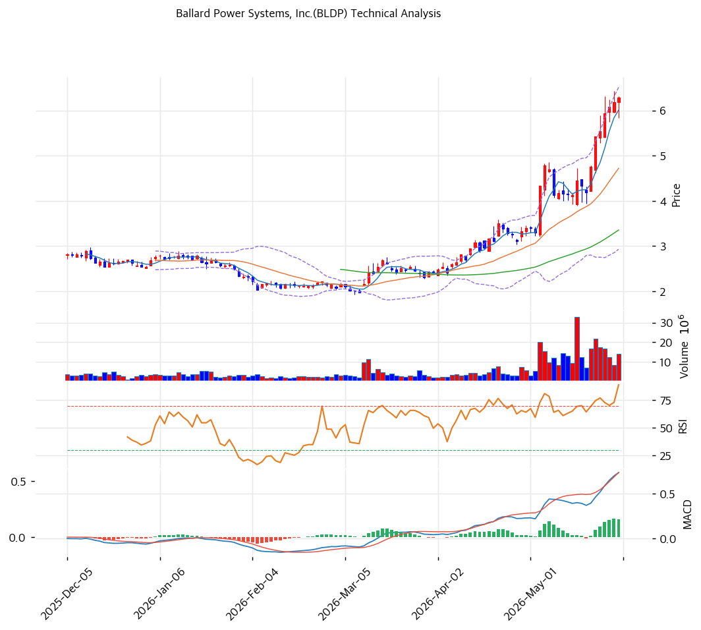

# 발라드 파워 시스템스(BLDP) 기술적 분석 보고서

---

## 가격 위치

현재가 **$6.29** — **52주 신고가** 갱신, 52주 위치 **100%**. 1년 **+391%** ($1.28→$6.29). 수소경제 부활 기대 + 트럼프 에너지 정책 변화 + 수소 테마 투기 급등. RSI 80.9 극단 과매수. 적자·영세 펀더멘털과 무관한 테마 변동.

## 이동평균선 / 모멘텀

MA5 $6 / MA20 $5 / MA60 $3 / MA120 $3 / MA200 $3 — **완전 정배열 True**. MA200 대비 **+118.6%**, MA60 대비 +87.6% 극단 이격. 1년 +391% 급등으로 이격도 극단. 단기 급등 정점.

**RSI 80.9 (극단 과매수 🔴)** — 80 초과 역사적 극단. MACD 매수 시그널(확장 둔화). 스토캐 K=91.8 / D=89.1 골든크로스 **과매수**. BB 폭 76.0% 극단 변동성. 거래량 1.06배. **수소 테마 투기 급등 정점**.

## 시그널 종합 / S&R

매수 1 / 매도 3 / 중립 3 → **매도우위**. 극단 과매수 다수.

- 저항: **$6.29 (52주 고가)** / $7 (피보 2.0 확장)
- 지지: **$5 (MA20·피보 1.272)** / $3\~4 (MA60·피보 0.5\~0.618) / $2 (추세선)

전략: **추격 매수 강력 비추 — TP $6 / SL $5**. RSI 80.9 + 1년 +391% + 극단 이격은 **수소 테마 투기 정점** — 단기 -30\~50% 급락 위험 높음. 적자·영세 펀더멘털 무관. **신규 진입 강력 비추**, 보유 시 분할 익절. MA20 $5 이탈 시 급락. 수소경제 회복·실적 가시화 전까지 보수적.
