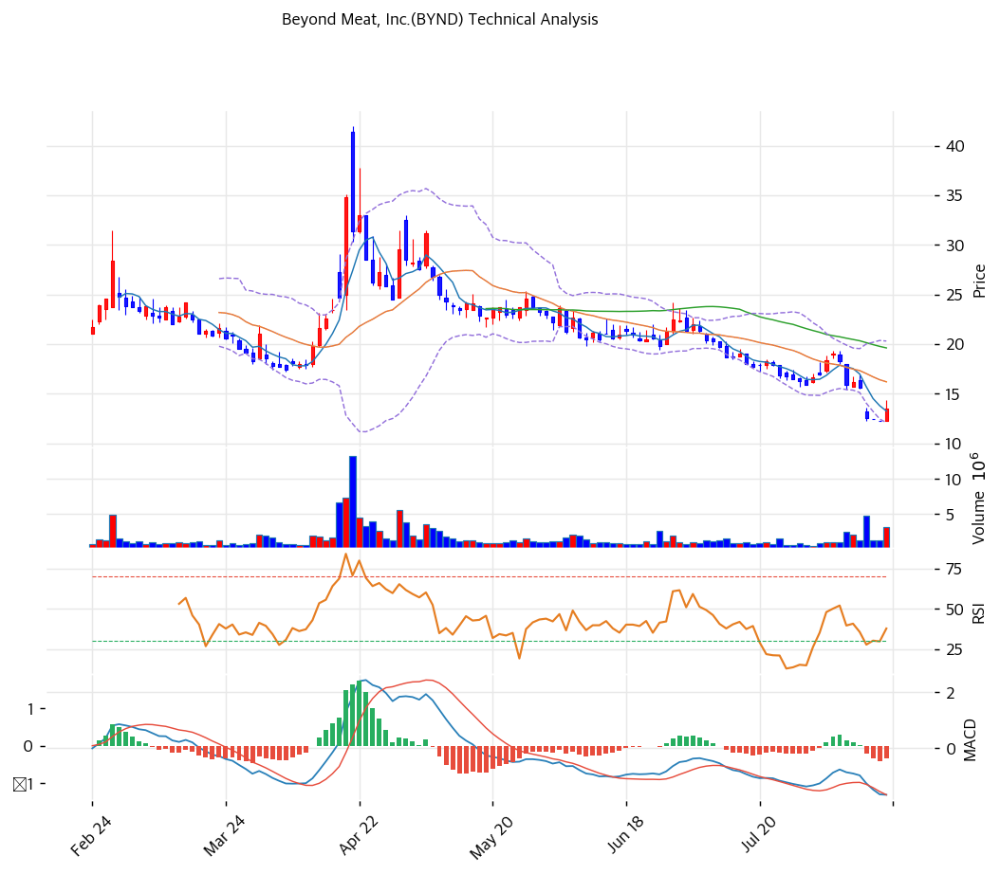

# Beyond Meat, Inc.(BYND) 기술적 분석

2026-08-17 | T2 Technical Analysis

## 차트

> ℹ️ **차트 기준**: 자동 수집된 원계열은 역분할 미조정이라 8/14에 30배 점프가 발생했다. 위 차트는 **분할 이전 전 구간에 ×30을 적용해 재생성**한 연속 시계열이며, 아래 모든 지표도 동일 기준으로 재계산했다.

## 가격 현황

| 항목 | 값 |
|---|---|
| 현재가 | **$13.47** (+10.31%) |
| 52주 고/저 | $230.70 / $12.00 |
| 52주 위치 | 0.7% |
| 52주 고점 대비 | **-94.2%** |
| RSI(14) | 34.7 (중립 하단) |
| MACD | -1.656 / -1.311 / -0.345 (매도구간, 히스토그램 축소) |
| Stochastic | K=6.2 D=2.1 골든크로스 (극단 과매도) |
| 볼린저 | 폭 50.8%, 하단($12.08) 바로 위 |
| 거래량 | 3,171,006주 (20일 평균 대비 2.68x) |

※ 기준일 2026-08-14 종가(전일 $12.2112). 2026-08-12·08-13은 데이터 피드에 종가만 존재해 고가·저가·거래량이 결측 — 스토캐스틱은 결측 회피를 위해 **종가 기준 14일 고/저**로 산출했고, 거래량 평균은 해당 2일을 제외한 직전 20거래일 기준이다.

## 이동평균선

| MA | 가격($) | 갭(%) | 위치 |
|---|--:|--:|---|
| MA5 | 13.25 | +1.7 | 위 |
| MA20 | 16.19 | -16.8 | 아래 |
| MA60 | 19.61 | -31.3 | 아래 |
| MA120 | 21.59 | -37.6 | 아래 |
| MA200 | 25.15 | -46.4 | 아래 |

→ **완전 역배열(MA5 < MA20 < MA60 < MA120 < MA200)**. 중기·장기 추세는 명백한 하락이며 MA200 대비 -46.4%로 이격도 크다. 유일한 긍정 신호는 현재가가 MA5(13.25)를 +1.7% 상회했다는 것뿐인데, 이는 5거래일짜리 반등에 불과하다. 의미 있는 추세 전환 확인선은 **MA20 $16.19 회복**이며 현재가 대비 +20.2%가 필요하다.

## 시그널 종합

| 구분 | 카운트 |
|---|--:|
| 매수 | 3 |
| 매도 | 2 |
| 중립 | 1 |
| **결론** | **단기 반등 우위 / 중기 하락 추세 유지** |

- 🟢 **스토캐스틱** K=6.2로 극단 과매도, D선 상향 돌파(골든크로스)
- 🟢 **볼린저** 하단 $12.08 이탈 후 회복, 밴드폭 50.8%로 변동성 정점 통과 조짐
- 🟢 **거래량** 2.68x 동반 상승 — 반등에 실수급이 붙었다
- 🔴 **이동평균** 완전 역배열, MA200 -46.4%
- 🔴 **52주 위치** 0.7% — 사실상 52주 최저권
- ⚪ **RSI 34.7 / MACD** RSI는 과매도(30)에 미달한 중립 하단, MACD는 매도구간이나 히스토그램이 -0.416 → -0.345로 축소되며 하락 모멘텀 둔화

## 지지·저항

| 구분 | 가격($) | 근거 |
|---|--:|---|
| 강 저항 | 16.19 | MA20 — 추세 전환 확인선 |
| 저항 | 15.47 | 피봇 R2 |
| 저항 | 14.47 | 피봇 R1 |
| 저항 | 14.34 | 8/14 장중 고가 (분할 후 최고) |
| **현재가** | **13.47** | — |
| 지지 | 13.25 | MA5 |
| 지지 | 12.34 | 피봇 S1 |
| 지지 | 12.21 | 8/13 종가 (분할 후 최저 종가) |
| 강 지지 | 12.08 | 볼린저 하단 |
| 강 지지 | 12.00 | 52주 저가 — **이탈 시 하방 참조선 소멸** |

※ 피보나치 되돌림은 스윙 폭이 $230.70 → $12.00으로 지나치게 커 0.236 되돌림조차 $63.61(현재가의 4.7배)에 위치한다. 실용적 의미가 없어 지지·저항 산정에서 제외했다.

## 전략

| 시나리오 | 액션 |
|---|---|
| 보유자 | **반등 시 축소** (TP $14.47 피봇 R1 / SL $12.00 52주 저가 이탈) |
| 신규 진입 1차 | **권장하지 않음** — 굳이 트레이딩한다면 $12.08\~12.34(볼린저 하단·피봇 S1) 지지 확인 후 소량 |
| 신규 진입 2차 | $16.19(MA20) **상향 돌파 후 안착** 시 추세 추종 전환 |
| 매도 트리거 | ① $12.00 종가 이탈 ② 나스닥 컴플라이언스 회복 통지 실패(8/31) ③ 2030 Notes 신규 대량 전환 공시 |

## 핵심 판단

지표 구성은 **"바닥권에서의 기술적 반등, 추세 전환은 아직"**이다. 스토캐스틱 6.2·볼린저 하단 회복·거래량 2.68x는 단기 반등의 조건을 갖췄고, MACD 히스토그램 축소도 하락 모멘텀 둔화를 지지한다. 그러나 완전 역배열에 MA200 대비 -46.4%, 52주 범위 위치 0.7%라는 배경은 이 반등이 하락 추세 안의 되돌림일 확률이 높다는 뜻이다.

이 종목에서 기술적 분석의 유효성 자체를 낮게 봐야 할 이유가 세 가지 있다. 첫째, **8/14가 분할조정 거래 1일차**라 분할 후 가격 기록이 단 하루뿐이고 이후 지표는 모두 합성 시계열에 기댄 값이다. 둘째, **유동주식이 16.66M주로 얇아진 상태에서 공매도가 유동주식의 약 26%**라 수급 충격 한 번에 차트가 무의미해진다 — 2025년 10월 $0.52 → $7.69(약 +1,380%) 폭등이 실제로 있었던 종목이다. 셋째, **8/31 나스닥 컴플라이언스 기한과 2030 Notes 추가 전환**이라는 이벤트 리스크가 차트 밖에 있다.

결론적으로 차트는 매수 근거가 아니라 **손절선 설정용**으로만 쓰는 것이 합리적이다. 하방 참조선은 $12.00 하나뿐이고, 그 아래로는 기술적 지지가 존재하지 않는다.
