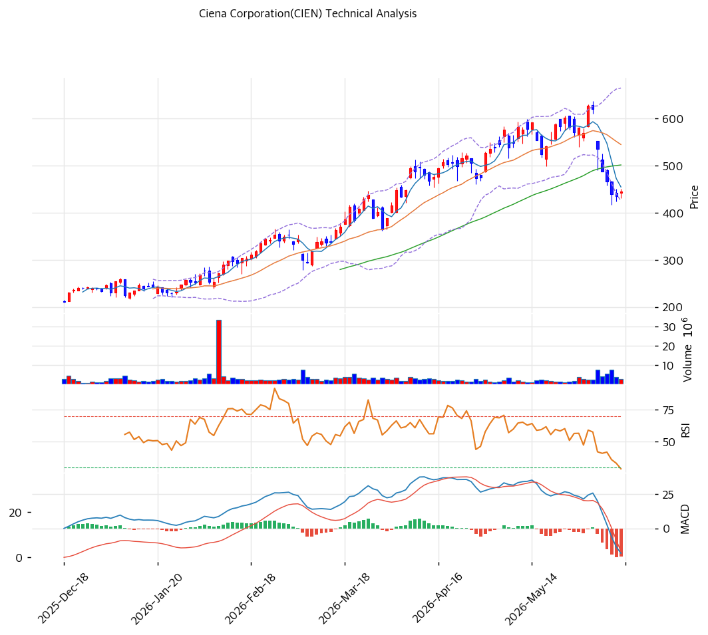

# Ciena(CIEN) 기술적 분석

## 차트

## 가격 현황

| 항목 | 값 |
|---|---|
| 현재가 | **$445.22** (+2.43%) |
| 52주 고/저 | $637.51 / $71.52 |
| 52주 위치 | 67.2% |
| RSI | 36.6 (과매도 근접) |
| MACD | 매도 |
| Stochastic | 중립 |
| 볼린저 | 하단 근접 |

## 이동평균선

| MA | 가격($) | 갭(%) | 위치 |
|---|--:|--:|---|
| MA5 | 455 | -2.1 | 아래 |
| MA20 | 545 | -18.3 | 아래 |
| MA60 | 502 | -11.2 | 아래 |
| MA120 | 391 | +14.0 | 위 |
| MA200 | 301 | +47.7 | 위 |

→ 단기·중기선(MA5·20·60) 아래의 **역배열(조정 심화)**. 52주 고가($637)서 -30% 급락으로 단·중기 추세가 꺾였으나, 장기선(MA120·200) 위로 장기 상승 추세는 유지. RSI 36.6 과매도 근접으로 단기 낙폭 과대.

## 시그널 종합

| 구분 | 카운트 |
|---|--:|
| 매수 | 1 |
| 매도 | 1 |
| 중립 | 4 |
| **결론** | **중립 (급락 후 과매도·바닥 탐색)** |

## 지지·저항

| 구분 | 가격($) | 근거 |
|---|--:|---|
| 강 저항 | 545 | MA20 |
| 저항 | 454 | 피봇 R1·MA5 |
| **현재가** | **$445.22** | 과매도권 |
| 지지 | 434 | 피봇 S1 |
| 강 지지 | 391\~422 | MA120·피봇 S2 |

## 전략

| 시나리오 | 액션 |
|---|---|
| 보유자 | 홀드 (TP $502 / SL $391) |
| 신규 진입 1차 | $434 (피봇 S1) |
| 신규 진입 2차 | $391 (MA120·강 지지) |
| 매도 트리거 | $391 종가 이탈 (MA120·장기 추세 훼손) |

## 핵심 판단

CIEN은 $72 → $637로 1년 6배 급등한 뒤 **고점 대비 -30% 급락($445)**한, 4개 비교 종목 중 가장 깊은 조정 종목이다. 실적 호조(FY26Q2 +40%·adj EPS 4배)에도 밸류 우려·광 섹터 셀오프로 단·중기선(MA5·20·60) 아래로 떨어졌다. RSI 36.6 과매도 근접·볼린저 하단으로 단기 낙폭은 과대하나, MACD 매도·역배열로 추세 반등은 미확인이다. 다만 장기선(MA120 +14%·MA200 +47.7%) 위로 장기 상승 추세는 유지되고 $7B 백로그가 펀더멘털을 받친다. $391\~434(MA120·피봇 S1) 지지에서 분할 접근이 가능하나, MA120($391) 이탈 시 추가 조정에 유의해야 한다. 4종목 중 과매도·밸류 완화 측면에서 진입 타이밍은 가장 우호적이다.
