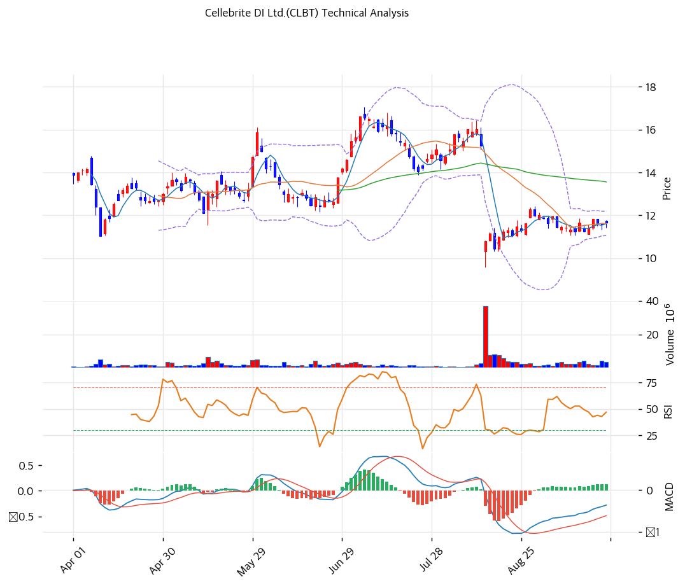

# Cellebrite DI Ltd.(CLBT) 기술적 분석

## 차트

## 가격 현황

| 항목 | 값 |
|---|---|
| 현재가 | **$11.66** (+0.87%) |
| 52주 고/저 | $19.98 (2025-11-13) / $9.58 (2026-08-13) |
| 52주 위치 | 20.0% |
| RSI | 45.6 (중립) |
| MACD | -0.36 / -0.49 / +0.13 (골든크로스, 히스토그램 확대) |
| Stochastic | K=57.3 D=52.3 골든크로스 (중립) |
| 볼린저 | 폭 9.8%, 중단($11.62) 부근. 극단적 스퀴즈 |

8월 13일 2분기 실적·가이던스 하향·CEO 교체가 한꺼번에 나오며 하루 만에 29% 빠졌고 장중 $9.58로 52주 신저가를 찍었다. 이후 곧바로 $11대로 되돌렸고, 9월 들어서는 $11.05\~$12.00의 좁은 박스에서 한 달째 횡보 중이다.

## 이동평균선

| MA | 가격($) | 갭(%) | 위치 |
|---|--:|--:|---|
| MA5 | 11.62 | +0.4 | 위 |
| MA20 | 11.62 | +0.3 | 위 |
| MA60 | 13.56 | -14.0 | 아래 |
| MA120 | 13.37 | -12.8 | 아래 |
| MA200 | 14.37 | -18.9 | 아래 |

→ **단기 수렴, 중장기 역배열(약세)**. MA5와 MA20이 $11.62에서 겹쳐 있고 주가가 그 위에 간신히 올라섰다. 반면 MA60·MA120·MA200은 $13.4\~14.4 구간에 모여 있어, 반등이 나와도 이 구간이 두꺼운 저항대가 된다. 8월 갭하락 이전 가격대와 겹치는 자리다.

## 시그널 종합

| 구분 | 카운트 |
|---|--:|
| 매수 | 2 |
| 매도 | 1 |
| 중립 | 3 |
| **결론** | **중립(약한 매수)** |

매수 신호는 MACD와 스토캐스틱 골든크로스 두 개다. 매도 신호는 중장기 이동평균 역배열이다. RSI(45.6), 볼린저(중단), 거래량은 중립이다. 거래량은 362만 주로 20일 평균 263만 주의 1.38배라 최근 며칠 거래가 붙고 있다.

## 지지·저항

| 구분 | 가격($) | 근거 |
|---|--:|---|
| 강 저항 | 14.37 | MA200, 8월 갭하락 이전 가격대 |
| 저항 | 13.55 | 피보나치 0.382 되돌림, MA60($13.56) |
| 저항 | 12.20 | 볼린저 상단, 9월 박스 상단($12.00) |
| **현재가** | **$11.66** | MA5·MA20 부근 |
| 지지 | 11.05 | 볼린저 하단, 9월 박스 하단 |
| 강 지지 | 9.58 | 8월 13일 장중 저점(52주 신저가) |

피보나치는 52주 고점 $19.98과 저점 $9.58을 기준으로 계산했다. 0.236 되돌림 $12.03이 현재 박스 상단과 겹친다.

## 전략

| 시나리오 | 액션 |
|---|---|
| 보유자 | 홀드 (TP $13.55 / SL $10.90) |
| 신규 진입 1차 | $11.05 (박스 하단, 볼린저 하단) |
| 신규 진입 2차 | $10.00 (8월 저점 $9.58 위 심리적 지지) |
| 매도 트리거 | 종가 $10.90 이탈(박스 하방 이탈) 또는 3분기 ARR 가이던스 하단 미달 |

박스 상단 $12.20을 거래량을 동반해 돌파하면 추격 매수 신호로 본다. 목표는 $13.55(MA60·피보나치 0.382)다.

## 핵심 판단

실적 쇼크 이후 한 달간 $11\~12에서 매도세가 소화되는 국면이다. 볼린저 밴드 폭 9.8%는 급락 직후 종목에서 보기 드문 수준의 수렴으로, 조만간 방향이 크게 나올 가능성이 높다. 단기 지표(MACD·스토캐스틱 골든크로스)는 위를 가리키지만 중장기 이동평균이 $13.4\~14.4에 몰려 있어 반등의 상단은 제한적이다. 방향을 정할 재료는 11월 3분기 실적이고, 그 전까지는 박스 하단 분할 매수, 이탈 시 손절의 대응이 합리적이다.
