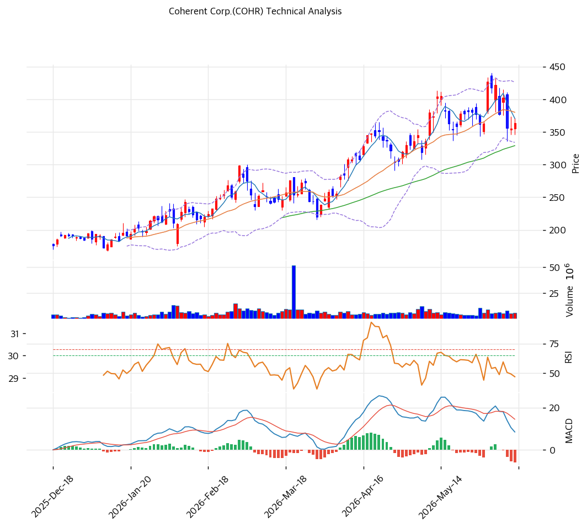

# 기술적분석

## 차트

## 가격 현황

| 항목         | 값                    |
| ---------- | -------------------- |
| 현재가        | **$363.58** (+2.48%) |
| 52주 고/저    | $440.00 / $76.88     |
| 52주 위치     | 81.9%                |
| RSI        | 48.9 (중립)            |
| MACD       | 매도                   |
| Stochastic | 중립                   |
| 볼린저        | 중간                   |

## 이동평균선

| MA    | 가격($) |  갭(%) | 위치 |
| ----- | ----: | ----: | -- |
| MA5   |   371 |  -1.9 | 아래 |
| MA20  |   380 |  -4.3 | 아래 |
| MA60  |   329 | +10.5 | 위  |
| MA120 |   274 | +32.8 | 위  |
| MA200 |   216 | +68.0 | 위  |

→ 단기선(MA5·20) 아래·중장기선 위의 **비정배열(단기 약세)**. 52주 고가($440)서 -17% 조정 중으로, 단기 모멘텀이 꺾였으나 중기 상승 추세(MA60 이상)는 유지. MA200 대비 +68%로 과열은 일부 해소.

## 시그널 종합

| 구분     |                 카운트 |
| ------ | ------------------: |
| 매수     |                   0 |
| 매도     |                   1 |
| 중립     |                   5 |
| **결론** | **매도우위 (단기 조정 국면)** |

## 지지·저항

| 구분      |       가격($) | 근거         |
| ------- | ----------: | ---------- |
| 강 저항    |       426.9 | 52주 고가     |
| 저항      |    375\~380 | 피봇 R1·MA20 |
| **현재가** | **$363.58** | 단기선 아래     |
| 지지      |         349 | 피봇 S1      |
| 강 지지    |    329\~334 | MA60·피봇 S2 |

## 전략

| 시나리오     | 액션                         |
| -------- | -------------------------- |
| 보유자      | 홀드 (TP $427 / SL $329)     |
| 신규 진입 1차 | $349 (피봇 S1)               |
| 신규 진입 2차 | $329 (MA60·강 지지)           |
| 매도 트리거   | $329 종가 이탈 (MA60·중기 추세 훼손) |

## 핵심 판단

COHR은 $77 → $440로 1년 4.7배 급등한 뒤 **고점 대비 -17% 조정 중**인 종목으로, 다른 비교 종목(신고가권)과 달리 단기 약세 국면이다. 단기선(MA5·20) 아래로 MACD 매도·매도우위 시그널이나, 중장기선(MA60 +10.5%·MA200 +68%) 위로 중기 상승 추세는 유지된다. RSI 48.9로 과매수 해소돼 다른 종목 대비 과열이 완화됐다. AI 광 트랜시버·NVIDIA $2B 투자가 펀더멘털을 받치고 애널 목표가($380)에 근접해, $329\~349(MA60·피봇 S1) 지지 확인 시 반등 여지가 있다. 단 beta 2.05의 변동성으로 MA60 이탈 시 추가 조정에 유의해야 한다. 4개 종목 중 유일하게 조정을 거친 만큼 진입 타이밍은 상대적으로 우호적이다.
