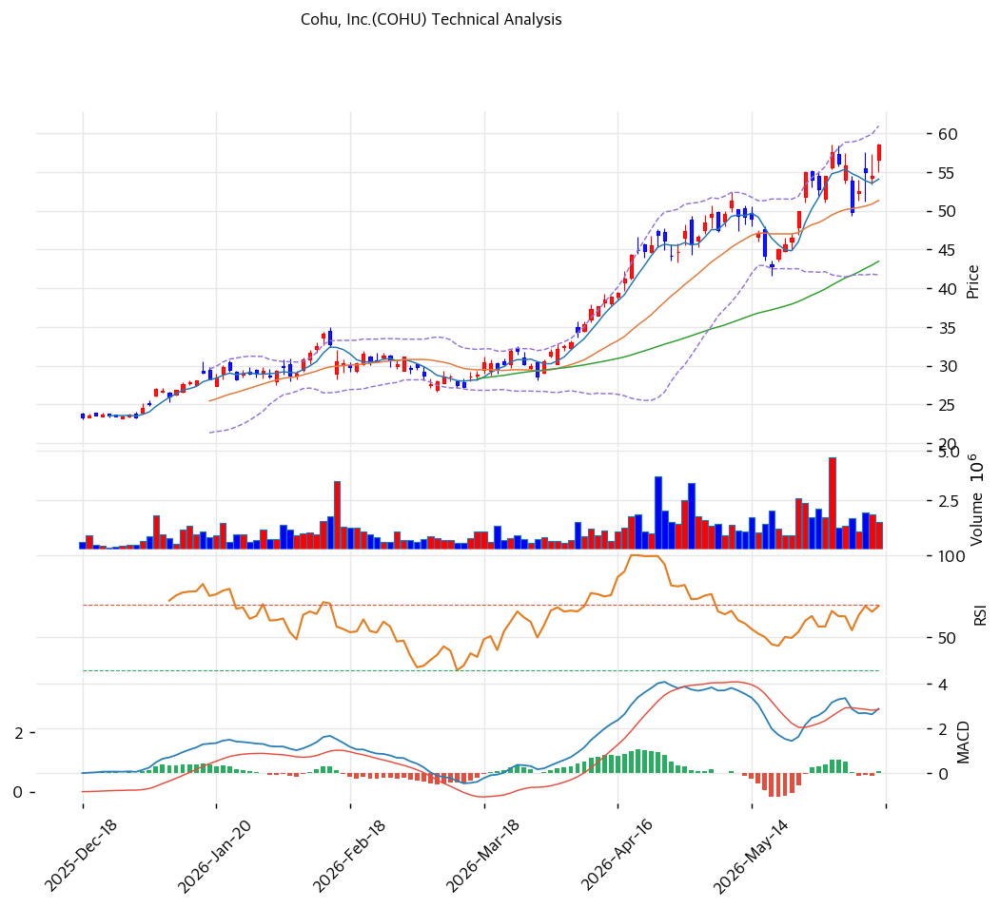

# Cohu(COHU) 기술적 분석

## 차트

## 가격 현황

| 항목 | 값 |
|---|---|
| 현재가 | **$58.57** (+7.53%) |
| 52주 고/저 | $58.70 / $17.71 |
| 52주 위치 | 100.0% |
| RSI | 64.3 (중립) |
| MACD | 매수 |
| Stochastic | 골든크로스 (중립) |
| 볼린저 | 상단 근접 |

## 이동평균선

| MA | 가격($) | 갭(%) | 위치 |
|---|--:|--:|---|
| MA5 | 54 | +8.3 | 위 |
| MA20 | 51 | +14.1 | 위 |
| MA60 | 43 | +34.7 | 위 |
| MA120 | 36 | +63.2 | 위 |
| MA200 | 30 | +92.5 | 위 |

→ **완전 정배열** 강세. MA200 대비 +92.5%의 큰 괴리로 강한 상승 추세이나 단기 과열. 당일 +7.53% 급등으로 52주 신고가 경신(단, 거래량 0.85x로 동반 약함).

## 시그널 종합

| 구분 | 카운트 |
|---|--:|
| 매수 | 1 |
| 매도 | 1 |
| 중립 | 4 |
| **결론** | **중립 (강세 추세 + 과열·거래량 미동반)** |

## 지지·저항

| 구분 | 가격($) | 근거 |
|---|--:|---|
| 강 저항 | 60 | 피봇 R1 |
| 저항 | 58.7 | 52주 고가 |
| **현재가** | **$58.57** | 신고가권 |
| 지지 | 56 | 피봇 S1 |
| 강 지지 | 51\~54 | MA20·피봇 S2 |

## 전략

| 시나리오 | 액션 |
|---|---|
| 보유자 | 분할 익절 (TP $60 / SL $51) |
| 신규 진입 1차 | $54 (피봇 S2·MA5) |
| 신규 진입 2차 | $51 (MA20 눌림) |
| 매도 트리거 | $51 종가 이탈 (MA20·추세 훼손) |

## 핵심 판단

COHU는 $18 → $58.6로 1년 3.3배 급등한 강한 상승 추세주로, 당일 +7.53% 급등으로 52주 신고가를 경신했다. 완전 정배열·MACD 매수로 추세가 강하나, MA200 대비 +92.5% 과열·당일 거래량 0.85배(미동반)로 종합은 중립이다. AI/HPC 테스트 회복·FY26Q2 $144M 가이던스가 추세를 받치고, 공매도 18.5%는 숏스퀴즈 상방 잠재력이자 변동성 요인이다. 추격보다 $51\~54(MA20·MA5) 눌림목 분할이 정석이며, 순현금·recurring 60%가 펀더멘털 하방을 지지한다.
