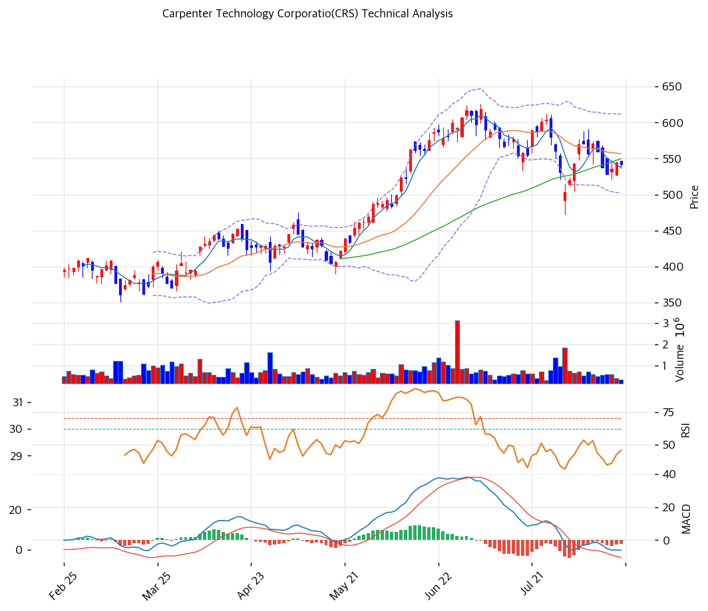

# Carpenter Technology(CRS) 기술적 분석

## 차트

## 가격 현황

| 항목 | 값 |
|---|---|
| 현재가 | **$542.38** (-0.41%) |
| 52주 고/저 | $625.99 (2026-07-06) / $228.00 (2025-09-25) |
| 52주 위치 | 79.0% |
| 고점 대비 | -13.4% |
| RSI(14) | 46.5 (중립) |
| MACD | -6.08 / -3.91 / -2.17 (매도구간, 히스토그램 축소) |
| Stochastic | K=55.2 D=49.4 골든크로스 (중립) |
| 볼린저 | 폭 19.7%, 중단 아래 |
| 거래량 | 20일 평균 대비 0.48x |
| 1년 / 2년 수익률 | +120.1% / +269.9% |

※ 2026-08-17 종가 기준(전일 $544.59)

## 이동평균선

| MA | 가격($) | 갭(%) | 위치 |
|---|--:|--:|---|
| MA5 | 537.75 | +0.9 | 위 |
| MA20 | 556.86 | -2.6 | 아래 |
| MA60 | 549.56 | -1.3 | 아래 |
| MA120 | 480.22 | +12.9 | 위 |
| MA200 | 420.86 | +28.9 | 위 |

→ **비정배열이며 단기 조정 국면**이다. 장기 추세는 명확히 살아 있다(MA200 대비 +28.9%, MA120 대비 +12.9%). 그러나 단기·중기선인 MA20과 MA60을 모두 내준 상태이고 두 선이 556.86과 549.56으로 좁게 붙어 있어 이 구간이 저항대로 바뀌었다. MA5(537.75)를 겨우 지키고 있는 형태다.

되돌림 폭 자체는 아직 얕다. 7월 6일 고점 $625.99 대비 -13.4%인데, 1년 상승률이 +120.1%인 종목에서는 통상적인 조정 범위다.

## 시그널 종합

| 구분 | 카운트 |
|---|--:|
| 매수 | 0 |
| 매도 | 1 |
| 중립 | 5 |
| **결론** | **방향성 부재, 매도 소폭 우위** |

- 🔴 **MACD** 매도구간(-6.08 < -3.91). 다만 히스토그램이 -2.17로 축소 중이라 하락 모멘텀은 둔화
- ⚪ **RSI 46.5** 중립 정중앙. 과매수도 과매도도 아님
- ⚪ **이동평균** MA20 대비 -2.6%로 이격이 작다. 방향성 판단 불가 구간
- ⚪ **볼린저** 밴드 폭 19.7%로 보통, 중단(556.86)과 하단(501.90) 사이 중간
- ⚪ **스토캐스틱** K 55.2가 D 49.4를 상향 돌파해 골든크로스이나 중립 영역이라 신호 강도가 약함
- ⚪ **거래량 0.48x** 20일 평균의 절반. 조정에 매도 압력이 실리지 않았다는 뜻이면서 반등 동력도 없다는 뜻

지표 6개 중 5개가 중립이다. 이런 배치는 **추세 전환이 아니라 소화 국면**을 시사한다.

## 지지·저항

| 구분 | 가격($) | 근거 |
|---|--:|---|
| 강 저항 | 625.99 | 52주 고가 (2026-07-06) |
| 저항 | 611.82 | 볼린저 상단 |
| 저항 | 556.86 | MA20 |
| 저항 | 549.56 | MA60 |
| **현재가** | **542.38** | — |
| 지지 | 537.75 | MA5 |
| 지지 | 531.94 | 피봇 S2 |
| 지지 | 501.90 | 볼린저 하단 |
| 강 지지 | 474\~482 | **PRZ (중)**: 피보나치 0.382 되돌림 + MA120 + 상승 추세선 |
| 강 지지 | 421\~427 | PRZ (약): MA200 + 피보나치 0.5 되돌림 |

※ 피보나치는 상승 추세 기준(Swing Low $228.00 → Swing High $625.99)

## 전략

| 시나리오 | 액션 |
|---|---|
| 보유자 | **홀드** (TP $612 볼린저 상단 / SL $501 볼린저 하단) |
| 신규 진입 1차 | $501\~510 (볼린저 하단, 현재가 대비 -6\~8%) |
| 신규 진입 2차 | **$474\~482** (PRZ 중, MA120·피보 0.382 겹침, -11\~13%) |
| 추세 추종 전환 | $557 (MA20) 거래량 동반 회복 후 안착 |
| 매도 트리거 | ① $474 PRZ 이탈 ② Q1 FY2027 실적(10/22) 가이던스 하회 ③ Boeing 737 생산율 47대 이행 지연 공식화 |

## 핵심 판단

차트는 **강한 장기 추세 안의 건강한 조정**을 보여준다. MA200 대비 +28.9%로 상승 추세가 유지되는 가운데 MA20·MA60을 내주고 거래량 없이 흘러내리는 형태이며, 지표 6개 중 5개가 중립이다. 매물 소화 구간으로 읽는 것이 자연스럽다.

조정의 시점이 의미를 갖는다. 고점 $625.99는 **2026년 7월 6일**이었고 그 직후인 **7월 24일 CEO 급서, 7월 30일 FY2026 실적 발표, 8월 12일 10-K 제출**이 이어졌다. 실적은 EPS $3.23으로 컨센서스 $3.07을 넘겼지만 매출 $851M이 컨센서스 $862M을 밑돌아 발표 당일 시간외에서 4.6% 빠졌다. 즉 이번 하락은 기술적 과열 해소와 이벤트 리스크가 겹친 결과이지 추세 훼손 신호로 보기는 어렵다.

주의할 점은 **밸류에이션이 차트보다 먼저 부담이 된다**는 것이다. PER 51.6배, PBR 12.1배는 자기 역사 대비 각각 +21%, +262%다. 애널리스트 최저 목표주가 $540은 이미 현재가 아래에 있다. 차트상 하방 지지가 $474\~482(PRZ 중)까지 열려 있는데 이는 현재가 대비 -11\~13%이며, 그 구간이 MA120과 피보나치 0.382가 겹치는 자리라 되돌림이 나온다면 여기까지가 1차 목표가 된다.

정리하면 추세 추종 관점에서는 홀드, 신규 진입 관점에서는 $500 아래를 기다리는 것이 손익비에 맞는다. 10월 22일 Q1 FY2027 실적이 다음 방향을 정할 분기점이다.
