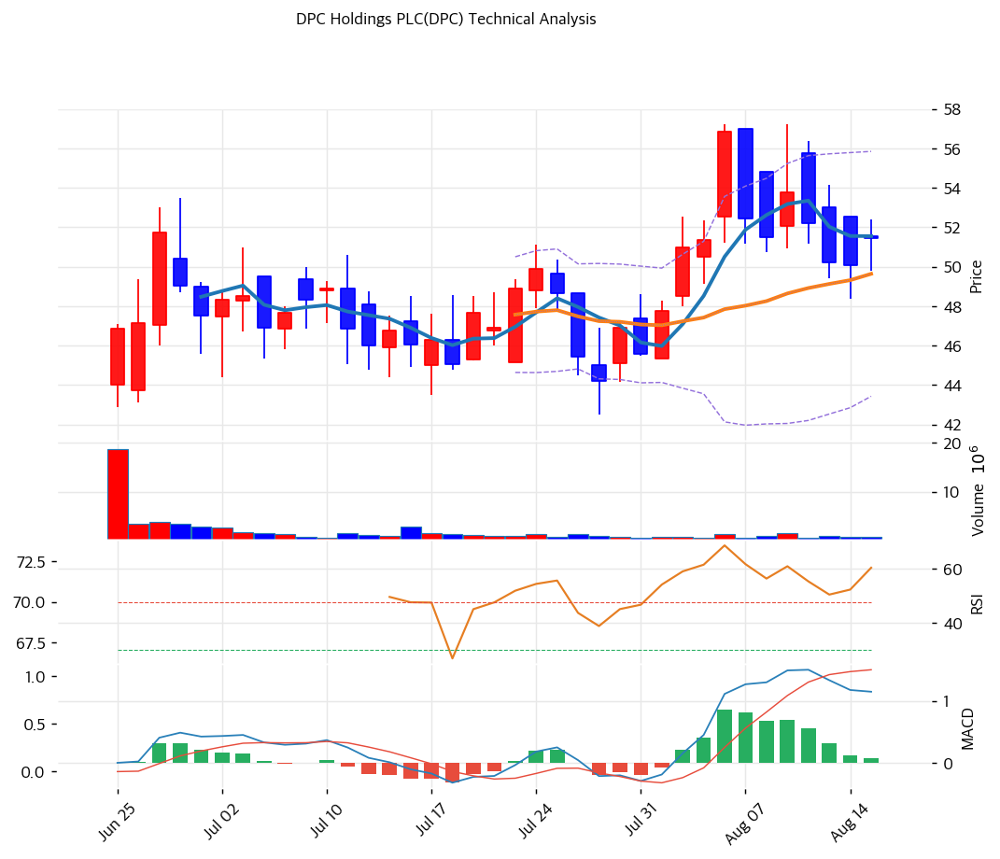

# DPC Holdings(DPC) 기술적 분석

## 차트

⚠️ **이 종목은 2026년 6월 25일 상장해 거래일이 37일뿐이다.** MA60·MA120·MA200은 산출 자체가 불가능하고, RSI·MACD·스토캐스틱도 표본이 얇아 신호 강도가 낮다. 아래 지표는 참고치로만 봐야 하며, 통상적인 추세 판단 도구가 작동하지 않는 구간이다.

## 가격 현황

| 항목 | 값 |
|---|---|
| 현재가 | **$51.46** (+2.74%) |
| 공모가 | $33.00 (2026-06-24 확정) |
| **공모가 대비** | **+55.9%** |
| 상장 후 고/저 | $57.25 (2026-08-06) / $42.50 (2026-07-29) |
| 구간 내 위치 | 60.7% |
| 고점 대비 | -10.1% |
| 상장 후 VWAP | **$48.10** (현재가 +7.0%) |
| RSI(14) | 54.7 (중립) |
| MACD | 1.15 / 1.07 / +0.08 (매수구간, 히스토그램 축소) |
| Stochastic | K=54.8 D=58.8 데드크로스 (중립) |
| 볼린저(20) | 상단 55.85 / 중단 49.64 / 하단 43.43, **폭 25.0%** |
| 거래량 | 20일 평균 대비 0.84x (평균 88.2만주) |
| **일간 변동성** | **4.26% (연환산 68%)** |

※ 2026-08-17 종가 기준(전일 $50.09)

볼린저 밴드 폭 25.0%는 같은 날 Howmet의 6.8%와 비교하면 3.7배다. 연환산 변동성 68%는 개별 산업재 종목으로서 매우 높은 수준이며, 상장 초기 가격 발견이 아직 진행 중이라는 뜻이다.

## 이동평균선

| MA | 가격($) | 갭(%) | 위치 |
|---|--:|--:|---|
| MA5 | 51.55 | -0.2 | 아래 |
| MA10 | 52.09 | -1.2 | 아래 |
| MA20 | 49.64 | +3.7 | 위 |
| MA60 | 산출 불가 | | 데이터 부족 |
| MA120 | 산출 불가 | | 데이터 부족 |
| MA200 | 산출 불가 | | 데이터 부족 |
| **상장 후 VWAP** | **48.10** | **+7.0** | 위 |

산출 가능한 세 개 중 MA5와 MA10을 밑돌고 MA20을 웃돈다. 단기 조정 중이지만 상장 이후 평균 매입단가($48.10) 위에 있다는 뜻이다.

정배열·역배열을 논할 수 있는 구간이 아니므로, 이 종목에서는 **상장 후 VWAP $48.10**과 **직전 고점 $57.25**, **직전 저점 $42.50** 세 개를 기준선으로 쓰는 편이 현실적이다.

## 상장 이후 주요 흐름

| 일자 | 종가 | 변동 | 내용 |
|---|--:|--:|---|
| 2026-06-25 | $46.88 | 시초 +33.3% | **상장 첫날.** 시가 $44.00, 거래량 1,865만주 |
| 2026-06-29 | $51.76 | +9.78% | 장중 $53.00. 초기 고점 |
| 2026-07-20 | $45.06 | -2.62% | Jefferies·Rothschild 커버리지 개시 |
| **2026-07-29** | **$44.23** | -2.64% | **장중 $42.50, 상장 후 최저** |
| 2026-08-04 | $51.00 | +6.81% | 반등 시작 |
| **2026-08-06** | **$56.84** | **+10.65%** | **장중 $57.25 최고. 같은 날 Howmet Q2 실적 발표** |
| 2026-08-07 | $52.44 | -7.74% | 급반락 |
| **2026-08-11** | **$53.77** | +4.45% | **상장 후 첫 실적 발표.** 장중 $57.24 |
| 2026-08-12 | $52.23 | -2.86% | Morgan Stanley 목표가 $59→$47 하향, RBC $53→$62 상향 |
| 2026-08-13 | $50.22 | -3.85% | |
| 2026-08-17 | $51.46 | +2.74% | |

두 개의 관찰이 나온다.

**첫째, 8월 6일의 +10.65%는 자체 재료가 아니었다.** 그날은 Howmet Aerospace가 Q2 실적을 발표하고 FY2026 가이던스를 세 번째로 올린 날이다. 정밀주조 업종 전반의 수요 확인이 DPC로 번진 것으로 보이며, 상장 직후 종목이 동종사 실적에 얼마나 민감한지를 보여준다.

**둘째, 자체 실적일(8월 11일)의 반응이 더 약했다.** 장중 $57.24까지 갔다가 $53.77에 마감했고 이후 이틀간 -2.86%, -3.85%로 밀렸다. 매출 +34%, 조정 EBITDA +33%, 연간 가이던스 첫 제시라는 내용에 비하면 인색한 반응이며, 다음 날 Morgan Stanley의 목표가 하향이 겹쳤다.

## 시그널 종합

| 구분 | 카운트 |
|---|--:|
| 매수 | 1 |
| 매도 | 1 |
| 중립 | 3 |
| 산출 불가 | 1 |
| **결론** | **판단 유보. 표본 부족** |

- 🟢 **MACD** 1.15가 시그널 1.07 위로 매수구간. 다만 히스토그램이 +0.13에서 +0.08로 줄어 힘이 빠지는 중
- 🔴 **스토캐스틱** K 54.8이 D 58.8 아래로 데드크로스. 중립 영역이라 강도는 약함
- ⚪ **RSI 54.7** 중립 정중앙
- ⚪ **볼린저** 중단 위, 상단까지 8.5% 여유. 밴드 폭 25.0%로 매우 넓어 신호 해석이 어려움
- ⚪ **거래량 0.84x** 상장 초기 대비 급감. 첫날 1,865만주에서 최근 70\~90만주 수준
- ⛔ **이동평균 배열** 산출 불가

거래량 감소가 눈에 띈다. 상장 첫날 1,865만주에서 최근 20일 평균 88만주로 줄었다. 초기 회전이 끝나고 유통 물량이 자리를 잡는 국면이며, 12월 보호예수 해제 전까지는 이 상태가 이어질 가능성이 높다.

## 지지·저항

| 구분 | 가격($) | 근거 |
|---|--:|---|
| 강 저항 | 57.25 | 상장 후 최고 (2026-08-06 장중) |
| 저항 | 55.85 | 볼린저 상단 |
| 저항 | 53.80 | 피봇 R2 |
| 저항 | 53.77 | 8/11 실적일 종가 |
| 저항 | 52.63 | 피봇 R1 |
| 저항 | 52.09 | MA10 |
| **현재가** | **51.46** | |
| 지지 | 51.55 → 상단 전환 | MA5 |
| 지지 | 50.05 | 피봇 S1 |
| 지지 | 49.88 | 피보 0.5 되돌림 |
| 지지 | 49.64 | MA20 |
| 지지 | 48.64 | 피봇 S2 |
| **강 지지** | **48.10\~48.13** | **상장 후 VWAP + 피보 0.618 되돌림** |
| 지지 | 47.00 | Morgan Stanley 목표주가 |
| 지지 | 43.43 | 볼린저 하단 |
| **강 지지** | **42.50** | **상장 후 최저 (2026-07-29)** |

※ 피보나치는 상장 후 스윙 기준($42.50 → $57.25)

$48.10\~48.13 구간이 이 차트의 핵심이다. 상장 이후 거래량 가중 평균단가와 피보나치 0.618 되돌림이 겹치며, 상장 후 매수자 전체의 손익분기점에 해당한다. 여기가 깨지면 아래는 $42.50까지 뚜렷한 지지가 없다.

## 전략

| 시나리오 | 액션 |
|---|---|
| 보유자 | **홀드** (TP $57.25 상장 후 고점 / SL $48.10 VWAP) |
| 신규 진입 | **12월 보호예수 해제 이후로 유보 권장** |
| 조기 진입 1차 | $48.10\~48.65 (VWAP·피봇 S2, 현재가 대비 -5.5~-6.5%) |
| 조기 진입 2차 | $43.43\~44.23 (볼린저 하단·7월 저점 종가, -14\~16%) |
| 추세 확장 | $57.25 거래량 동반 돌파 후 안착 |
| 매도 트리거 | ① $48.10 VWAP 이탈 ② Q3 2026 조정 EBITDA 마진 18% 하회 ③ 보호예수 해제 후 대량 블록딜 출회 |

## 핵심 판단

기술적 분석이 가장 무력한 종류의 차트다. 거래일 37일, 연환산 변동성 68%, 이동평균 대부분 산출 불가. 이 상태에서 추세를 논하는 것은 근거가 얇다.

읽을 수 있는 것은 세 가지다.

**① 공모가 대비 +55.9%인데 상장 후 VWAP 대비로는 +7.0%다.** 첫날 시초가가 공모가 대비 33% 위에서 시작했기 때문에, 실제 시장 참여자 대부분의 평균 매입가는 $48.10 근처다. 공모 배정을 받은 소수만이 큰 차익 상태이며, 이 구조는 12월 보호예수 해제 때 매도 압력의 크기를 좌우한다.

**② 자체 실적보다 동종사 실적에 더 크게 반응했다.** 8월 6일 Howmet 실적일에 +10.65%, 자체 실적일인 8월 11일에는 +4.45% 후 이틀 연속 하락이다. 시장이 아직 이 회사를 개별 기업이 아니라 정밀주조 업종 노출 수단으로 보고 있다는 뜻이다.

**③ 거래량이 20분의 1로 줄었다.** 상장 첫날 1,865만주에서 최근 88만주다. 가격 발견이 일단락됐고 유동성이 얇아진 상태라, 보호예수 해제나 실적 서프라이즈 같은 큰 이벤트에 가격이 과민하게 반응할 여지가 크다.

정리하면 차트로는 방향을 정할 수 없다. 이 종목의 다음 가격은 11월 초 Q3 실적과 **12월 21일경 보호예수 해제**라는 두 개의 이벤트가 정한다. 신규 진입이라면 그 두 이벤트를 확인한 뒤 들어가는 편이 명백히 유리하고, 그 전에 사겠다면 $48.10(상장 후 VWAP) 아래에서만 의미가 있다.
