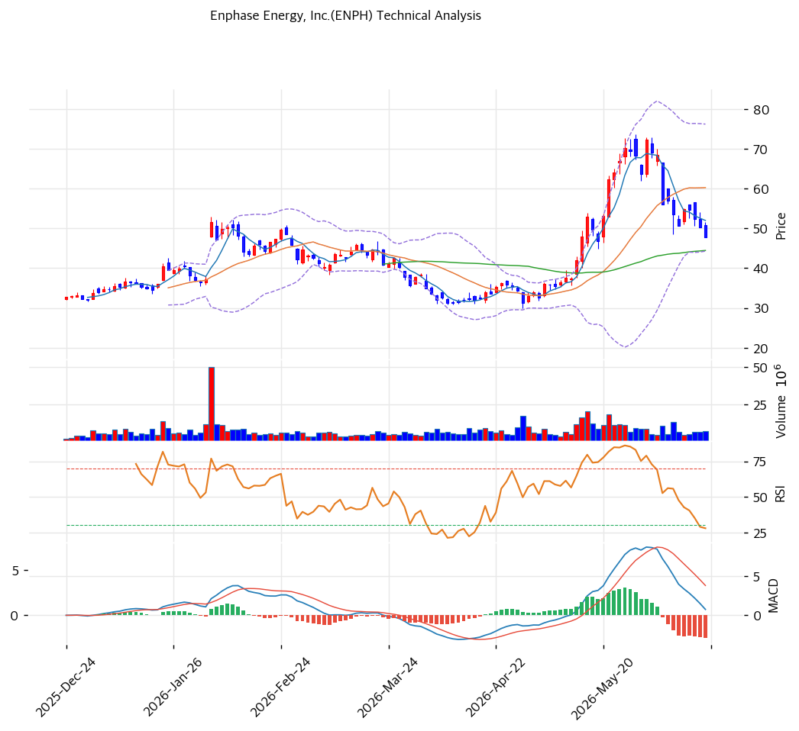

# Enphase(ENPH) 기술적 분석

2026-06-18 | T2 Technical Analysis

---

## 차트

---

## 1. 가격 현황

| 항목 | 값 |
|------|-----|
| 현재가 | $47.78 |
| 52주 고가 | $73.74 |
| 52주 저가 | $25.78 |
| 52주 범위 위치 | 45.9% (중단) |
| 거래량비 | 0.79x (평균 이하) |

> 저점($25.78)에서 반등했으나 고점($73.74)에서 35% 하락한 조정 국면. 25D 절벽·실적 둔화가 주가를 눌렀다. 현재 단기선(MA20 $60) 아래, 중장기선(MA60 $44·MA200 $39) 위. Beta 1.57 고변동.

---

## 2. 차트 패턴 분석

### 2.1 캔들스틱 패턴

| 패턴 | 위치 | 신뢰도 | 해석 |
|------|------|--------|------|
| 고점 후 하락 | $73→$47 | 중 | 실적 둔화 반영 |
| MA60 지지 시험 | $47.78 ≈ MA60 $44 | 중 | 중기 지지 공방 |
| 스토캐스틱 과매도 | K=7.7 | 중 | 단기 반등 여지 |

※ 주요 캔들 패턴: 망치형, 역망치형, 장악형, 도지, 샛별/석별, 적삼병/흑삼병, 하라미, 유성형, 교수형 등

### 2.2 가격 구조 패턴

- **고점 대비 하락·중기 지지 시험** (신뢰도: 중)
  $73 고점 후 $47대로 하락. MA60($44)·피보 0.618($47) 지지대 시험. 지지 유지 시 반등, 이탈 시 추가 조정.

- **단기 약세·중장기 상승 잔존** (신뢰도: 중)
  MA5·MA20 아래(단기 약세), MA60·120·200 위(중장기 상승). 단기 눌림과 중장기 추세 교차.

※ 주요 구조 패턴: 이중천정/바닥, 삼각수렴, 쐐기형, 깃발형, 페넌트, 컵앤핸들, 박스권 등

### 2.3 다이버전스

- **과매도 반등 시도** (신뢰도: 중)
  스토캐스틱 과매도(K=7.7)·RSI 42.6 중립. 단기 반등 여지이나 MACD 매도 전환으로 모멘텀 약화 혼재.

※ RSI·MACD 기반 | 상승 다이버전스 = 가격↓ 지표↑, 하락 다이버전스 = 가격↑ 지표↓

### 2.4 패턴 종합 판단

고점 대비 35% 하락 후 MA60($44)·피보 0.618($47) 지지대를 시험하는 국면. 단기선 아래로 단기 약세이나 중장기선 위로 추세 잔존. 스토캐스틱 과매도(K=7.7)로 단기 반등 여지가 있으나, MACD 매도 전환·거래량 감소로 추세 확신은 약하다. **지지($45\~47) 유지 여부**가 방향을 결정하며, 펀더(25D 절벽 실적)가 약해 기술적 반등도 추세 전환 확인 필요.

---

## 3. 이동평균선 — 단기 약세·중장기 상승 혼재

| MA | 값 | 현재가 괴리율 | 위치 |
|----|-----|--------------|------|
| MA5 | $52 | -8.1% | 아래 |
| MA20 | $60 | -20.7% | 아래 |
| MA60 | $44 | +7.5% | 위 |
| MA120 | $43 | +11.8% | 위 |
| MA200 | $39 | +22.0% | 위 |

**해석**: 현재가가 단기선(MA5 $52·MA20 $60) 아래로 **단기 조정**이나, 중장기선(MA60 $44·MA120 $43·MA200 $39) 위로 **중장기 상승 추세 잔존**. 정배열 깨짐(aligned False) — 고점 후 단기 급락 국면. MA60($44) 지지가 추세 방어선.

---

## 4. 보조 지표

### RSI(14) — 42.6 (중립)

조정으로 중립권. 과매도는 아니나 약세 기울기.

### MACD(12,26,9)

| 항목 | 값 |
|------|-----|
| MACD | \~1.0 |
| Signal | \~3.0 |
| Histogram | ~-3.0 |
| 크로스 상태 | 매도 전환(확산) |

**해석**: MACD가 Signal 하향 돌파한 매도 전환, 히스토그램 음(-) 확대 → 하락 모멘텀 지속.

### 볼린저밴드(20, 2σ)

| 항목 | 값 |
|------|-----|
| 상단 | $76 |
| 중단 (MA20) | $60 |
| 하단 | $44 |
| 밴드 폭 | 53.0% (고변동) |
| 현재 위치 | 중간~하단 |

**해석**: 밴드 폭 53%로 변동성 매우 큼. 현재가 $47.78은 중단($60) 아래·하단($44) 위. 하단 근접 시 단기 반등, 중단 회복 실패 시 약세 지속.

### 스토캐스틱(14, 3, 3)

| 항목 | 값 |
|------|-----|
| Slow %K | 7.7 |
| Slow %D | 15.1 |
| 크로스 상태 | 데드크로스 |
| 판단 | 과매도(심) |

**해석**: 심한 과매도권(K=7.7). 단기 기술 반등 여지이나 데드크로스로 방향 확인 필요.

---

## 5. 지지/저항 — 추세선 · 피보나치 · PRZ 통합

### 5.1 종합 지지/저항 테이블

| 구분 | 가격 | 근거 |
|------|------|------|
| 저항 | $73.74 | 52주 고가 |
| 저항 | $64 | 추세선 저항 |
| 저항 | $63 | 피보 0.236 |
| 저항 | $60 | MA20 |
| 저항 | $57 | 피보 0.382 |
| 저항 | $52 | 피보 0.5·MA5·PRZ(약) |
| 저항 | $50 | 피봇 R1 |
| **현재가** | **$47.78** | 하락 후 지지 시험 |
| 지지 | $47 | 피보 0.618 |
| 지지 | $46 | 피봇 S1 |
| 지지 | $45 | 피봇 S2·전략 SL |
| 지지 | $44 | MA60 |
| 지지 | $40 | 피보 0.786 |
| 지지 | $39 | MA200 |

---

## 6. 시그널 종합

| 지표 | 내용 | 시그널 |
|------|------|--------|
| 차트 패턴 | 고점 후 하락, 지지 시험 | ⚪ |
| 이동평균선 | 단기 약세·중장기 상승 혼재 | ⚪ |
| RSI | 42.6 — 중립 | ⚪ |
| MACD | 매도 전환(확산) | 🔴 |
| 볼린저밴드 | 중단 아래, 밴드폭 53% | ⚪ |
| 스토캐스틱 | 과매도(K=7.7), 데드크로스 | 🟢 |
| 거래량 | 0.79x 평균 이하 | ⚪ |

**종합 판단**: 🟢 매수 1개 / 🔴 매도 1개 / ⚪ 중립 4개 → **중립 (하락 후 지지 시험)**

고점 대비 35% 하락 후 MA60($44)·피보 0.618($47) 지지대를 시험. MACD 매도 전환(약세) vs 스토캐스틱 심한 과매도(반등 여지)가 상충. 펀더(25D 절벽·2026 Q1 적자)가 약해 기술적 과매도 반등이 와도 추세 전환은 실적 확인 필요. 지지($44\~47) 이탈 시 MA200($39)까지 열린다.

---

## 7. 전략 제안

### 보유 중인 경우
- **홀드 (지지 주시)**
- 익절 라인: $52(피보 0.5)·$57(피보 0.382)·$60(MA20)
- 손절 라인: $45 (피봇 S2 이탈)
- 리스크/리워드: 변동성 큼(Beta 1.57), 분할 대응

### 진입 대기인 경우
- **지지 확인 후 분할 (펀더 약세 유의)**
- 1차 진입가: $44\~47 (MA60·피보 0.618 PRZ)
- 2차 진입가: $39\~40 (MA200·피보 0.786)
- 진입 조건: 25D 절벽 실적 둔화로 펀더 약세. 기술적 과매도(K=7.7)이나 추세 반등은 **매출·OPM 저점 확인 + 컨센 EPS 달성 가시화** 후. 지지($44) 이탈 시 관망.
