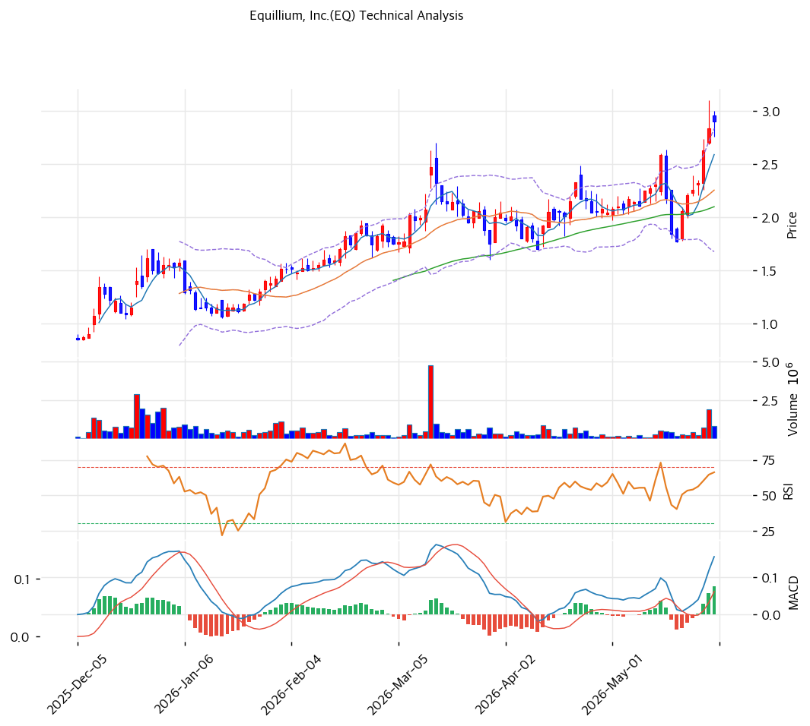

# 이퀄리움(EQ) 기술적 분석 보고서

---

## 가격 위치

현재가 **$2.90** (+2.11%) — **52주 신고가** 갱신, 52주 위치 **100%** (고가 $2.90 / 저가 $0.29). 1년 **+900%** ($0.29→$2.90). 마이크로캡 저가주 + 파이프라인 기대 + 투기 급등. 거래량 2.3배. RSI 68.1 중립. 매출 없는 임상 바이오텍 펀더멘털 무관 변동.

## 이동평균선

| 이평선 | 값 | 이격도 | 위치 |
|------|---:|----:|:---:|
| MA5 | $3 | +12.0% | 위 |
| MA20 | $2 | +28.6% | 위 |
| MA60 | $2 | +38.2% | 위 |
| MA120 | $2 | +65.6% | 위 |
| MA200 | $2 | +81.4% | 위 |

**완전 정배열 True**. MA200 대비 +81.4%, MA20 대비 +28.6%. 1년 +900% 급등으로 이격 큼 — 저가주 변동성 극단.

## 모멘텀 지표

- **RSI 68.1 (중립)** — 70 직전. 추가 모멘텀 여지이나 과매수 근접
- **MACD \~0 / 시그널 \~0** — 매수 + 확장(저가 미세 변동)
- **스토캐스틱 K=84.8 / D=77.4** — 골든크로스 **과매수**
- **볼린저밴드** — 상단 $3 / 중심 $2 / 하단 $2, 폭 51.5%, 상단 근접. 변동성 확대
- **거래량비 2.3x** — 평균 대비 급증, 투기 유입

## 피보나치 되돌림 (스윙 $3 / $0.3)

| 레벨 | 가격 | 성격 |
|------|---:|------|
| 0.236 | $2 | 1차 지지 |
| 0.5 | $2 | 중기 지지 |
| 0.618 | $1 | 깊은 조정 |
| 0.786 | $1 | 추가 조정 |
| 1.272 확장 | $4 | 상승 시 목표 |
| 2.0 확장 | $6 | 추가 목표 |

※ 마이크로캡 저가주($3 미만)로 호가·되돌림이 $1 단위 — 변동성 극단 유의.

## 지지/저항 (S&R)

- **저항**: **$3(PRZ 강: 피봇·추세선 저항)** / $2.90(52주 고가)
- **지지**: **$2(MA20·MA60·피보 0.236\~0.5)** / $1(피보 0.618\~0.786)

## 종합 시그널 & 전략

**시그널: 매수 3 / 매도 2 / 중립 2 → 매수우위** (저가주 급등 모멘텀)

- **전략**: HOLD(홀드) — **TP $3 / SL $3** (저가주 호가 단위 주의). WAIT(관망) e1=$3 / e2=$2
- **추격 매수 강력 비추**: 1년 +900% + 마이크로캡 + 매출 없는 임상 바이오텍은 **극단 투기 변동**. 단기 -50%+ 급락 위험 매우 높음
- **상방**: $3 돌파 시 피보 1.272 $4 (임상 데이터·라이선스 호재 시)
- **하방**: $2(MA20) 이탈 시 $1 급락. 파이프라인 가치 외 근거 없음
- **변곡점**: EQ504·EQ302 임상 데이터·라이선스 이벤트가 주가 전적 결정. 펀더멘털 투자 부적합, 호재 외 보유 비추
