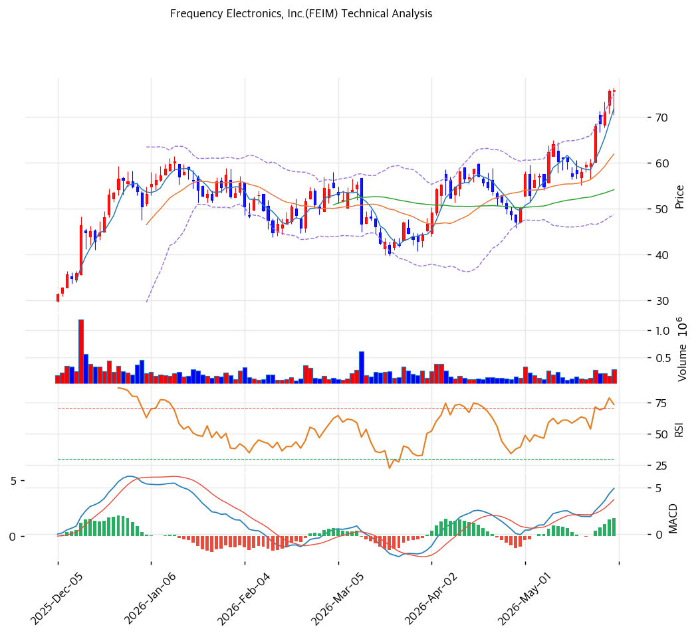

# 기술적분석

***

## 가격 위치

현재가 **$75.88** (+0.37%) — **52주 신고가** 갱신, 52주 위치 **100%** (고가 $75.88 / 저가 $18.26). 1년 **+315%** ($18.26→$75.88). 우주·국방 정밀 타이밍 테마 + 흑전. 거래량 1.6배. RSI 73.9 과매수.

## 이동평균선

| 이평선   |   값 |    이격도 |  위치 |
| ----- | --: | -----: | :-: |
| MA5   | $72 |  +5.6% |  위  |
| MA20  | $62 | +22.5% |  위  |
| MA60  | $54 | +40.1% |  위  |
| MA120 | $53 | +44.5% |  위  |
| MA200 | $44 | +71.1% |  위  |

**완전 정배열 True**. MA200 대비 +71.1%, MA20 대비 +22.5% 극단 이격. 1년 +315% 급등으로 단기 이격 큼 — 추세 강세이나 과열.

## 모멘텀 지표

* **RSI 73.9 (과매수 🔴)** — 70 초과 과매수. 단기 조정 압력
* **MACD 5.0 / 시그널 3.0 / 히스토 2.0** — 매수 시그널 + **확장 진행**(hist 증가). 모멘텀 유효
* **스토캐스틱 K=94.7 / D=91.4** — 골든크로스 **과매수**(90 초과 극단)
* **볼린저밴드** — 상단 $75 / 중심 $62 / 하단 $49, 폭 42.7%, **상단 근접**. 변동성 확대
* **거래량비 1.6x** — 평균 상회, 매수세 유입

## 피보나치 되돌림 (스윙 $76 / $18)

| 레벨       |   가격 | 성격              |
| -------- | ---: | --------------- |
| 0.236    |  $63 | 1차 지지 (MA20 동조) |
| 0.382    |  $54 | 2차 지지 (MA60 동조) |
| 0.5      |  $47 | 중기 지지           |
| 0.618    |  $40 | 깊은 조정 지지        |
| 1.272 확장 |  $92 | 상승 시 목표         |
| 1.618 확장 | $112 | 추가 목표           |

## 지지/저항 (S\&R)

* **저항**: $75.88(52주 고가) / $78(피봇 R1) / $80(피봇 R2) / $92(피보 1.272)
* **지지**: **$72(PRZ 중: 추세선·피봇 S1·MA5)** / $68(피봇 S2) / **$62(PRZ 약: MA20·피보 0.236)** / **$54(PRZ 약: MA60·피보 0.382)** / $47(피보 0.5) / $40(피보 0.618)

## 종합 시그널 & 전략

**시그널: 매수 2 / 매도 3 / 중립 2 → 매도우위** (과매수 + 신고가)

* **전략**: HOLD(비중축소) — **TP $77 / SL $68**. WAIT(관망) e1=$72 / e2=$62
* **눌림목 매수**: RSI 73.9 + 스토캐 94.7 + 1년 +315%로 신고가 추격 비추. **MA20 $62 \~ MA60 $54 눌림목 분할 매수** 권고. 깊은 조정 시 피보 0.5 $47
* **상방**: 52주 고가 $75.88 안착 + 우주·국방 수주 가시화 시 피보 1.272 $92 도전
* **하방**: $72(PRZ) 이탈 시 $62\~54 조정. 단기 -25\~40% 조정 위험(과매수 + FY2026 분기 둔화)
* **변곡점**: 위성·국방 수주 회복 + OP margin 정상화(FY2026 둔화)가 추세 분기점. PER 101x 일회성 착시 유의
