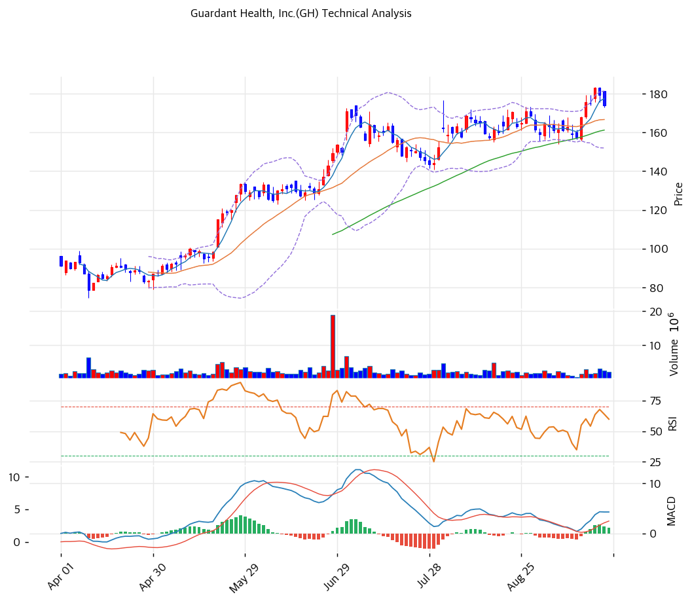

# Guardant Health, Inc.(GH) 기술적 분석

## 차트

## 가격 현황

| 항목 | 값 |
|---|---|
| 현재가 | **$177.16** (+1.89%) |
| 52주 고/저 | $183.51 (2026-09-17) / $55.38 (2025-09-24) |
| 52주 위치 | 95.0% |
| RSI | 59.6 (중립) |
| MACD | 4.47 / 3.23 / +1.24 (매수 구간, 히스토그램 수축) |
| Stochastic | K=77.3 D=83.4 데드크로스 (과매수 근접) |
| 볼린저 | 폭 18.3%, 상단($182.65) 근접 |

1년 만에 $55에서 $183까지 3.3배 오른 강한 추세 종목이다. 상승은 계단식이었다. 5월 Guardant360 Liquid CDx FDA 승인으로 $83→$130, 7월 30일 2분기 실적과 가이던스 상향으로 $144→$162, 9월 15일 Morgan Stanley 콘퍼런스 전후 8월 박스($155\~173) 상단을 돌파했다. 9월 17일 신고가 $183.51 이후 이틀 조정을 받고 $177로 되돌아왔다.

## 이동평균선

| MA | 가격($) | 갭(%) | 위치 |
|---|--:|--:|---|
| MA5 | 177.68 | -0.3 | 아래 |
| MA20 | 167.34 | +5.9 | 위 |
| MA60 | 161.65 | +9.6 | 위 |
| MA120 | 134.48 | +31.7 | 위 |
| MA200 | 120.98 | +46.4 | 위 |

→ **완전 정배열(강세)**. MA5 > MA20 > MA60 > MA120 > MA200 순서가 깨지지 않았다. MA200 대비 +46.4%로 장기 과열 구간이지만, MA20 괴리는 +5.9%로 단기 과열은 크지 않다. 주가가 MA5를 살짝 밑돌아 단기 숨고르기 신호가 나왔다.

## 시그널 종합

| 구분 | 카운트 |
|---|--:|
| 매수 | 3 |
| 매도 | 1 |
| 중립 | 2 |
| **결론** | **매수우위** |

매수 신호는 이동평균 정배열, MACD 매수 구간, 거래량(20일 평균 대비 1.21배) 세 개다. 매도 신호는 스토캐스틱 데드크로스(K 77.3, D 83.4) 하나다. RSI(59.6)와 볼린저(상단 근접, 이탈 전)는 중립이다. MACD 히스토그램이 1.36에서 1.24로 줄어 상승 탄력은 약해지는 중이다.

## 지지·저항

| 구분 | 가격($) | 근거 |
|---|--:|---|
| 강 저항 | 196.38 | 애널리스트 평균 목표가 |
| 저항 | 183.51 | 52주 신고가(9/17), 볼린저 상단($182.65) |
| **현재가** | **$177.16** | MA5 부근 |
| 지지 | 170.50 | 9월 22일 장중 저점, 8월 박스 상단($173.17) 되돌림 |
| 지지 | 167.34 | MA20, 볼린저 중단 |
| 지지 | 155.00\~161.65 | 8월 박스 하단, MA60 |
| 강 지지 | 153.27 | 피보나치 0.236 되돌림, 볼린저 하단($152.03) |

피보나치는 52주 저점 $55.38과 고점 $183.51 기준이다. 상승폭이 커서 0.382 되돌림($134.56)은 MA120($134.48)과 겹치는 깊은 조정선이다.

## 전략

| 시나리오 | 액션 |
|---|---|
| 보유자 | 홀드 (TP $196 / SL $160) |
| 신규 진입 1차 | $167\~170 (MA20·8월 박스 상단 되돌림 확인) |
| 신규 진입 2차 | $155 (8월 박스 하단·피보나치 0.236 부근) |
| 매도 트리거 | 종가 $160 이탈(MA60 하회) 또는 3분기 Shield 검사 건수 가이던스 미달 |

## 핵심 판단

추세는 명확하게 위를 향한다. 5개 이동평균 정배열과 MACD 매수 구간이 유지되고, 8월 박스를 거래량을 동반해 돌파했다. 다만 52주 범위의 95%에 있고 스토캐스틱이 과매수권에서 꺾였다. 신고가 $183.51을 거래량과 함께 넘기 전까지는 $167\~183 사이 등락 가능성이 높다. 신규 진입은 추격보다 MA20 부근 눌림을 기다리는 편이 손익비가 낫고, 보유자는 MA60($160) 이탈 전까지 추세를 따라가도 된다.
