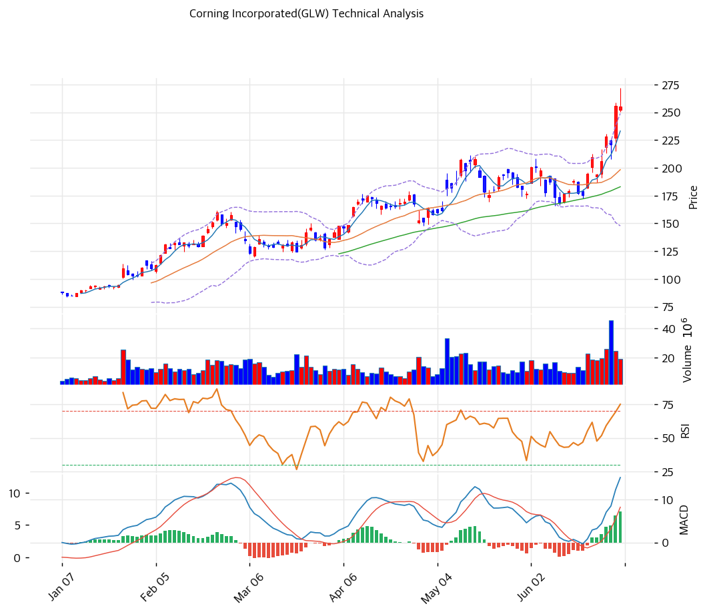

# 기술적분석

## 차트

## 가격 현황

| 항목         | 값                              |
| ---------- | ------------------------------ |
| 현재가        | **$255.43** (-0.1%)            |
| 52주 고/저    | $255.69 / $51.04 (5배 랠리)       |
| 52주 위치     | 99.9% (신고가)                    |
| RSI        | 69.1 (중립, 과매수 근접)              |
| MACD       | 15 / 8 / +7 (매수·확대)            |
| Stochastic | K=88.8 D=89.3 데드크로스 (과매수)      |
| 볼린저        | 폭 51.0%, **상단 돌파** ($249 상단 위) |
| 거래량        | 20일 평균 대비 1.13x                |

## 이동평균선

| MA    | 가격($) |    갭(%) | 위치 |
| ----- | ----: | ------: | -- |
| MA5   |   233 |   +9.5% | 위  |
| MA20  |   198 |  +28.8% | 위  |
| MA60  |   183 |  +39.6% | 위  |
| MA120 |   153 |  +67.1% | 위  |
| MA200 |   126 | +103.4% | 위  |

→ **완전 정배열 (포물선형 초강세)**. 현재가가 MA5\~MA200 모두 위, **MA200 대비 +103%·MA20 대비 +28.8%** 의 극단적 이격 — ⚠️ **과열 경고**(MA20 괴리 >20%). 52주 저점 $51에서 5배 폭등한 추세의 정점 구간. 단기 되돌림 시 1차 지지 MA5($233), 2차 MA20($198).

## 시그널 종합

| 구분     |                       카운트 |
| ------ | ------------------------: |
| 매수     |          2 (이동평균 추세·MACD) |
| 매도     |     2 (이동평균 과열·스토캐스틱 과매수) |
| 중립     |           3 (RSI·볼린저·거래량) |
| **결론** | **중립 (강한 추세 + 심한 과열 혼재)** |

## 지지·저항

| 구분      |       가격($) | 근거                           |
| ------- | ----------: | ---------------------------- |
| 강 저항    |         332 | 피보나치 1.272 확장 (포물선 목표)       |
| 저항      |         281 | 피봇 R2                        |
| 저항      |         268 | 피봇 R1                        |
| **현재가** | **$255.43** | 52주 신고가                      |
| 지지      |         247 | 피봇 S1                        |
| 지지      |    231\~238 | 추세선 저항·MA5·피봇 S2 (PRZ 중)     |
| 강 지지    |         198 | MA20                         |
| 강 지지    |    181\~187 | 추세선 지지·MA60·피보 0.382 (PRZ 중) |

## 전략

| 시나리오     | 액션                                     |
| -------- | -------------------------------------- |
| 보유자      | 분할 익절 + 추세 추종 (TP $268\~281 / SL $238) |
| 신규 진입 1차 | $247 (피봇 S1 되돌림)                       |
| 신규 진입 2차 | $198\~231 (MA5\~MA20 깊은 눌림)            |
| 매도 트리거   | MA5($233) 종가 이탈 또는 스토캐스틱 데드크로스 하향      |

## 핵심 판단

GLW는 52주 저점 $51에서 $255까지 **5배 폭등한 포물선형 초강세**이며, 현재 **52주 신고가 + 볼린저 상단 돌파($255 > $249)** 의 극단 과열 상태다(AI 광섬유 슈퍼사이클 선반영). MACD 매수 히스토그램이 확대돼 모멘텀은 살아 있으나, **MA20 +28.8%·MA200 +103% 이격, 스토캐스틱 88.8 과매수**로 단기 조정 위험이 매우 높다 — RSI 69로 과매수(70) 직전. 포물선 상단은 통상 변동성이 극심하므로 **추격 매수는 고위험**. 추세추종은 유효하되 보유자는 분할 익절로 리스크를 줄이고, 신규는 $198\~247 되돌림을 기다리는 편이 안전하다. 펀더멘털(밸류에이션)과 차트의 괴리는 T3·T4에서 검증한다.
