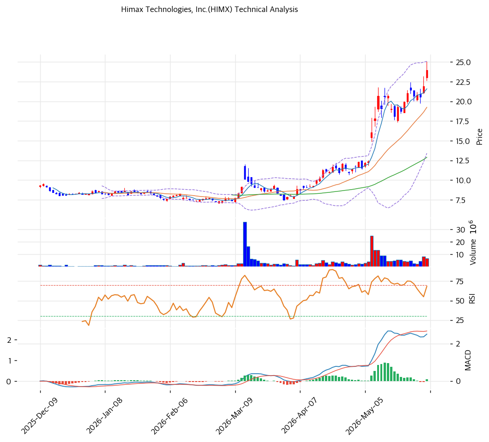

# 기술적분석

***

## 가격 위치

현재가 **$23.98** (당일 **+9.45%**) — **52주 신고가** 갱신, 52주 위치 **100%** (고가 $23.98 / 저가 $6.93). 1년 **+246%** ($6.93→$23.98). 디스플레이 사이클 회복 + 차량 DDIC + WiseEye 엣지 AI·LCoS AR 테마. 거래량 0.99배(평이). RSI 74.4 과매수.

## 이동평균선

| 이평선   |   값 |     이격도 |  위치 |
| ----- | --: | ------: | :-: |
| MA5   | $22 |  +11.1% |  위  |
| MA20  | $19 |  +24.6% |  위  |
| MA60  | $13 |  +86.1% |  위  |
| MA120 | $11 | +128.4% |  위  |
| MA200 | $10 | +148.4% |  위  |

**완전 정배열 True**. MA200 대비 +148.4%, MA20 대비 +24.6% 극단 이격. 1년 +246% 급등으로 이격 극단 — 단기 급등 정점.

## 모멘텀 지표

* **RSI 74.4 (과매수 🔴)** — 70 초과 과매수. 단기 조정 압력
* **MACD 3.0 / 시그널 2.0 / 히스토 0.0** — 매수 + 확장 진행(모멘텀 유효)
* **스토캐스틱 K=75.8 / D=72.4** — 골든크로스, 중립\~과매수
* **볼린저밴드** — 상단 $25 / 중심 $19 / 하단 $13, 폭 60.7%, **중간**. 변동성 큼
* **거래량비 0.99x** — 평균 수준

## 피보나치 되돌림 (스윙 $23.98 / $6.93)

| 레벨    |  가격 | 성격               |
| ----- | --: | ---------------- |
| 0.236 | $20 | 1차 지지 (MA20 근접)  |
| 0.382 | $17 | 2차 지지            |
| 0.5   | $15 | 중기 지지            |
| 0.618 | $13 | 깊은 조정 (MA60 근접)  |
| 0.786 | $11 | 추가 조정 (MA120 근접) |

## 지지/저항 (S\&R)

* **저항**: $23.98(52주 고가) / $25(피봇 R1·BB 상단)
* **지지**: $23(피봇 S1) / $22(MA5) / $21(피봇 S2) / **$20(MA20·피보 0.236)** / $17(피보 0.382) / $15(피보 0.5) / $13(MA60)

## 종합 시그널 & 전략

**시그널: 매수 2 / 매도 2 / 중립 3 → 중립** (추세 vs 과매수 상충)

* **전략**: HOLD(홀드) — **TP $24 / SL $21**. WAIT(관망) e1 $23 / e2 $19
* **눌림목 매수**: RSI 74.4 + 1년 +246% + MA200 +148%로 **신고가 추격 비추**. 조정 시 **MA20 $19\~20 \~ 피보 0.382 $17 분할 매수**, 깊은 조정 시 MA60 $13
* **상방**: 52주 고가 $23.98 돌파 시 $25. 차량 DDIC·WiseEye·AR 모멘텀이 동력
* **하방**: MA20 $20 이탈 시 $17 → $15(피보 0.5). 회복·테마 선반영 되돌림 위험
* **변곡점**: 디스플레이 사이클 회복 + WiseEye/LCoS 신사업 매출 가시화가 추세 분기점. 과매수로 단기 변동성
