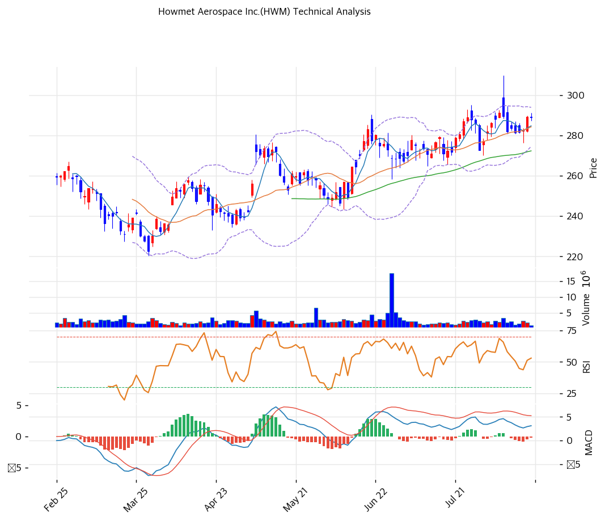

# Howmet Aerospace(HWM) 기술적 분석

## 차트

## 가격 현황

| 항목 | 값 |
|---|---|
| 현재가 | **$289.12** (-0.02%) |
| 52주 고/저 | $310.00 (2026-08-06 장중) / $169.45 (2025-08-20) |
| 52주 종가 최고 | $291.42 (2026-08-05) |
| 52주 위치 | 85.1% |
| 고점 대비 | -6.7% |
| RSI(14) | 58.7 (중립, 상단) |
| MACD | 3.11 / 3.31 / -0.21 (매도구간, 히스토그램 축소) |
| Stochastic | K=42.2 D=35.9 골든크로스 (중립) |
| 볼린저 | 폭 6.8%, 중단 위 |
| 거래량 | 20일 평균 대비 0.49x |
| 1년 수익률 | +68.8% |

※ 2026-08-17 종가 기준(전일 $289.18)

## 이동평균선

| MA | 가격($) | 갭(%) | 위치 |
|---|--:|--:|---|
| MA5 | 284.82 | +1.5 | 위 |
| MA20 | 284.39 | +1.7 | 위 |
| MA60 | 272.51 | +6.1 | 위 |
| MA120 | 260.71 | +10.9 | 위 |
| MA200 | 241.27 | +19.8 | 위 |

→ **완전 정배열이다.** 5개 이동평균선 전부를 위에 두고 있고 배열 순서도 어긋남이 없다. MA200 대비 +19.8%, MA120 대비 +10.9%로 장기 추세가 견고하다.

다만 단기 이격은 거의 없다. MA5(284.82)와 MA20(284.39)이 사실상 겹쳐 있고 현재가와의 거리도 1.5\~1.7%에 불과하다. 상승 각도가 완만해지며 옆으로 눕고 있는 형태다. 반대로 이는 조정 시 1차 지지가 바로 아래에 있다는 뜻이기도 하다.

## 시그널 종합

| 구분 | 카운트 |
|---|--:|
| 매수 | 1 |
| 매도 | 1 |
| 중립 | 4 |
| **결론** | **정배열 유지, 단기 방향성 부재** |

- 🟢 **이동평균** 5개선 완전 정배열. 유일한 명확한 매수 신호
- 🔴 **MACD** 3.11이 시그널 3.31 아래. 히스토그램 -0.21로 매도구간이나 전일 -0.44 대비 축소 중이라 소멸 직전
- ⚪ **RSI 58.7** 중립 상단. 과매수 기준 70까지 여유가 있다
- ⚪ **볼린저** 밴드 폭 6.8%로 매우 좁다. 변동성 수축 국면이며 방향은 밴드 이탈 시 결정된다
- ⚪ **스토캐스틱** K 42.2가 D 35.9를 상향 돌파한 골든크로스이나 중립 영역이라 강도가 약하다
- ⚪ **거래량 0.49x** 20일 평균의 절반. 8월 6일 실적일 3.38M주 이후 급감

볼린저 밴드 폭 6.8%는 좁은 편이다. 이런 수축 뒤에는 통상 방향성 있는 움직임이 따르는데, 지금은 어느 쪽인지 지표가 답을 주지 않는다.

## 최근 흐름

| 일자 | 종가 | 변동 | 이벤트 |
|---|--:|--:|---|
| 2026-07-29 | $272.79 | **-4.63%** | 실적 발표 전 급락 |
| 2026-08-05 | $291.42 | +1.12% | 52주 종가 최고 |
| **2026-08-06** | $289.72 | -0.58% | **Q2 실적 발표. 시가 $299.00, 장중 $310.00 사상 최고 후 반전** |
| 2026-08-07 | $281.88 | -2.71% | 후속 하락 |
| 2026-08-13 | $282.82 | +0.42% | 저점 확인 |
| 2026-08-14 | $289.18 | +2.25% | 반등 |
| 2026-08-17 | $289.12 | -0.02% | 보합 |

8월 6일 캔들이 이번 국면의 성격을 압축한다. Q2 실적이 매출·조정 EBITDA·마진·조정 EPS 네 항목 모두 가이던스 상단을 넘었고 FY2026 가이던스도 상향됐는데, 주가는 $299에 갭 상승 출발해 장중 $310까지 올랐다가 $289.72에 마이너스로 마감했다. 위꼬리 $20.28짜리 반전 캔들이며 거래량 3.38M주로 20일 평균의 1.6배였다.

호재에 팔리는 구간이 왔다는 뜻이다. 이후 6거래일간 $280\~290 박스에서 움직이며 갭을 메우지 않았다는 점은 하방도 제한적임을 보여준다.

## 지지·저항

| 구분 | 가격($) | 근거 |
|---|--:|---|
| 강 저항 | 310.00 | 52주 장중 최고 (2026-08-06) |
| 저항 | 294.08 | 볼린저 상단 |
| 저항 | 293.40 | 피봇 R2 |
| 저항 | 291.42 | 52주 종가 최고 (2026-08-05) |
| 저항 | 291.26 | 피봇 R1 |
| **현재가** | **289.12** | |
| 지지 | 287.09 | 피봇 S1 |
| 지지 | 285.07 | 피봇 S2 |
| 지지 | 284.39 | MA20 |
| **강 지지** | **272\~277** | **PRZ (강)**: MA60 272.51 + 볼린저 하단 274.69 + 피보 0.236 되돌림 276.83 |
| 지지 | 256\~261 | PRZ (중): 피보 0.382 되돌림 256.31 + MA120 260.71 |
| 지지 | 239\~241 | PRZ (약): 피보 0.5 되돌림 239.72 + MA200 241.27 |

※ 피보나치는 상승 추세 기준(Swing Low $169.45 → Swing High $310.00)
※ 확장 목표: 1.272 = $348.23 / 1.382 = $363.69 / 1.618 = $396.86

$272\~277 구간이 이 차트에서 가장 두꺼운 지지대다. MA60, 볼린저 하단, 피보나치 0.236이 5달러 안에 겹치고, 7월 29일 종가 저점 $272.79도 같은 자리다. 현재가 대비 -4.2~-5.9%다.

## 전략

| 시나리오 | 액션 |
|---|---|
| 보유자 | **홀드** (TP $310 사상 최고 재도전 / SL $272 MA60) |
| 신규 진입 1차 | $283\~285 (MA20·피봇 S2, 현재가 대비 -1.4~-2.1%) |
| 신규 진입 2차 | **$272\~277** (PRZ 강, MA60·볼린저 하단·피보 0.236, -4.2~-5.9%) |
| 신규 진입 3차 | $256\~261 (PRZ 중, -9.7~-11.4%) |
| 추세 확장 진입 | $291.42(52주 종가 최고) 거래량 동반 돌파 후 안착 |
| 매도 트리거 | ① $272 MA60 이탈 ② Q3 2026 실적(11월 초) 조정 EBITDA 마진 32.2% 하회 ③ FY2026 가이던스 미상향 |

## 핵심 판단

차트는 **강한 상승 추세 안에서 변동성이 수축한 소강 국면**을 보여준다. 5개 이동평균선 완전 정배열, MA200 대비 +19.8%, 1년 수익률 +68.8%로 추세 자체는 훼손된 곳이 없다. 동시에 볼린저 밴드 폭이 6.8%까지 좁아졌고 거래량은 평균의 절반이며 지표 6개 중 4개가 중립이다.

주목할 지점은 8월 6일이다. 사상 최고 실적과 세 번째 가이던스 상향이 나온 날 장중 $310으로 사상 최고를 찍고 마이너스로 마감했다. 좋은 뉴스가 더 이상 주가를 올리지 못하는 구간이라는 신호이며, 이는 밸류에이션 부담(PER 62.4배, PBR 20.2배)과 방향이 일치한다.

반대로 하방도 제한적이다. 실적일 갭($282.26 → $284.37 구간)이 메워지지 않았고, 이후 6거래일 저점이 $276.26으로 PRZ 강 지지대 안쪽에서 멈췄다. 대량 매도가 실린 하락은 없었다.

정리하면 추세 추종 관점에서는 홀드가 자연스럽고, 신규 진입은 $272\~277 구간을 노리는 편이 손익비에 맞는다. 방향은 11월 초 Q3 실적이 정할 가능성이 높다. 밴드 폭이 좁아진 만큼 그때의 움직임은 클 것으로 본다.
