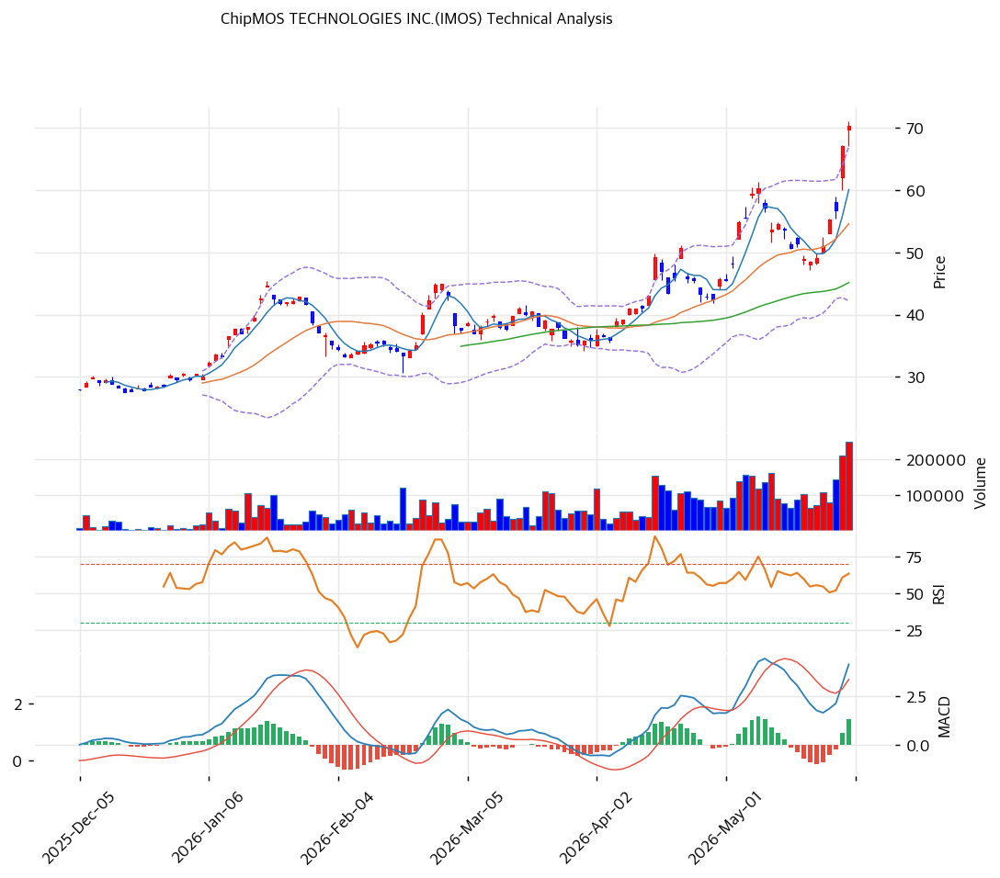

# 칩모스(IMOS) 기술적 분석 보고서

---

## 가격 위치

현재가 **$66.94** — 52주 고가 $70.26 근접, 52주 위치 **100%**. 1년 **+344%** ($15.09→$70.26). 반도체 후공정 사이클 회복 + DDIC·메모리 + AI 수요 급등. RSI 75.8 과매수 + 거래량 2.24배. 후공정 회복 테마 강세.

## 이동평균선 / 모멘텀

MA5 $60 / MA20 $55 / MA60 $45 / MA120 $40 / MA200 $32 — **완전 정배열 True**. MA200 대비 **+117.2%**, MA20 대비 +28.7% 극단 이격. 1년 +344% 급등으로 이격 큼. 단기 급등 정점.

**RSI 75.8 (과매수 🔴)** — 70 초과 과매수. MACD 4/3 매수 + 확장. 스토캐 K=87.8 / D=71.1 골든크로스 **과매수**. BB 상단 근접 (폭 45.4%). 거래량 2.24배. 단기 과열.

## 시그널 종합 / S&R

매수 3 / 매도 3 / 중립 1 → **중립** (추세 강세 vs 과매수 상충).

- 저항: **$70.26 (52주 고가)** / $72 (피봇 R1·PRZ) / $78 (피보 2.0)
- 지지: **$68 (피봇 S1)** / $65 (피봇 S2·피보 1.272) / $60 (PRZ: MA5) / $56 (MA20·피보 0.236) / $45 (MA60)
- 깊은 조정 지지: $53 (피보 0.382) / $51 (피보 0.5)

전략: **HOLD(홀드) — TP $72 / SL $65**. WAIT(관망) e1=$68 / e2=$55. RSI 75.8 + 1년 +344% 극단 이격은 단기 과열 — -25\~40% 조정 위험. **MA20 $55 ~ $51(피보 0.5) 눌림목 분할 매수** 권고. 후공정 사이클 회복·EPS 정상화 시 추가 상승, 신고가권 추격 비추. MA20 $55 이탈 시 조정 심화.
