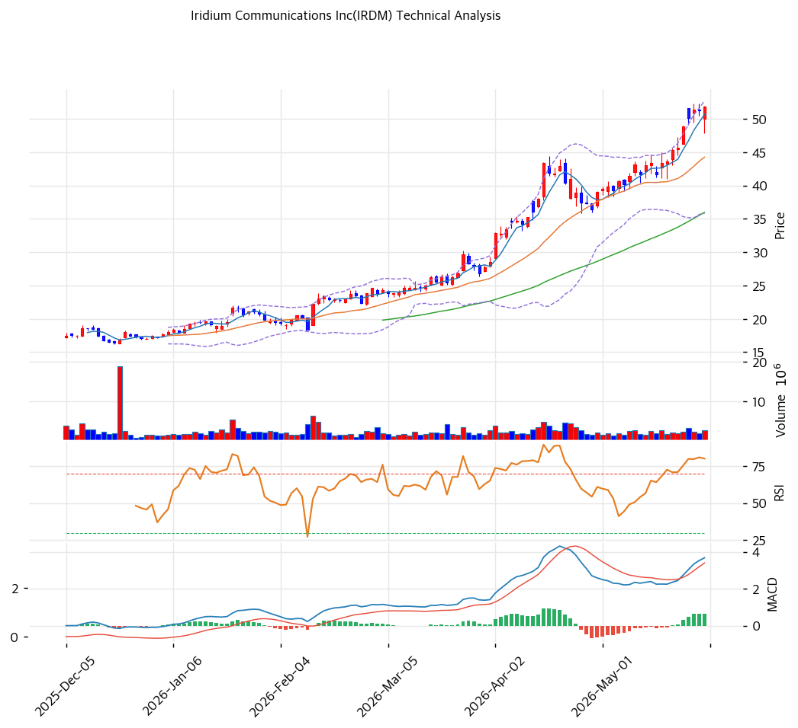

# 기술적분석

***

## 가격 위치

현재가 **$51.78** (+1.01%) — **52주 신고가** 갱신, 52주 위치 **100%** (고가 $51.78 / 저가 $15.62). 1년 **+215%** ($15.62→$51.78). 위성통신·D2D(직접위성통신) 테마 + 흑자·FCF·주주환원 재평가가 랠리 동력. 거래량 1.3배. RSI 77.5 과매수 영역 진입.

## 이동평균선

| 이평선   |   값 |     이격도 |  위치 |
| ----- | --: | ------: | :-: |
| MA5   | $51 |   +2.2% |  위  |
| MA20  | $44 |  +17.0% |  위  |
| MA60  | $36 |  +43.9% |  위  |
| MA120 | $28 |  +85.7% |  위  |
| MA200 | $24 | +112.9% |  위  |

**MA5 < MA20 < MA60 < MA120 < MA200 완전 정배열 True**. MA200 대비 +112.9%, MA20 대비 +17.0% 극단 이격. 1년 +215% 급등으로 단기 이격도 사상 최대 수준 — 추세는 강하나 과열.

## 모멘텀 지표

* **RSI 77.5 (과매수 🔴)** — 70 초과 과매수, 80 근접. 단기 조정 압력
* **MACD 4.0 / 시그널 3.0 / 히스토 1.0** — 매수 시그널이나 확장 둔화(hist 축소). 모멘텀 약화 초기
* **스토캐스틱 K=93.9 / D=93.0** — 골든크로스이나 **과매수 영역**(90 초과 극단)
* **볼린저밴드** — 상단 $53 / 중심 $44 / 하단 $36, 폭 38.2%, **상단 근접**. 변동성 확대 + 단기 과열
* **거래량비 1.3x** — 평균 상회, 매수세 유입

## 피보나치 되돌림 (스윙 $52 / $15)

| 레벨       |  가격 | 성격              |
| -------- | --: | --------------- |
| 0.236    | $44 | 1차 지지 (MA20 동조) |
| 0.382    | $38 | 2차 지지 (추세선 동조)  |
| 0.5      | $34 | 중기 지지           |
| 0.618    | $29 | 깊은 조정 지지        |
| 1.272 확장 | $62 | 상승 시 목표         |
| 1.382 확장 | $66 | 추가 목표           |

## 지지/저항 (S\&R)

* **저항**: $51.78(52주 고가) / $53(피봇 R1) / $55(피봇 R2) / $62(피보 1.272)
* **지지**: $49(피봇 S1) / $46(피봇 S2) / **$44(PRZ 약: MA20·피보 0.236)** / $38(PRZ 약: 추세선·피보 0.382) / $36(MA60) / $34(피보 0.5)
* **추세선**: 상승 추세선 지지 견고(6개 저점 연결)

## 종합 시그널 & 전략

**시그널: 매수 1 / 매도 2 / 중립 3 → 매도우위** (추세 강세 vs 과매수 상충)

* **전략**: HOLD(비중축소) — **TP $53 / SL $46**. WAIT(관망) 진입가 e1=$49 / e2=$44
* **눌림목 매수**: RSI 77.5 + 1년 +215% 극단 이격으로 추격 비추. **MA20 $44 \~ 피보 0.382 $38 분할 매수** 권고. 깊은 조정 시 MA60 $36 추가 진입
* **상방**: 52주 고가 $51.78 안착 + D2D·IoT 가시화 시 피보 1.272 $62 도전
* **하방**: MA20 $44 이탈 시 $38\~36 조정 심화. 배당·자사주 매입이 하방 일부 방어
* **변곡점**: 단기 -25\~40% 조정 위험(극단 과매수). D2D 매출화 + 2026Q2 실적이 추세 분기점
