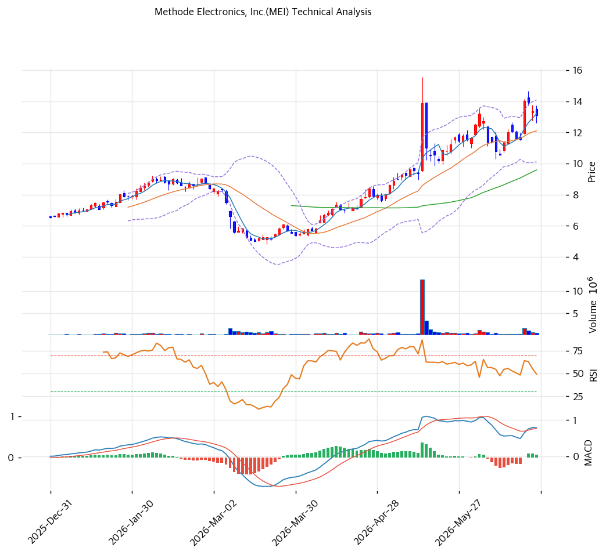

# 메소드일렉트로닉스(MEI) 기술적 분석

2026-06-25 | T2 Technical Analysis

---

## 차트

---

## 1. 가격 현황

| 항목 | 값 |
|------|-----|
| 현재가 | $13.09 (0.00%) |
| 52주 고가 | $14.02 |
| 52주 저가 | $5.01 |
| 52주 범위 위치 | 89.7% (고점권) |
| 거래량비 | — |
| RSI | 59.7 (중립) |

> 52주 저점($5.01)에서 **약 2.6배 반등**해 고점($14.02) 부근(pos 89.7%)에 위치. 실적 바닥 통과·턴어라운드 기대(영업이익 흑전, 데이터센터 전력 사업)로 1년간 강하게 회복했다. 모든 이동평균선 위로 정배열을 형성했으나 단기선(MA5 $13)에는 살짝 못 미친다. RSI 59.7 중립. PBR 0.69x의 자산가치 회복 + 턴어라운드 베팅이 반등을 이끌었다.

---

## 2. 차트 패턴 분석

### 2.1 구조·캔들

| 패턴 | 위치 | 신뢰도 | 해석 |
|------|------|--------|------|
| 바닥 탈출·정배열 | 전 이평선 위 | 상 | 추세 전환 |
| 고점권 접근 | 52주 고가 -7% | 중 | 저항 시험 |
| 단기 숨고르기 | MA5 하회 | 중 | 단기 조정 |

- **하락 추세 탈출·정배열 전환** (신뢰도: 상): $5 저점 후 2.6배 반등하며 MA20·MA60·MA120·MA200 모두 상회(aligned True), 중장기 추세가 상승 전환.
- **52주 고가 저항 시험** (신뢰도: 중): $14.02 부근(pos 89.7%) 저항 시험 국면. 돌파 시 신고가, 실패 시 MA20($12) 되돌림.

### 2.2 다이버전스

- **모멘텀 중립화** (신뢰도: 중): RSI 59.7 중립, MACD 매수 유지이나 확산 둔화, 스토캐 고점권 데드크로스로 단기 속도 조절.

---

## 3. 이동평균선 — 정배열 회복

| MA | 값 | 괴리율 | 위치 |
|----|-----|--------|------|
| MA5 | $13 | -0.9% | 부근 |
| MA20 | $12 | +8.2% | 위 |
| MA60 | $10 | +36.5% | 위 |
| MA120 | $8 | +54.9% | 위 |
| MA200 | $8 | +65.2% | 위 |

**해석**: MA20~MA200 모두 아래에 둔 **정배열**로 중장기 추세가 상승 전환했다. MA200 대비 +65.2%로 확장됐으나 SIMO만큼 극단적이지는 않다. 단기선(MA5 $13) 부근에서 숨고르기 중. MA20($12)이 1차 지지, MA60($10)이 추세 지지선.

---

## 4. 보조 지표

### RSI(14) — 59.7 (중립)
중립권. 과매수(70) 전으로 추가 상승 여력 있으나, 52주 고가 저항이 변수.

### MACD
| MACD | Signal | Hist | 크로스 |
|---|---|---|---|
| +1 | +1 | \~0 | 매수(확산 둔화) |

영선 위 매수 유지이나 히스토그램 미미 → 상승 모멘텀 둔화·횡보 가능.

### 볼린저밴드(20,2σ)
| 상단 | 중단 | 하단 | 밴드폭 |
|---|---|---|---|
| $14 | $12 | $10 | 32.9% |

현재가 $13.09는 상단($14)과 중단($12) 사이. 밴드폭 32.9%로 변동성 큼. 상단 돌파 시 52주 고가, 실패 시 중단($12) 회귀.

### 스토캐스틱
| %K | %D | 판단 |
|---|---|---|
| 73.1 | 76.8 | 데드크로스(고점권) |

과매수권 데드크로스 → 단기 속도 조절.

---

## 5. 지지/저항

| 구분 | 가격 | 근거 |
|------|------|------|
| 저항 | $14.02 | 52주 고가 |
| **현재가** | **$13.09** | 고점권 |
| 지지 | $13 | MA5 |
| 지지 | $12 | MA20·볼린저 중단 |
| 지지 | $10 | MA60·볼린저 하단 |
| 지지 | $8 | MA120·MA200 |
| 지지 | $5.01 | 52주 저점 |

---

## 6. 시그널 종합

| 지표 | 내용 | 시그널 |
|------|------|--------|
| 차트 패턴 | 바닥 탈출·정배열 | 🟢 |
| 이동평균선 | 정배열 회복 | 🟢 |
| RSI | 59.7 — 중립 | ⚪ |
| MACD | 매수(확산 둔화) | 🟢 |
| 볼린저밴드 | 상·중단 사이 | ⚪ |
| 스토캐스틱 | 고점권 데드크로스 | 🔴 |
| 거래량 | — | ⚪ |

**종합 판단**: 🟢 매수 3개 / 🔴 매도 1개 / ⚪ 중립 3개 → **매수 우위 (바닥 탈출·턴어라운드 추세)**

$5 저점에서 2.6배 반등하며 **정배열로 추세 전환**한 턴어라운드 차트다. 실적 바닥 통과·데이터센터 전력 기대가 동력. 다만 52주 고가($14.02) 저항권·스토캐 데드크로스로 단기 숨고르기 가능. **MA20($12) 지지 유지 시 고가 돌파 재시도**, 이탈 시 MA60($10) 되돌림. 턴어라운드 실적(영업흑자 지속) 확인이 추세의 전제.

---

## 7. 전략 제안

### 보유 중인 경우
- **홀드 (추세 추종, 고가 돌파 주시)**
- 익절: $14.02(52주 고가)·돌파 시 신고가 분할
- 손절/비중축소: $12(MA20)·$10(MA60) 이탈
- 턴어라운드 초기, 분할 대응

### 진입 대기인 경우
- **눌림목 분할 (실적 확인)**
- 1차 진입가: $12 (MA20)
- 2차 진입가: $10 (MA60·볼린저 하단)
- 진입 조건: PBR 0.69x 자산가치 + 턴어라운드 베팅이나 아직 순손실. **영업흑자 정착·데이터센터 전력 매출 확인 후 분할**. 52주 고가 저항·실적 변동성 유의.
