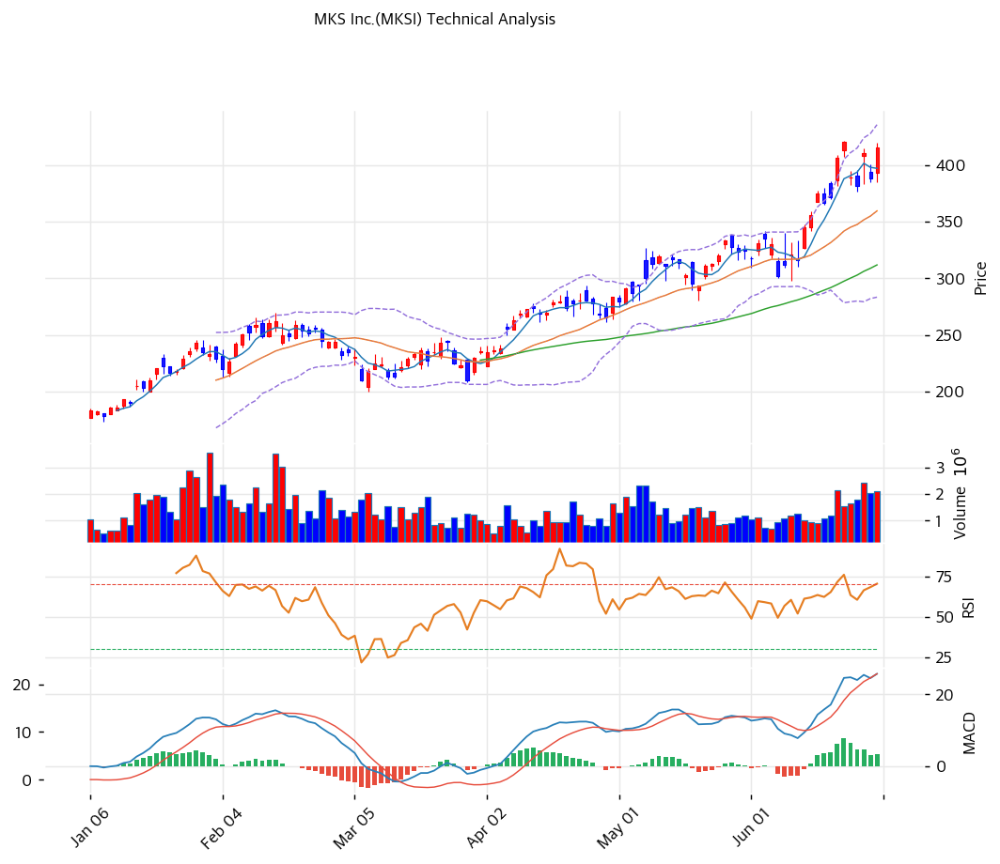

# 기술적분석

## 차트

## 가격 현황

| 항목         | 값                            |
| ---------- | ---------------------------- |
| 현재가        | **$416.00** (+7.05%)         |
| 52주 고/저    | $420.56 / $89.14             |
| 52주 위치     | 98.6%                        |
| RSI        | 64.6 (중립)                    |
| MACD       | 26 / 22 / +3 (매수·확대)         |
| Stochastic | K=86.6 D=80.4 골든크로스 (과매수)    |
| 볼린저        | 폭 42.4%, 중간\~상단 ($436 상단 근접) |
| 거래량        | 20일 평균 대비 1.62x              |

## 이동평균선

| MA    | 가격($) |   갭(%) | 위치 |
| ----- | ----: | -----: | -- |
| MA5   |   397 |  +4.7% | 위  |
| MA20  |   360 | +15.7% | 위  |
| MA60  |   312 | +33.4% | 위  |
| MA120 |   270 | +54.2% | 위  |
| MA200 |   220 | +89.5% | 위  |

→ **완전 정배열 (강한 상승추세)**. 현재가가 MA5부터 MA200까지 모두 위에 위치하고 단기선이 장기선 위로 배열된 교과서적 강세. 다만 MA200 대비 +89.5%, MA60 대비 +33% 괴리로 **장기 이평선과의 이격이 극단적** — 추세는 강하나 단기 되돌림 시 1차 지지는 MA5($397)·MA20($360).

## 시그널 종합

| 구분     |             카운트 |
| ------ | --------------: |
| 매수     |   2 (이동평균·MACD) |
| 매도     |   1 (스토캐스틱 과매수) |
| 중립     | 3 (RSI·볼린저·거래량) |
| **결론** |        **매수우위** |

## 지지·저항

| 구분      |       가격($) | 근거                      |
| ------- | ----------: | ----------------------- |
| 강 저항    |         512 | 피보나치 1.272 확장 (돌파 시 목표) |
| 저항      |         442 | 피봇 R2                   |
| 저항      |         436 | 볼린저 상단                  |
| 저항      |         429 | 피봇 R1                   |
| 저항      |      420.56 | 52주 고가 (돌파 시도 중)        |
| **현재가** | **$416.00** | —                       |
| 지지      |         397 | MA5 + 피봇 S1 근접 (PRZ 약)  |
| 지지      |         372 | 피봇 S2                   |
| 강 지지    |         360 | MA20                    |
| 강 지지    |         312 | MA60 + 추세선 지지           |

## 전략

| 시나리오     | 액션                                       |
| -------- | ---------------------------------------- |
| 보유자      | 홀드 (TP $429 / SL $372) — 추세 유효, 분할 익절 병행 |
| 신규 진입 1차 | $394 (MA5·피봇 S1 되돌림 대기)                  |
| 신규 진입 2차 | $360 (MA20 지지 확인)                        |
| 매도 트리거   | MA20($360) 종가 이탈 또는 MACD 데드크로스           |

## 핵심 판단

MKSI는 1월 $185에서 6개월 만에 $416까지 **2.2배 상승한 강력한 정배열 추세**다. 오늘 +7.05% 대량거래(1.62x)로 52주 고가($420.56) 돌파를 시도 중이며, MACD 매수 히스토그램이 확대돼 모멘텀은 살아 있다. 다만 **스토캐스틱 K=86.6 과매수 + 볼린저 상단 근접 + 장기 이평선 대비 +89% 이격**으로 단기 과열 신호가 누적됐다 — RSI는 64.6으로 아직 과매수(70) 전이라 추가 상승 여지는 남아 있다. 52주 고가($420.56)·피봇 R1($429)을 거래량 동반 돌파하면 피보나치 확장 $512가 다음 목표, 실패 시 MA20($360)까지 되돌림 가능. **추세추종은 유효하나 신규 진입은 $394 이하 눌림목 분할이 유리한 구간**.
