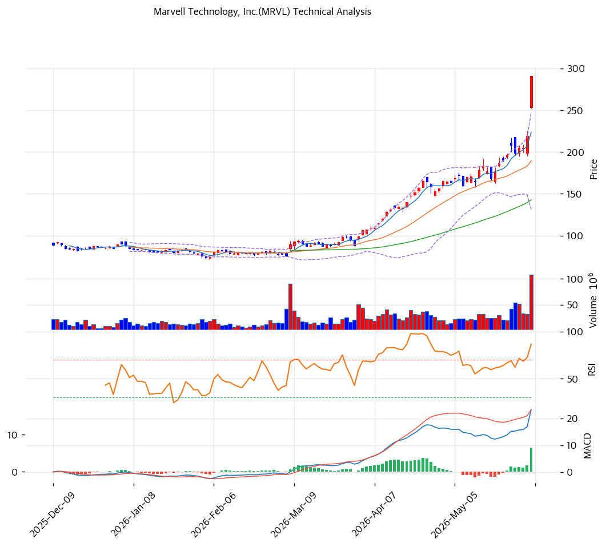

# 마벨 테크놀로지(MRVL) 기술적 분석 보고서

---

## 가격 위치

현재가 **$290.79** (보합) — **52주 신고가** 갱신, 52주 위치 **100%** (고가 $290.79 / 저가 $62.19). 1년 **+367%** ($62.19→$290.79). AI 커스텀 실리콘·광 DSP 폭발적 수요 + 데이터센터 매출 신기록. 거래량 **3.74배 폭증**. RSI 85.9 극단 과매수.

## 이동평균선

| 이평선 | 값 | 이격도 | 위치 |
|------|---:|----:|:---:|
| MA5 | $224 | +30.0% | 위 |
| MA20 | $189 | +53.5% | 위 |
| MA60 | $143 | +103.7% | 위 |
| MA120 | $113 | +158.5% | 위 |
| MA200 | $100 | +190.4% | 위 |

**완전 정배열 True**. MA200 대비 **+190.4%**, MA20 대비 +53.5% 극단 이격. 1년 +367% 급등으로 이격도 역사적 극단 — 단기 급등 정점 신호.

## 모멘텀 지표

- **RSI 85.9 (극단 과매수 🔴)** — 80 초과 역사적 극단. 단기 조정 압력 매우 큼
- **MACD 23 / 시그널 17 / 히스토 6** — 매수 + 확장 진행(급등 모멘텀 지속)
- **스토캐스틱 K=89.7 / D=82.2** — 골든크로스 **과매수**(90 근접 극단)
- **볼린저밴드** — 상단 $248 / 중심 $189 / 하단 $131, 폭 61.3%, **상단 돌파**. 변동성 극대
- **거래량비 3.74x** — 평균 3.7배 폭증, 모멘텀 매수 쇄도

## 피보나치 되돌림 (스윙 $290.79 / $62.19)

| 레벨 | 가격 | 성격 |
|------|---:|------|
| 0.236 | $237 | 1차 지지 |
| 0.382 | $203 | 2차 지지 |
| 0.5 | $176 | 중기 지지 |
| 0.618 | $149 | 깊은 조정 (MA60 근접) |
| 0.786 | $111 | 추가 조정 |
| 1.272 확장 | $354 | 상승 시 목표 |

## 지지/저항 (S&R)

- **저항**: $290.79(52주 고가) / $304(피봇 R1) / $354(피보 1.272 확장)
- **지지**: $265(피봇 S1) / **$238(PRZ 약: 피보 0.236·피봇 S2)** / $239(피봇 S2) / $203(피보 0.382) / **$189(MA20)** / $176(피보 0.5) / $143(MA60)

## 종합 시그널 & 전략

**시그널: 매수 3 / 매도 3 / 중립 1 → 중립** (추세 강세 vs 극단 과매수 상충)

- **전략**: HOLD(홀드) — **TP $297 / SL $239**. WAIT(관망) e1 $265 / e2 $189
- **눌림목 매수**: RSI 85.9 + 1년 +367% + MA200 +190% + 거래량 3.74x로 **신고가 추격 강력 비추**. 단기 조정 시 **MA20 $189 ~ 피보 0.382 $203 분할 매수**, 깊은 조정 시 MA60 $143
- **상방**: 52주 고가 $290.79 돌파 시 $304 → 피보 1.272 확장 $354. 커스텀 실리콘 수주 모멘텀이 동력
- **하방**: 피보 0.236 $237 이탈 시 MA20 $189 → $176. 밸류 부담(Fwd PE 47.6x)으로 조정 폭 클 수 있음
- **변곡점**: AI 커스텀 실리콘 램프·광 DSP 수주가 추세 분기점. 과매수 극단으로 단기 변동성 확대 불가피
