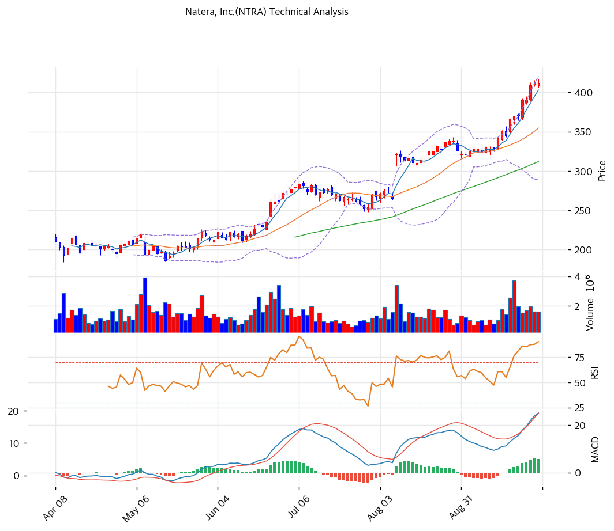

# Natera, Inc.(NTRA) 기술적 분석

## 차트

## 가격 현황

| 항목 | 값 |
|---|---|
| 현재가 | **$411.77** (-0.19%, 2026-09-28 종가) |
| 52주 고/저 (종가) | $412.56 (2026-09-25, 사상 최고) / $160.21 |
| 52주 위치 | 99.7% |
| RSI | 83.0 (과매수 🔴) |
| MACD | 25 / 19 / +6 (매수 구간, 히스토그램 축소) |
| Stochastic | K=95.5 D=95.8 데드크로스 (과매수) |
| 볼린저 | 상단 $420 / 중단 $355 / 하단 $289, 폭 37.1% |
| 거래량 | 20일 평균 대비 1.12배 |

1년 사이 $160에서 $412까지 2.6배가 됐고 연초 대비로는 +70.6%다. 상승은 두 번의 뉴스로 계단을 만들었다. 5월 15일 Signatera의 FDA 동반진단 승인, 8월 6일 2분기 실적과 세 번째 가이던스 상향이다. 9월에는 일본 PMDA 승인(9/22)과 RBC 목표가 상향($350→$460, 9/25)이 이어지며 9월 25일 종가 기준 사상 최고가를 새로 썼다.

## 이동평균선

| MA | 가격($) | 갭(%) | 위치 |
|---|--:|--:|---|
| MA5 | 403 | +2.2 | 위 |
| MA20 | 355 | +16.1 | 위 |
| MA60 | 312 | +32.0 | 위 |
| MA120 | 264 | +56.0 | 위 |
| MA200 | 245 | +67.8 | 위 |

→ **완전 정배열(강세)**. MA5 > MA20 > MA60 > MA120 > MA200 순서가 유지된다. 다만 MA20 괴리가 +16.1%, MA200 괴리가 +67.8%로 단기와 장기 모두 이격이 크다. MA20($355)까지의 거리가 주가의 14%라 평균 회귀가 일어나면 조정 폭이 크다.

## 시그널 종합

| 구분 | 카운트 |
|---|--:|
| 매수 | 1 |
| 매도 | 2 |
| 중립 | 3 |
| **결론** | **매도우위** |

매수 신호는 이동평균 정배열 하나다. 매도 신호는 RSI 83(과매수)과 스토캐스틱 데드크로스(K 95.5, D 95.8) 두 개다. MACD(매수 구간이지만 히스토그램 축소), 볼린저(밴드 중간, 폭 37.1%), 거래량(1.12배)은 중립이다. 추세는 살아 있지만 모멘텀 지표가 모두 극단값에 있고, 신고가를 쓰는 날 거래량이 평균 수준이라 매수세가 새로 붙는 모양은 아니다.

## 지지·저항

| 구분 | 가격($) | 근거 |
|---|--:|---|
| 목표 저항 | 488 | 피보나치 1.272 확장 |
| 강 저항 | 417\~423 | 피봇 R1·R2, 장중 신고가 $417.38, 볼린저 상단 $420 (PRZ 약) |
| 저항 | 412.56 | 52주 종가 고점 |
| **현재가** | **$411.77** | 피봇 $412 |
| 지지 | 401\~406 | 피봇 S1·S2, MA5 (PRZ 중) |
| 지지 | 355\~356 | MA20, 피보나치 0.236 되돌림, 볼린저 중단 (PRZ 약) |
| 강 지지 | 311\~318 | MA60, 피보나치 0.382 되돌림, 추세선 저항 상단 (PRZ 중) |
| 추세 지지 | 248 | 상승 추세선 하단 |

피보나치는 52주 저점 $157과 고점 $417 기준이다. 0.5 되돌림은 $287로 볼린저 하단($289)과 겹친다. 상단은 뚫린 저항이 없어 확장 레벨($488, $517)만 남았다. 이 수준은 애널리스트 최고 목표가($460)보다 높아 펀더멘털 근거가 약하다.

## 전략

| 시나리오 | 액션 |
|---|---|
| 보유자 | 비중축소 (TP $421 / SL $401) |
| 신규 진입 1차 | $406 (피봇 S1, 단기 눌림 확인 후 소량) |
| 신규 진입 2차 | $355 (MA20·피보나치 0.236·볼린저 중단 겹침) |
| 매도 트리거 | 종가 $401 이탈(MA5·피봇 S2 하회) 또는 3분기 MRD 순증 급감 |

## 핵심 판단

추세는 위를 향하지만 가격이 추세를 앞질렀다. RSI 83, 스토캐스틱 95, MA20 괴리 +16%가 한꺼번에 나타났다. 과열이 풀릴 때 첫 지지는 MA20이다. 보유자는 $417\~423 저항대에서 일부 차익을 챙기고 $401 이탈 시 추가 축소하는 편이 손익비가 낫다. 신규 진입은 MA20($355)까지 기다리는 쪽이 합리적이며, 이 가격도 애널리스트 평균 목표가($352.80)와 거의 같다. 3분기 실적에서 MRD 순증이 유지되면 확장 레벨 $488이 다음 목표가 된다.
