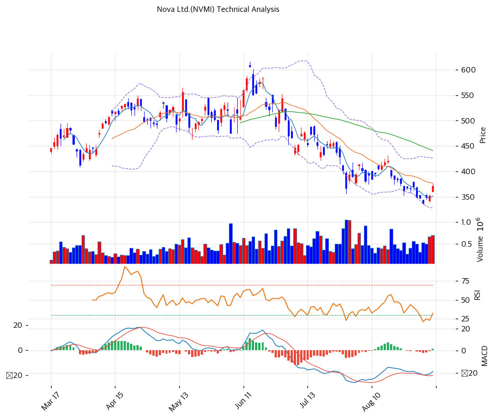

# Nova Ltd.(NVMI) 기술적 분석

---

## 가격 현황

| 항목 | 값 |
|---|---|
| 현재가 | **$372.10** (+5.50%) |
| 52주 고 / 저 | $615.99 (2026-06-15) / $265.26 |
| 52주 위치 | 30.5% |
| 고점 대비 | -39.6% |
| 9월 1일 저점 대비 | +10.2% |
| RSI(14) | 45.7 (중립) |
| MACD / Signal / Hist | -19 / -20 / +1 (매수 크로스, 히스토그램 확대) |
| Stochastic | K=28.7 D=15.6 골든크로스 (중립 영역) |
| 볼린저 | 폭 25.8%, 중간 |
| 거래량 | 20일 평균 대비 1.54x |

9월 4일 종가 $372.10은 하루 전 대비 5.5% 오른 값이다. 9월 1일 종가 $337.64가 최근 저점이었고 거기서 3거래일 만에 10.2% 반등했다. 다만 6월 15일 장중 고가 $615.99와 비교하면 여전히 39.6% 아래다.

※ 52주 범위는 장중 기준이다. 종가 기준으로는 $605.65 / $275.78이며 이 기준의 52주 위치는 29.2%다.

---

## 이동평균선

| MA | 가격($) | 갭(%) | 위치 |
|---|--:|--:|---|
| MA5 | 352 | +5.7% | 현재가가 위 |
| MA20 | 378 | -1.5% | 현재가가 아래 |
| MA60 | 441 | -15.6% | 현재가가 아래 |
| MA120 | 468 | -20.5% | 현재가가 아래 |
| MA200 | 438 | -15.0% | 현재가가 아래 |

**비정배열이다.** MA120($468)이 MA60($441)보다 위에 있고, MA200($438)은 MA60보다 아래다. 중장기선이 뒤엉킨 전형적인 하락 전환 국면의 배열이다.

주목할 점은 MA120이 MA60보다 27달러 높다는 사실이다. 3개월 전 평균가가 6개월 전 평균가보다 낮다는 뜻이고, 이는 최근 3개월의 하락이 그 이전 3개월보다 가팔랐다는 의미다. 실제로 6월 말 종가 $542.94에서 8월 말 $348.45까지 두 달 만에 35.8% 빠졌다.

현재가가 MA5 위로 올라온 것은 단기 반등의 유일한 흔적이다. MA20($378)까지 6달러 남았고, 이 선을 회복하지 못하면 반등은 단기에 그친다.

---

## 모멘텀 지표

| 지표 | 값 | 판정 |
|------|-----|------|
| RSI(14) | 45.7 | 중립 |
| MACD | -19 | 0선 아래 |
| Signal | -20 | |
| Histogram | +1 | 확대 중 (매수 크로스) |
| Stochastic %K | 28.7 | 중립 (과매도 탈출) |
| Stochastic %D | 15.6 | 골든크로스 |

RSI 45.7은 과매도(30)와 중립(50) 사이다. 40% 가까운 하락 뒤인데도 과매도 신호가 뜨지 않는다는 것은, 하락이 한 번에 무너진 것이 아니라 두 달에 걸쳐 계단식으로 진행됐다는 뜻이다. 그만큼 강한 기술적 반등을 기대할 근거도 약하다.

MACD는 여전히 0선 아래(-19)지만 시그널선(-20)을 위로 통과했고 히스토그램이 +1로 돌아섰다. 하락 모멘텀이 약해지는 초기 신호다. 다만 MACD 절대값이 마이너스인 상태의 크로스는 추세 전환이 아니라 하락 중 되돌림인 경우가 더 많다.

스토캐스틱은 K 28.7, D 15.6으로 과매도권에서 막 올라온 골든크로스다. 세 지표 중 가장 적극적인 매수 신호이지만 K와 D의 간격이 13포인트로 벌어져 있어 단기 과열 소지가 있다.

---

## 볼린저 밴드

| 구분 | 값 |
|------|-----:|
| 상단 | $426 |
| 중심선 | $378 |
| 하단 | $329 |
| 밴드 폭 | 25.8% |
| 위치 | 중간 |

밴드 폭 25.8%는 확장도 수축도 아닌 중간 국면이다. 현재가 $372.10은 중심선 $378 바로 아래에 있다. 밴드 하단 $329는 9월 1일 저점 $337.64보다 아래에 있어, 최근 저점에서도 밴드를 이탈하지는 않았다.

밴드 안에서 움직이는 구간이라 볼린저 자체로는 방향성 판단이 어렵다. 중심선 $378 돌파 여부가 관전 포인트다.

---

## 지지·저항

| 구분 | 가격($) | 근거 |
|---|--:|---|
| 강 저항 | 482 | 피보나치 0.618 되돌림 |
| 저항 | 438\~441 | MA200 + MA60 + 피보나치 0.5 (3중) |
| 저항 | 426 | 볼린저 상단 |
| 저항 | 400 | 피보나치 0.382 되돌림 |
| 저항 | 378\~386 | MA20 + 피봇 R1·R2 (PRZ, 중) |
| **현재가** | **372.10** | |
| 지지 | 363 | 피봇 S1 |
| 지지 | 349\~353 | 피보나치 0.236 + MA5 + 피봇 S2 (PRZ, 중) |
| 강 지지 | 337.64 | 9월 1일 종가 저점 |
| 강 지지 | 329 | 볼린저 하단 |
| 강 지지 | 265.26 | 52주 최저 |

피봇 기준값은 $370이다.

**저항의 밀도가 위쪽으로 갈수록 높아진다.** 특히 $438\~441 구간은 MA200($438), MA60($441), 피보나치 0.5 되돌림($441)이 3중으로 겹친다. 이 구간을 돌파하지 못하면 기술적으로는 하락 추세 안의 반등에 머문다.

당장의 1차 관문은 $378\~386이다. MA20($378)과 피봇 R1($379)·R2($386)이 겹치는 PRZ 구간이며 신뢰도는 중간이다.

---

## 추세선

| 구분 | 기울기 | 현재 수준($) | 접점 | 추세 |
|------|------:|------:|----:|------|
| 지지선 | +0.37 | 430 | 6개 | 상승 |
| 저항선 | -0.17 | 513 | 6개 | 하락 |

**상승 지지선은 이미 무너졌다.** 6개 접점으로 형성된 상승 지지선은 현재 $430 수준을 지나는데 주가는 $372.10이다. 58달러 아래다. 2025년 하반기부터 이어진 상승 채널의 하단을 이탈한 상태이며, 이탈한 지지선은 이후 저항으로 작용하는 것이 일반적이다.

하락 저항선은 $513으로 현재가와 141달러 떨어져 있어 당장은 참조점이 되지 않는다.

두 추세선이 각각 상승과 하락 방향으로 벌어져 있다는 것 자체가 이 차트에 일관된 추세가 없다는 뜻이다. 2025년 9월부터 2026년 6월까지의 상승 국면과 2026년 6월 이후의 하락 국면이 성격이 다르기 때문이다.

---

## 피보나치

스윙 고점 $616, 저점 $266 기준 하락 되돌림이다.

| 되돌림 | 가격($) |
|------|-----:|
| 0.236 | 349 |
| 0.382 | 400 |
| 0.5 | 441 |
| 0.618 | 482 |
| 0.786 | 541 |

현재가 $372.10은 0.236($349)과 0.382($400) 사이에 있다. 하락분의 30% 정도만 되돌린 위치다.

---

## 월별 가격 흐름

| 월말 | 종가($) | 전월 대비 |
|------|-----:|------:|
| 2024-12 | 196.95 | |
| 2025-03 | 184.33 | -6.4% (분기) |
| 2025-06 | 275.20 | +49.3% (분기) |
| 2025-09 | 319.66 | +16.2% (분기) |
| 2025-12 | 328.39 | +2.7% (분기) |
| 2026-01 | 457.84 | +39.4% |
| 2026-03 | 434.28 | -5.1% (2개월) |
| 2026-06 | 542.94 | +25.0% (3개월) |
| 2026-07 | 390.87 | **-28.0%** |
| 2026-08 | 348.45 | -10.9% |

2026년 1월 한 달에 39.4% 오른 것이 이 상승의 시작점이었다. 6월 15일 $615.99에서 정점을 찍고 7월 한 달에 28.0% 빠졌다.

**7월 하락에 실적 이벤트가 없었다.** 2분기 실적은 8월 6일에 발표됐고, 7월 급락은 그보다 앞선다. 6월 22일부터 7월 2일 사이 CEO와 이사 4인의 매도가 집중된 시점과 겹친다.

8월 6일 실적 발표일에는 $402.38에서 $381.32로 5.2% 하락 마감했다(거래량 915K). 매출과 EPS 모두 가이던스 상단 부근이었고 3분기 가이던스도 +25.6% 성장을 제시했는데 주가는 빠졌다. 실적이 아니라 밸류에이션이 조정되고 있다는 근거다.

거래량 최대치는 7월 29일 1,053K주였다. 이날 종가 $366.91로 현재가와 거의 같은 수준이며, 이 가격대에 물량이 쌓였다는 뜻이다.

---

## 시그널 종합

| 지표 | 상태 | 시그널 |
|------|------|------|
| 이동평균선 | 비정배열, MA20 아래 | ⚪ |
| RSI | 45.7 중립 | ⚪ |
| MACD | 매수 크로스, 히스토그램 확대 | 🟢 |
| 볼린저밴드 | 중간 위치, 폭 25.8% | ⚪ |
| 스토캐스틱 | 과매도권 골든크로스 | ⚪ |
| 거래량 | 1.54x | ⚪ |

| 구분 | 카운트 |
|---|--:|
| 매수 | 1 |
| 매도 | 0 |
| 중립 | 5 |
| **결론** | **매수우위 (약)** |

매도 신호가 하나도 없다는 점은 의미가 있다. 40% 하락이 지표상으로는 대부분 소화됐다는 뜻이다. 다만 명확한 매수 신호도 MACD 하나뿐이라 방향 전환을 확인했다고 보기는 어렵다. 관망 구간에 가깝다.

---

## 전략

| 시나리오 | 액션 |
|---|---|
| 보유자 | 홀드 (TP $618 / SL $353) |
| 신규 진입 1차 | $363 (피봇 S1) |
| 신규 진입 2차 | $378 (MA20 돌파 확인 후) |
| 매도 트리거 | $349 이탈 (피보나치 0.236 + PRZ 하단) |

**보유 중이라면 홀드다.** 매도 신호가 없고 MACD가 돌아섰다. 다만 목표가 $618은 52주 최고가를 그대로 가져온 기계적 산출값이라 현실적인 1차 목표로는 $438\~441 구간(MA200·MA60·피보나치 0.5 3중 저항)을 쓰는 편이 맞다. 손절선 $353은 PRZ 하단이며, 이 선이 깨지면 다음 지지는 $337.64(9월 1일 저점)다.

**미보유라면 두 갈래다.** $363(피봇 S1)까지 눌릴 때 1차 진입하거나, $378(MA20) 돌파를 확인한 뒤 따라 들어가는 방법이다. 지금 가격 $372.10은 두 지점 사이에 끼어 있어 어느 쪽으로도 근거가 약하다.

7월 29일에 최대 거래량이 터진 $366.91 부근이 지금 가격대다. 이 자리를 지키느냐가 단기 방향을 가른다.

---

## 핵심 판단

주가는 2026년 6월 15일 $615.99에서 9월 1일 $337.64까지 45.2% 빠졌고 현재 $372.10으로 10.2% 반등한 자리다. 이동평균은 비정배열이고 상승 지지선($430)은 이미 아래로 뚫렸다. 반면 RSI 45.7, 매도 시그널 0개, MACD 매수 크로스는 하락 모멘텀이 소진되고 있음을 보여준다. 추세는 아래, 모멘텀은 중립이라는 엇갈린 상태다.

이 하락 구간에 실적 악재가 없었다는 점이 차트 해석의 핵심이다. 매 분기 사상 최대 매출을 경신했고 8월 6일 발표한 3분기 가이던스는 전년 대비 +25.6% 성장이다. 그럼에도 주가가 빠진 것은 6월 고점에서 45배였던 선행 PER이 27배로 정상화되는 과정이기 때문이다. 기술적으로는 $378(MA20) 회복이 1차 확인점, $438\~441 돌파가 추세 전환의 확인점이다. 밸류에이션 관점의 분해는 T3, 주식수 증가가 주당 실적을 잠식한 구조는 T4에서 다룬다.
