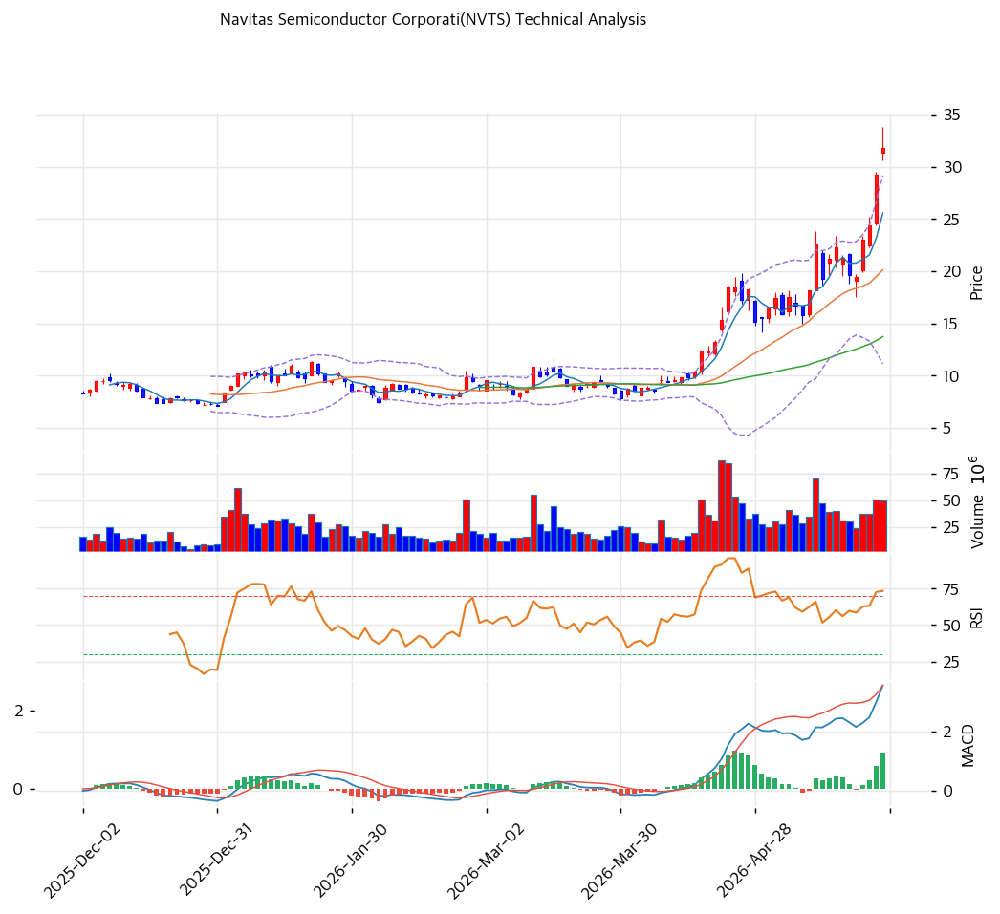

# Navitas Semiconductor(NVTS) 기술적 분석

## 차트

## 가격 현황

| 항목 | 값 |
|---|---|
| 현재가 | **$31.79** (+0.00%) |
| 52주 고/저 | $31.79 / $5.10 |
| 52주 위치 | 100.0% (신고가) |
| RSI | 75.6 🔴 과매수 |
| MACD | 4.0 / 3.0 / 1.0 매수 (확장) |
| Stochastic | K=93.2 D=88.2 골든크로스 (과매수) |
| 볼린저 | 폭 89.5%, 상단 근접 |

## 이동평균선

| MA | 가격($) | 갭(%) | 위치 |
|---|--:|--:|---|
| MA5 | 26.0 | +24.3% | 위 |
| MA20 | 20.0 | +57.8% | 위 |
| MA60 | 14.0 | +131.5% | 위 |
| MA120 | 11.0 | +181.4% | 위 |
| MA200 | 10.0 | +212.3% | 위 |

→ **정배열 True**. 단 MA20 괴리 +57.8%, MA200 괴리 +212.3%로 극단 과열. 차트상 4월 중순부터 수직 상승 — 1년 +523% ($5.10→$31.79), 최근 2개월 가속 구간 진입. 볼린저 밴드 폭 89.5%는 변동성 폭발 신호로 평균 회귀 압력 누적.

## 시그널 종합

| 구분 | 카운트 |
|---|--:|
| 매수 | 2 (정배열, MACD 매수 확장) |
| 매도 | 3 (RSI 과매수, Stoch 과매수, BB 상단 근접) |
| 중립 | 2 (거래량 1.35x, 추세선) |
| **결론** | **매도우위 — 단기 조정 임박** |

## 지지·저항

| 구분 | 가격($) | 근거 |
|---|--:|---|
| 강 저항 | 34.0 | 피봇 R1 (돌파 시 추가 상승) |
| 저항 | 31.79 | 52주 신고가 |
| **현재가** | **$31.79** | 신고가 근접 |
| 지지 | 30.0 | 피봇 S1 (심리적 라운드) |
| 지지 | 29.0 | 피봇 S2 / 피보 2.0 확장 PRZ |
| 강 지지 | 20.0 | MA20 (1차 평균회귀) |
| 강 지지 | 14.0 | MA60 / 피보 0.382 되돌림 |

## 전략

| 시나리오 | 액션 |
|---|---|
| 보유자 | **비중축소(트레일링)** TP $32 / SL $29 — 1/3 익절 권고 |
| 신규 진입 1차 | $20 (MA20 터치, -37% 조정 시) |
| 신규 진입 2차 | $14 (MA60 / 피보 0.382, -56% 조정 시) |
| 매도 트리거 | $29 종가 이탈 → 추세 균열 / RSI 50 하회 시 전량 |

## 핵심 판단

극단 과열 구간(MA200 괴리 +212%, RSI 75.6, BB 상단 +89% 폭)에서 단기 차익실현 압력 임계. 차트는 4월 중순 이후 수직 상승으로 평균회귀 압력 누적, 매도 시그널 3건이 매수 2건 압도. 정배열 추세 자체는 유효하나 현 가격대 신규 진입 불리 — 보유자는 부분 익절 후 트레일링 SL $29, 신규는 MA20($20) 또는 MA60($14) 분할 매수 대기가 합리적. 단기 조정 폭 -10\~30% 시나리오 우세.
