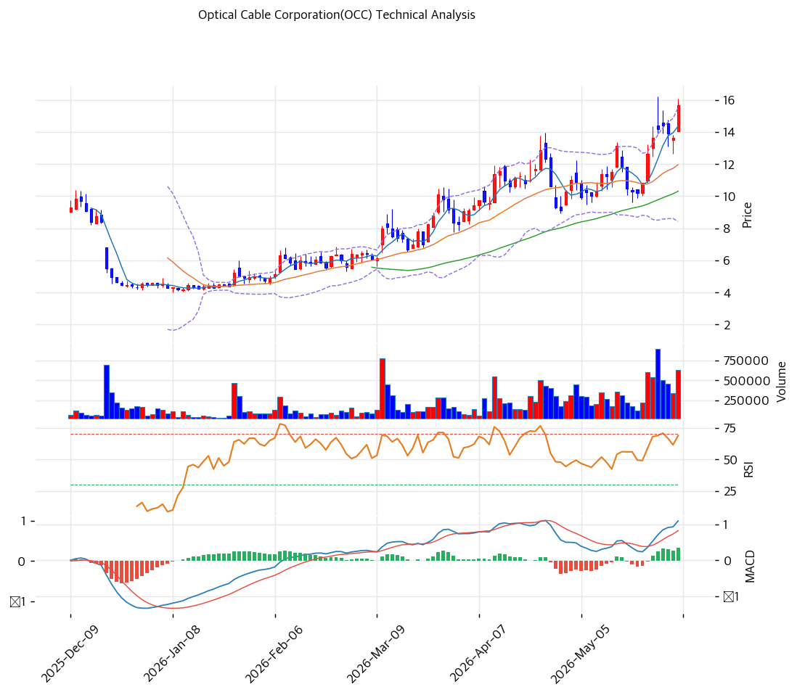

# 옵티컬 케이블(OCC) 기술적 분석 보고서

---

## 가격 위치

현재가 **$15.65** (보합) — **52주 신고가** 갱신, 52주 위치 **100%** (고가 $15.65 / 저가 $2.62). 1년 **+497%** ($2.62→$15.65). AI 데이터센터 광케이블·커넥티비티 테마 급등. RSI 68.7 중립. 저가주($2대→$15대) 출신 소형주로 변동성 극대.

## 이동평균선

| 이평선 | 값 | 이격도 | 위치 |
|------|---:|----:|:---:|
| MA5 | $14 | +9.1% | 위 |
| MA20 | $12 | +30.8% | 위 |
| MA60 | $10 | +51.9% | 위 |
| MA120 | $8 | +97.2% | 위 |
| MA200 | $8 | +98.9% | 위 |

**완전 정배열 True**. MA200 대비 +98.9%, MA20 대비 +30.8% 극단 이격. 1년 +497% 급등으로 이격 극단 — 단기 급등 정점.

## 모멘텀 지표

- **RSI 68.7 (중립)** — 70 직전, 과매수 근접이나 여유. 추가 모멘텀 가능
- **MACD 매수권** — 단기 모멘텀 유효 (저가주 절대값 작음)
- **스토캐스틱 과매수 경계** — 골든크로스 영역
- **볼린저밴드** — 상단 근접, 폭 확대. 변동성 큼
- **거래량** — 테마 매수세 유입

## 피보나치 되돌림 (스윙 $15.65 / $2.62)

| 레벨 | 가격 | 성격 |
|------|---:|------|
| 0.236 | $13 | 1차 지지 (MA5 근접) |
| 0.382 | $11 | 2차 지지 (MA20 근접) |
| 0.5 | $9 | 중기 지지 (MA60 근접) |
| 0.618 | $7 | 깊은 조정 |
| 0.786 | $5 | 추가 조정 |

※ 저가주 출신으로 호가·되돌림 변동성 극대 유의.

## 지지/저항 (S&R)

- **저항**: $15.65(52주 고가)
- **지지**: $14(MA5·피보 0.236) / **$12(MA20·피보 0.382)** / $10(MA60·피보 0.5) / $8(MA120·MA200) / $7(피보 0.618)

## 종합 시그널 & 전략

**시그널: 중립~매수우위** (모멘텀 강세, 단 테마 의존)

- **전략**: HOLD(홀드) — 신고가권 추격 신중. 미보유 시 눌림목 대기
- **눌림목 매수**: 1년 +497% + MA200 +99%로 **추격 강력 비추**. 펀더멘털(매출 정체·적자·PBR 7x) 대비 테마 과열. 조정 시 **MA20 $12 ~ MA60 $10 분할 매수(투기적)**
- **상방**: 52주 고가 $15.65 돌파 시 신고가. 데이터센터 광케이블 테마가 동력
- **하방**: MA20 $12 이탈 시 $10(MA60) → $8(MA120/200). 테마 소멸 시 급락
- **변곡점**: AI 데이터센터 광케이블 매출 성장 + 지속 흑자 전환이 추세 분기점. 펀더멘털 미검증 소형주로 비중·손절 엄격 관리
