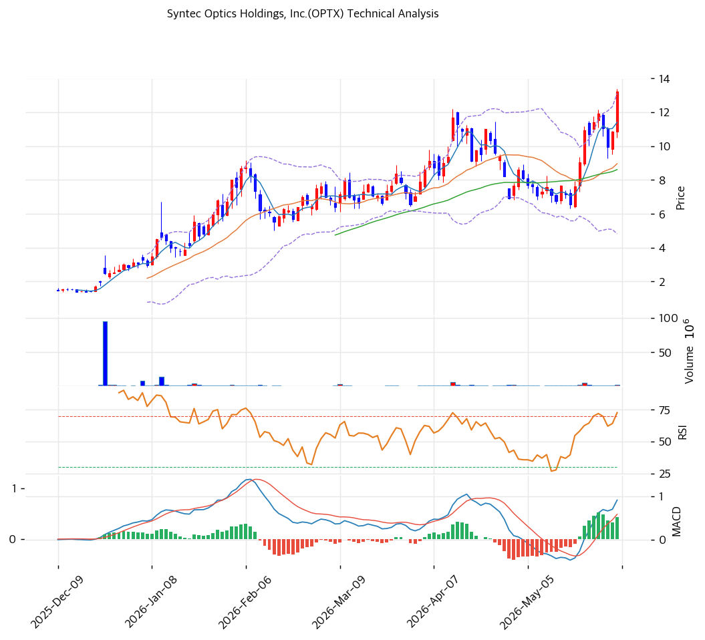

# 기술적분석

***

## 가격 위치

현재가 **$13.23** (보합) — **52주 신고가** 갱신, 52주 위치 **100%** (고가 $13.23 / 저가 $1.24). 1년 **+967%** ($1.24→$13.23). 포토닉스·AI 옵틱스·국방 광학 테마 급등. 거래량 1.61배. RSI 66.3 중립. 저가주($1대→$13대) 출신 소형주로 변동성 극대.

## 이동평균선

| 이평선   |   값 |     이격도 |  위치 |
| ----- | --: | ------: | :-: |
| MA5   | $11 |  +16.1% |  위  |
| MA20  |  $9 |  +47.7% |  위  |
| MA60  |  $9 |  +53.7% |  위  |
| MA120 |  $7 |  +98.2% |  위  |
| MA200 |  $5 | +178.5% |  위  |

**완전 정배열 True**. MA200 대비 **+178.5%**, MA20 대비 +47.7% 극단 이격. 1년 +967% 급등으로 이격도 극단 — 단기 급등 정점.

## 모멘텀 지표

* **RSI 66.3 (중립)** — 70 직전, 과매수 근접이나 여유. 추가 모멘텀 가능
* **MACD 1.0 / 시그널 0.0 / 히스토 0.0** — 매수 + 확장(저가주 절대값 작음)
* **스토캐스틱 K=79.2 / D=77.5** — 골든크로스, 중립\~과매수 경계
* **볼린저밴드** — 상단 $13 / 중심 $9 / 하단 $5, 폭 **92.4% 극단**, 상단 근접. 변동성 폭발
* **거래량비 1.61x** — 평균 대비 증가

## 피보나치 되돌림 (스윙 $13.23 / $1.24)

| 레벨    | 가격 | 성격                   |
| ----- | -: | -------------------- |
| 0.236 | $8 | 1차 지지                |
| 0.382 | $9 | 2차 지지 (MA20·MA60 근접) |
| 0.5   | $7 | 중기 지지 (MA120 근접)     |
| 0.618 | $6 | 깊은 조정                |
| 0.786 | $4 | 추가 조정                |

※ 저가주 출신으로 호가·되돌림이 $1 단위 — 변동성 극대 유의.

## 지지/저항 (S\&R)

* **저항**: $13.23(52주 고가) / $14(피봇 R1·추세선 저항)
* **지지**: $11(피봇 S1·MA5) / **$9(PRZ: MA20·MA60·피보 0.382·피봇 S2)** / $8(피보 0.236) / $7(MA120·피보 0.5) / $5(MA200)

## 종합 시그널 & 전략

**시그널: 매수 2 / 매도 1 / 중립 4 → 매수우위** (모멘텀 강세, 단 테마 의존)

* **전략**: HOLD(홀드) — **TP $13 / SL $9**. WAIT(관망) e1 $11 / e2 $9
* **눌림목 매수**: 1년 +967% + MA200 +178% + BB 92% 극단으로 **추격 강력 비추**. 펀더멘털(매출 정체·적자·EV/Rev 19.7x) 대비 극단 투기. 단기 -30\~50% 급락 시 MA20·MA60 $9 \~ 피보 0.5 $7 분할 매수(투기적)
* **상방**: 52주 고가 $13.23 돌파 시 $14. 테마 모멘텀이 유일 동력
* **하방**: MA20·MA60 $9(PRZ) 이탈 시 $7\~5 급락. EV/Revenue 19.7x 극단 고평가로 조정 폭 큼
* **변곡점**: 포토닉스·AI 옵틱스 테마 지속 여부 + 실제 매출 성장 전환이 분기점. 펀더멘털 미검증 투기 종목으로 비중·손절 엄격 관리
