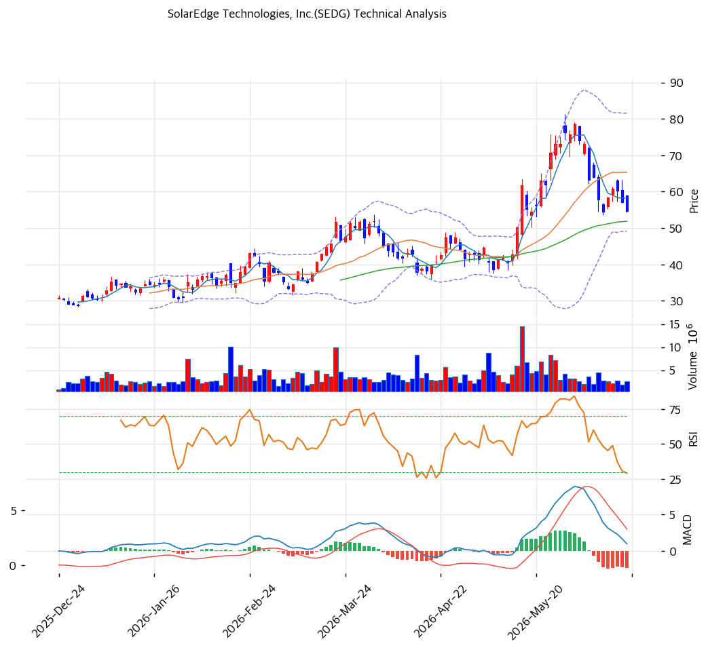

# SolarEdge(SEDG) 기술적 분석

2026-06-18 | T2 Technical Analysis

---

## 차트

---

## 1. 가격 현황

| 항목 | 값 |
|------|-----|
| 현재가 | $54.68 |
| 52주 고가 | $81.25 |
| 52주 저가 | $15.75 |
| 52주 범위 위치 | 61.8% (중상단) |
| 거래량비 | 0.69x (평균 이하) |

> 저점($15.75)에서 5배 급등해 고점($81.25) 찍은 뒤 $54대로 조정. 1년 변동폭이 극단적(Beta 1.42)인 정책·업황 민감주. 현재 MA20($65) 아래로 단기 조정, 중장기선(MA60·120·200) 위에서 상승 추세 잔존.

---

## 2. 차트 패턴 분석

### 2.1 캔들스틱 패턴

| 패턴 | 위치 | 신뢰도 | 해석 |
|------|------|--------|------|
| 고점 후 조정 | $81→$54 | 중 | 급등 후 되돌림 |
| MA60 지지 시험 | $54.68 ≈ MA60 $52 | 중 | 중기 지지 공방 |
| 스토캐스틱 과매도 | K=13.8 | 중 | 단기 반등 여지 |

※ 주요 캔들 패턴: 망치형, 역망치형, 장악형, 도지, 샛별/석별, 적삼병/흑삼병, 하라미, 유성형, 교수형 등

### 2.2 가격 구조 패턴

- **급등 후 조정·중기 지지 시험** (신뢰도: 중)
  $15.75→$81.25 급등(턴어라운드 기대) 후 $54대 조정. MA60($52)·피보 0.618($54) 지지대 시험 중. 지지 유지 시 반등, 이탈 시 추가 조정.

- **단기 약세·중장기 추세 잔존** (신뢰도: 중)
  MA5·MA20 아래(단기 약세)이나 MA60·120·200 위(중장기 상승). 단기 눌림과 중장기 추세의 교차 국면.

※ 주요 구조 패턴: 이중천정/바닥, 삼각수렴, 쐐기형, 깃발형, 페넌트, 컵앤핸들, 박스권 등

### 2.3 다이버전스

- **과매도 반등 시도** (신뢰도: 중)
  스토캐스틱 과매도(K=13.8)·RSI 44.1 중립. 단기 반등 여지이나 MACD 매도 전환으로 모멘텀 약화 혼재.

※ RSI·MACD 기반 | 상승 다이버전스 = 가격↓ 지표↑, 하락 다이버전스 = 가격↑ 지표↓

### 2.4 패턴 종합 판단

급등(턴어라운드 기대) 후 고점 대비 조정 국면. 현재가가 MA60($52)·피보 0.618($54) 지지대를 시험한다. 단기선(MA5·MA20) 아래로 단기 약세이나 중장기선 위로 상승 추세는 잔존. 스토캐스틱 과매도로 단기 반등 여지가 있으나, MACD 매도 전환·거래량 감소로 추세 확신은 약하다. **지지($51\~52) 유지 여부**가 방향을 결정하며, 변동성 큰 종목이라 확인 후 대응이 정석.

---

## 3. 이동평균선 — 단기 약세·중장기 상승 혼재

| MA | 값 | 현재가 괴리율 | 위치 |
|----|-----|--------------|------|
| MA5 | $58 | -6.1% | 아래 |
| MA20 | $65 | -16.3% | 아래 |
| MA60 | $52 | +5.4% | 위 |
| MA120 | $44 | +24.8% | 위 |
| MA200 | $40 | +35.8% | 위 |

**해석**: 현재가가 단기선(MA5 $58·MA20 $65) 아래로 **단기 조정**이나, 중장기선(MA60 $52·MA120 $44·MA200 $40) 위로 **중장기 상승 추세 잔존**(MA200 대비 +35.8%). 정배열 깨짐(aligned False) — 급등 후 단기 눌림 국면. MA60($52) 지지 유지가 추세 방어선.

---

## 4. 보조 지표

### RSI(14) — 44.1 (중립)

조정으로 중립권. 과매수·과매도 아님. 방향성 모색.

### MACD(12,26,9)

| 항목 | 값 |
|------|-----|
| MACD | \~1.0 |
| Signal | \~3.0 |
| Histogram | ~-2.0 |
| 크로스 상태 | 매도 전환(확산) |

**해석**: MACD가 Signal 하향 돌파한 매도 전환, 히스토그램 음(-) 확대 → 단기 하락 모멘텀. 급등 후 조정 반영.

### 볼린저밴드(20, 2σ)

| 항목 | 값 |
|------|-----|
| 상단 | $82 |
| 중단 (MA20) | $65 |
| 하단 | $49 |
| 밴드 폭 | 49.6% (고변동) |
| 현재 위치 | 중간~하단 |

**해석**: 밴드 폭 49.6%로 변동성 큼. 현재가 $54.68은 중단($65) 아래·하단($49) 위. 하단 근접 시 단기 반등, 중단 회복 실패 시 약세 지속.

### 스토캐스틱(14, 3, 3)

| 항목 | 값 |
|------|-----|
| Slow %K | 13.8 |
| Slow %D | 19.3 |
| 크로스 상태 | 데드크로스 |
| 판단 | 과매도 |

**해석**: 과매도권(K=13.8). 단기 반등 여지이나 데드크로스로 방향 확인 필요.

---

## 5. 지지/저항 — 추세선 · 피보나치 · PRZ 통합

### 5.1 종합 지지/저항 테이블

| 구분 | 가격 | 근거 |
|------|------|------|
| 저항 | $81.25 | 52주 고가 |
| 저항 | $69 | 피보 0.236 |
| 저항 | $65 | MA20 |
| 저항 | $63 | 피보 0.382 |
| 저항 | $59 | 피보 0.5·피봇 R1 |
| 저항 | $58 | MA5·PRZ(중) |
| **현재가** | **$54.68** | 조정 국면 |
| 지지 | $54 | 피보 0.618 |
| 지지 | $53 | 피봇 S1 |
| 지지 | $52 | MA60·PRZ(강) |
| 지지 | $51 | 피봇 S2·전략 SL |
| 지지 | $47 | 피보 0.786 |
| 지지 | $40 | MA200 |

---

## 6. 시그널 종합

| 지표 | 내용 | 시그널 |
|------|------|--------|
| 차트 패턴 | 급등 후 조정, 지지 시험 | ⚪ |
| 이동평균선 | 단기 약세·중장기 상승 혼재 | ⚪ |
| RSI | 44.1 — 중립 | ⚪ |
| MACD | 매도 전환(확산) | 🔴 |
| 볼린저밴드 | 중단 아래, 밴드폭 50% | ⚪ |
| 스토캐스틱 | 과매도, 데드크로스 | 🟢 |
| 거래량 | 0.69x 평균 이하 | ⚪ |

**종합 판단**: 🟢 매수 1개 / 🔴 매도 1개 / ⚪ 중립 5개 → **중립 (조정 후 방향 모색)**

급등 후 조정 국면으로 단기선 아래·중장기선 위의 혼재. MACD 매도 전환(약세) vs 스토캐스틱 과매도(반등 여지)가 상충. MA60($52)·피보 0.618($54) 지지대가 방어선이고, 이탈 시 MA200($40)까지 열린다. 변동성 큰 정책 민감주라 지지 확인 후 대응.

---

## 7. 전략 제안

### 보유 중인 경우
- **홀드 (지지 주시)**
- 익절 라인: $59(피보 0.5)·$65(MA20)·$69(피보 0.236)
- 손절 라인: $51 (피봇 S2·MA60 이탈)
- 리스크/리워드: 변동성 큼(Beta 1.42), 분할 대응

### 진입 대기인 경우
- **지지 확인 후 분할 (변동성 큼)**
- 1차 진입가: $52\~54 (MA60·피보 0.618 PRZ)
- 2차 진입가: $47\~49 (피보 0.786·BB 하단)
- 진입 조건: 정책·업황 민감주로 변동 큼. 턴어라운드(6분기 GM 개선·2026 Q2 BEP 근접) 확인 + 25D 폐지 수요 영향 모니터. 흑자 전환 가시화가 추세 전환 트리거. 지지($52) 이탈 시 관망.
